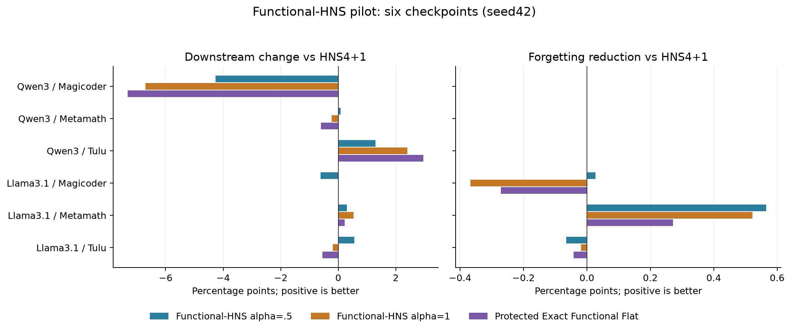

# Functional-HNS 初步试验：2 models × 3 tasks × seed42（2026-09-14）

状态：complete；已评分 128/128 cells；五方法齐全的checkpoint 6/6；更新时间UTC：2026-09-13T20:00:24.838497+00:00。

只处理已训练LoRA，不重新训练。原始LoRA与统一HNS4+1为对照；Functional-HNS α=.5/1和Protected Exact Functional Flat各构建六个adapter，合计18个新adapter。所有模块固定原U/V，rank16、alpha32、scaling2、target modules和base/config不变。

## 初步结果解读

- Functional-HNS α=0.5：相对统一HNS，Target -0.442 pp，Off -0.242 pp，FG reduction +0.088 pp；Target W/T/L=[4, 0, 2]，FG reduction W/T/L=[2, 3, 1]，Target与Off同时Pareto改善 3/6。
- Functional-HNS α=1：相对统一HNS，Target -0.698 pp，Off -0.546 pp，FG reduction +0.023 pp；Target W/T/L=[2, 1, 3]，FG reduction W/T/L=[1, 3, 2]，Target与Off同时Pareto改善 0/6。
- Protected Exact Functional Flat：相对统一HNS，Target -0.882 pp，Off -0.566 pp，FG reduction -0.007 pp；Target W/T/L=[2, 1, 3]，FG reduction W/T/L=[1, 3, 2]，Target与Off同时Pareto改善 1/6。

本轮没有功能加权HNS配置在六case平均Target和FG上同时改善；当前结果不足以支持整体替换原始HNS。

HNS已有 3/6 case的FG为0，存在clipped FG的改善下限；不能只看FG判断是否受益，需要同时查看Off原始平均和Target。

PR增加、功能能量下降和参数Fro变化同时发生，无法从这次固定nuclear-budget试验拆分shape与scalar dose的贡献。报告的编辑后PR使用同一frozen Base轨迹缓存q，是retrospective proxy，未重新采集编辑后模型的activation。Exact Functional Flat是诊断端点，PR最大不能直接解释为最优性能。

适度加权α=.5的分任务结果（每组两个Base，均相对HNS）：

- magicoder：Target -2.439 pp，Off -0.651 pp，FG reduction +0.014 pp。
- metamath：Target +0.190 pp，Off +0.243 pp，FG reduction +0.283 pp。
- tulu：Target +0.924 pp，Off -0.319 pp，FG reduction -0.033 pp。

MetaMath是本轮适度功能加权的积极信号；Magicoder总体退步，Tulu目标成绩提升伴随Off下降。后续若检验升级，应先区分编辑剂量与形状、并验证calibration分布，而非直接追求PR最大；本轮不额外调参或按checkpoint选配置。



## 方法与冻结协议

$q_i=\sum_a(v_i^\top h_a)^2/N$，来自原训练分布256条SFT样本（含assistant响应）、最长512tokens、sampling seed42的frozen Base轨迹。q还依赖输入分布、module和LoRA的V，不能称为Base-only或task-data-free；保存的是source-basis二阶矩而不是可投影任意新V的完整hidden-state covariance。

$\bar q_i=\max(q_i,0.1\operatorname{median}(q))$；$g_i=\sigma_i(\bar q_i/\operatorname{median}(q))^{\alpha/2}$；$\tilde\sigma_i=\mathrm{HNS}_{4+1}(g)_i/(\bar q_i/\operatorname{median}(q))^{\alpha/2}$；$t_i=\tilde\sigma_i\sum_j\sigma_j/\sum_j\tilde\sigma_j$。α=0严格退回原始HNS API，复用统一4+1 adapter并核验目标谱一致，不另挑配置。functional gains不排序，保持原始方向索引。

Protected Exact Functional Flat：$t_i\propto1/\sqrt{\bar q_i}$，恢复同一nuclear budget；它equalize的是保护后的能量。表中Functional PR用真实q计算；protected PR另外报告，禁止把二者混淆。

所有α/step/floor在看结果前固定，不按checkpoint调优。Balanced reconstruction复用现有代码；源basis hash必须与activation缓存逐module完全一致，保存权重核预算和重构误差必须<1e-5。

Downstream分别为HumanEval pass@1、GSM8K strict accuracy、IFEval prompt strict accuracy。全部adapter还评测其余三类benchmark，Commonsense使用原8-task macro。Off/Retention为其余三类百分成绩等权平均；FG为各类max(Base−adapter,0)再平均。FG越小越好，FG reduction正值为减少遗忘。生成prompt/chat、greedy参数、parser、metric及scripts全部复用三种子协议。

已有LoRA/HNS/Base全量结果先核验脚本、dataset与权重哈希，再通过四类benchmark短测试逐token对照；若不一致，则同批重新生成全部对照，不能混用旧结果。最多两张B300，一worker一张；短测试4096序列起，OOM逐级降；长任务使用已验证的2048上限，short benchmark使用probe选中的上限。

## Base reference

| Base | HumanEval | GSM8K | IFEval | Commonsense |
| --- | --- | --- | --- | --- |
| Qwen3-8B | 66.463 | 85.747 | 69.686 | 82.675 |
| Llama-3.1-8B-Instruct | 52.439 | 62.396 | 61.922 | 71.404 |

## 逐checkpoint downstream

| Base | Task | Seed | LoRA | HNS α=0 (4+1) | Functional-HNS α=0.5 | Functional-HNS α=1 | Protected Exact Functional Flat |
| --- | --- | --- | --- | --- | --- | --- | --- |
| Qwen3-8B | magicoder | 42 | 65.244 | 75.000 | 70.732 | 68.293 | 67.683 |
| Qwen3-8B | metamath | 42 | 84.155 | 88.173 | 88.249 | 87.945 | 87.566 |
| Qwen3-8B | tulu | 42 | 67.837 | 70.795 | 72.089 | 73.198 | 73.752 |
| Llama-3.1-8B-Instruct | magicoder | 42 | 53.659 | 54.878 | 54.268 | 54.878 | 54.878 |
| Llama-3.1-8B-Instruct | metamath | 42 | 77.255 | 80.819 | 81.122 | 81.350 | 81.046 |
| Llama-3.1-8B-Instruct | tulu | 42 | 63.216 | 65.434 | 65.989 | 65.250 | 64.880 |

## 逐checkpoint Retention / forgetting

| Base | Task | Method | Off / Retention | FG | Off ΔHNS | FG reduction vs HNS |
| --- | --- | --- | --- | --- | --- | --- |
| Qwen3-8B | magicoder | LoRA | 77.798 | 1.900 | -3.535 | -1.900 |
| Qwen3-8B | magicoder | HNS α=0 (4+1) | 81.333 | 0.000 | 0.000 | 0.000 |
| Qwen3-8B | magicoder | Functional-HNS α=0.5 | 80.407 | 0.000 | -0.926 | 0.000 |
| Qwen3-8B | magicoder | Functional-HNS α=1 | 80.018 | 0.000 | -1.315 | 0.000 |
| Qwen3-8B | magicoder | Protected Exact Functional Flat | 79.967 | 0.000 | -1.366 | 0.000 |
| Qwen3-8B | metamath | LoRA | 71.293 | 1.799 | -3.627 | -1.799 |
| Qwen3-8B | metamath | HNS α=0 (4+1) | 74.920 | 0.000 | 0.000 | 0.000 |
| Qwen3-8B | metamath | Functional-HNS α=0.5 | 75.249 | 0.000 | 0.328 | 0.000 |
| Qwen3-8B | metamath | Functional-HNS α=1 | 75.925 | 0.000 | 1.004 | 0.000 |
| Qwen3-8B | metamath | Protected Exact Functional Flat | 75.703 | 0.000 | 0.783 | 0.000 |
| Qwen3-8B | tulu | LoRA | 86.018 | 0.000 | 0.655 | 0.000 |
| Qwen3-8B | tulu | HNS α=0 (4+1) | 85.363 | 0.000 | 0.000 | 0.000 |
| Qwen3-8B | tulu | Functional-HNS α=0.5 | 85.448 | 0.000 | 0.086 | 0.000 |
| Qwen3-8B | tulu | Functional-HNS α=1 | 84.976 | 0.000 | -0.387 | 0.000 |
| Qwen3-8B | tulu | Protected Exact Functional Flat | 84.779 | 0.000 | -0.584 | 0.000 |
| Llama-3.1-8B-Instruct | magicoder | LoRA | 60.202 | 5.039 | -4.605 | -4.201 |
| Llama-3.1-8B-Instruct | magicoder | HNS α=0 (4+1) | 64.807 | 0.838 | 0.000 | 0.000 |
| Llama-3.1-8B-Instruct | magicoder | Functional-HNS α=0.5 | 64.430 | 0.810 | -0.377 | 0.028 |
| Llama-3.1-8B-Instruct | magicoder | Functional-HNS α=1 | 64.794 | 1.205 | -0.013 | -0.367 |
| Llama-3.1-8B-Instruct | magicoder | Protected Exact Functional Flat | 64.840 | 1.109 | 0.032 | -0.271 |
| Llama-3.1-8B-Instruct | metamath | LoRA | 57.819 | 4.713 | -5.334 | -2.895 |
| Llama-3.1-8B-Instruct | metamath | HNS α=0 (4+1) | 63.153 | 1.817 | 0.000 | 0.000 |
| Llama-3.1-8B-Instruct | metamath | Functional-HNS α=0.5 | 63.312 | 1.252 | 0.159 | 0.565 |
| Llama-3.1-8B-Instruct | metamath | Functional-HNS α=1 | 62.659 | 1.295 | -0.494 | 0.522 |
| Llama-3.1-8B-Instruct | metamath | Protected Exact Functional Flat | 62.612 | 1.546 | -0.541 | 0.272 |
| Llama-3.1-8B-Instruct | tulu | LoRA | 63.726 | 1.809 | -2.678 | -1.490 |
| Llama-3.1-8B-Instruct | tulu | HNS α=0 (4+1) | 66.404 | 0.319 | 0.000 | 0.000 |
| Llama-3.1-8B-Instruct | tulu | Functional-HNS α=0.5 | 65.679 | 0.384 | -0.725 | -0.065 |
| Llama-3.1-8B-Instruct | tulu | Functional-HNS α=1 | 64.330 | 0.338 | -2.074 | -0.019 |
| Llama-3.1-8B-Instruct | tulu | Protected Exact Functional Flat | 64.687 | 0.361 | -1.717 | -0.042 |

## 完整四benchmark表

| Base | Task | Seed | Method | HumanEval | GSM8K | IFEval | Commonsense |
| --- | --- | --- | --- | --- | --- | --- | --- |
| Qwen3-8B | magicoder | 42 | LoRA | 65.244 | 83.927 | 65.804 | 83.662 |
| Qwen3-8B | magicoder | 42 | HNS α=0 (4+1) | 75.000 | 88.628 | 71.719 | 83.653 |
| Qwen3-8B | magicoder | 42 | Functional-HNS α=0.5 | 70.732 | 87.794 | 70.240 | 83.188 |
| Qwen3-8B | magicoder | 42 | Functional-HNS α=1 | 68.293 | 86.657 | 70.425 | 82.973 |
| Qwen3-8B | magicoder | 42 | Protected Exact Functional Flat | 67.683 | 86.277 | 70.610 | 83.014 |
| Qwen3-8B | metamath | 42 | LoRA | 64.024 | 84.155 | 66.728 | 83.127 |
| Qwen3-8B | metamath | 42 | HNS α=0 (4+1) | 67.683 | 88.173 | 72.458 | 84.620 |
| Qwen3-8B | metamath | 42 | Functional-HNS α=0.5 | 69.512 | 88.249 | 71.719 | 84.515 |
| Qwen3-8B | metamath | 42 | Functional-HNS α=1 | 71.341 | 87.945 | 72.089 | 84.344 |
| Qwen3-8B | metamath | 42 | Protected Exact Functional Flat | 69.512 | 87.566 | 73.383 | 84.214 |
| Qwen3-8B | tulu | 42 | LoRA | 84.756 | 89.007 | 67.837 | 84.291 |
| Qwen3-8B | tulu | 42 | HNS α=0 (4+1) | 82.927 | 88.704 | 70.795 | 84.458 |
| Qwen3-8B | tulu | 42 | Functional-HNS α=0.5 | 83.537 | 88.400 | 72.089 | 84.408 |
| Qwen3-8B | tulu | 42 | Functional-HNS α=1 | 81.707 | 89.007 | 73.198 | 84.214 |
| Qwen3-8B | tulu | 42 | Protected Exact Functional Flat | 81.098 | 88.931 | 73.752 | 84.308 |
| Llama-3.1-8B-Instruct | magicoder | 42 | LoRA | 53.659 | 56.255 | 55.268 | 69.083 |
| Llama-3.1-8B-Instruct | magicoder | 42 | HNS α=0 (4+1) | 54.878 | 63.609 | 60.444 | 70.369 |
| Llama-3.1-8B-Instruct | magicoder | 42 | Functional-HNS α=0.5 | 54.268 | 61.865 | 60.813 | 70.613 |
| Llama-3.1-8B-Instruct | magicoder | 42 | Functional-HNS α=1 | 54.878 | 64.670 | 58.965 | 70.747 |
| Llama-3.1-8B-Instruct | magicoder | 42 | Protected Exact Functional Flat | 54.878 | 64.519 | 59.335 | 70.666 |
| Llama-3.1-8B-Instruct | metamath | 42 | LoRA | 54.268 | 77.255 | 54.159 | 65.029 |
| Llama-3.1-8B-Instruct | metamath | 42 | HNS α=0 (4+1) | 61.585 | 80.819 | 58.226 | 69.649 |
| Llama-3.1-8B-Instruct | metamath | 42 | Functional-HNS α=0.5 | 60.366 | 81.122 | 59.889 | 69.680 |
| Llama-3.1-8B-Instruct | metamath | 42 | Functional-HNS α=1 | 58.537 | 81.350 | 59.704 | 69.737 |
| Llama-3.1-8B-Instruct | metamath | 42 | Protected Exact Functional Flat | 59.146 | 81.046 | 58.780 | 69.909 |
| Llama-3.1-8B-Instruct | tulu | 42 | LoRA | 62.805 | 57.089 | 63.216 | 71.285 |
| Llama-3.1-8B-Instruct | tulu | 42 | HNS α=0 (4+1) | 62.805 | 65.959 | 65.434 | 70.448 |
| Llama-3.1-8B-Instruct | tulu | 42 | Functional-HNS α=0.5 | 61.585 | 65.201 | 65.989 | 70.252 |
| Llama-3.1-8B-Instruct | tulu | 42 | Functional-HNS α=1 | 58.537 | 64.064 | 65.250 | 70.391 |
| Llama-3.1-8B-Instruct | tulu | 42 | Protected Exact Functional Flat | 59.146 | 64.594 | 64.880 | 70.321 |

## Functional PR与编辑剂量

| Base | Task | Method | Raw-q PR | Protected-q PR | Full-moment PR | Functional RMS ratio | Energy ratio | Fro ratio | max gain t/σ | floored fraction |
| --- | --- | --- | --- | --- | --- | --- | --- | --- | --- | --- |
| Qwen3-8B | magicoder | LoRA | 1.045 | 1.045 | 1.036 | 1.000 | 1.000 | 1.000 | 1.000 | 0.001 |
| Qwen3-8B | magicoder | HNS α=0 (4+1) | 2.436 | 2.436 | 2.019 | 0.141 | 0.020 | 0.522 | 16.870 | 0.001 |
| Qwen3-8B | magicoder | Functional-HNS α=0.5 | 8.916 | 8.916 | 5.781 | 0.076 | 0.006 | 0.531 | 10.085 | 0.001 |
| Qwen3-8B | magicoder | Functional-HNS α=1 | 15.970 | 15.970 | 11.955 | 0.064 | 0.004 | 0.543 | 7.404 | 0.001 |
| Qwen3-8B | magicoder | Protected Exact Functional Flat | 16.000 | 16.000 | 12.096 | 0.062 | 0.004 | 0.544 | 35.870 | 0.001 |
| Qwen3-8B | metamath | LoRA | 1.315 | 1.315 | 1.246 | 1.000 | 1.000 | 1.000 | 1.000 | 0.001 |
| Qwen3-8B | metamath | HNS α=0 (4+1) | 6.785 | 6.785 | 4.265 | 0.214 | 0.046 | 0.609 | 12.568 | 0.001 |
| Qwen3-8B | metamath | Functional-HNS α=0.5 | 12.753 | 12.753 | 7.304 | 0.166 | 0.028 | 0.620 | 14.108 | 0.001 |
| Qwen3-8B | metamath | Functional-HNS α=1 | 15.979 | 15.979 | 10.484 | 0.150 | 0.023 | 0.642 | 11.252 | 0.001 |
| Qwen3-8B | metamath | Protected Exact Functional Flat | 16.000 | 16.000 | 10.538 | 0.148 | 0.022 | 0.644 | 32.173 | 0.001 |
| Qwen3-8B | tulu | LoRA | 2.201 | 2.201 | 1.936 | 1.000 | 1.000 | 1.000 | 1.000 | 0.002 |
| Qwen3-8B | tulu | HNS α=0 (4+1) | 10.025 | 10.025 | 7.164 | 0.423 | 0.179 | 0.757 | 18.990 | 0.002 |
| Qwen3-8B | tulu | Functional-HNS α=0.5 | 14.161 | 14.161 | 9.805 | 0.366 | 0.134 | 0.768 | 17.671 | 0.002 |
| Qwen3-8B | tulu | Functional-HNS α=1 | 15.985 | 15.985 | 11.818 | 0.338 | 0.114 | 0.792 | 15.126 | 0.002 |
| Qwen3-8B | tulu | Protected Exact Functional Flat | 16.000 | 16.000 | 11.847 | 0.338 | 0.114 | 0.792 | 41.151 | 0.002 |
| Llama-3.1-8B-Instruct | magicoder | LoRA | 1.255 | 1.255 | 1.221 | 1.000 | 1.000 | 1.000 | 1.000 | 0.001 |
| Llama-3.1-8B-Instruct | magicoder | HNS α=0 (4+1) | 4.771 | 4.771 | 3.978 | 0.160 | 0.026 | 0.642 | 6.394 | 0.001 |
| Llama-3.1-8B-Instruct | magicoder | Functional-HNS α=0.5 | 12.414 | 12.414 | 9.305 | 0.095 | 0.009 | 0.652 | 7.084 | 0.001 |
| Llama-3.1-8B-Instruct | magicoder | Functional-HNS α=1 | 15.984 | 15.984 | 13.027 | 0.081 | 0.007 | 0.668 | 6.050 | 0.001 |
| Llama-3.1-8B-Instruct | magicoder | Protected Exact Functional Flat | 16.000 | 16.000 | 13.077 | 0.080 | 0.006 | 0.668 | 9.804 | 0.001 |
| Llama-3.1-8B-Instruct | metamath | LoRA | 3.437 | 3.437 | 3.105 | 1.000 | 1.000 | 1.000 | 1.000 | 0.000 |
| Llama-3.1-8B-Instruct | metamath | HNS α=0 (4+1) | 12.034 | 12.034 | 9.650 | 0.544 | 0.296 | 0.873 | 9.440 | 0.000 |
| Llama-3.1-8B-Instruct | metamath | Functional-HNS α=0.5 | 15.026 | 15.026 | 11.985 | 0.493 | 0.243 | 0.880 | 11.474 | 0.000 |
| Llama-3.1-8B-Instruct | metamath | Functional-HNS α=1 | 15.987 | 15.987 | 13.189 | 0.469 | 0.220 | 0.895 | 11.446 | 0.000 |
| Llama-3.1-8B-Instruct | metamath | Protected Exact Functional Flat | 16.000 | 16.000 | 13.196 | 0.469 | 0.220 | 0.894 | 15.069 | 0.000 |
| Llama-3.1-8B-Instruct | tulu | LoRA | 3.874 | 3.874 | 3.381 | 1.000 | 1.000 | 1.000 | 1.000 | 0.000 |
| Llama-3.1-8B-Instruct | tulu | HNS α=0 (4+1) | 12.136 | 12.136 | 9.334 | 0.347 | 0.120 | 0.860 | 3.431 | 0.000 |
| Llama-3.1-8B-Instruct | tulu | Functional-HNS α=0.5 | 15.060 | 15.060 | 11.783 | 0.274 | 0.075 | 0.869 | 3.767 | 0.000 |
| Llama-3.1-8B-Instruct | tulu | Functional-HNS α=1 | 15.987 | 15.987 | 13.288 | 0.248 | 0.062 | 0.888 | 4.502 | 0.000 |
| Llama-3.1-8B-Instruct | tulu | Protected Exact Functional Flat | 16.000 | 16.000 | 13.318 | 0.248 | 0.062 | 0.887 | 4.471 | 0.000 |

PR/entropy等模块谱量采用module median；functional RMS ratio为$\sqrt{\sum_m E'_m/\sum_m E_m}$，Energy ratio为其平方。历史build字段functional_energy_ratio实际保存前者，checkpoint_summary.tsv增加两个显式字段消除歧义。固定nuclear mass并不固定Frobenius或functional energy，性能差不能只归因于PR改变。

## 相同完整cohort上的方法汇总

| Method | n | Target | ΔLoRA | ΔHNS | Off | Off ΔHNS | FG | FG reduction vs HNS | Target vs HNS W/T/L | Off vs HNS W/T/L | FG vs HNS W/T/L |
| --- | --- | --- | --- | --- | --- | --- | --- | --- | --- | --- | --- |
| LoRA | 6 | 68.561 | 0.000 | -3.955 | 69.476 | -3.187 | 2.543 | -2.048 | [0, 0, 6] | [1, 0, 5] | [0, 1, 5] |
| HNS α=0 (4+1) | 6 | 72.516 | 3.955 | 0.000 | 72.663 | 0.000 | 0.496 | 0.000 | [0, 6, 0] | [0, 6, 0] | [0, 6, 0] |
| Functional-HNS α=0.5 | 6 | 72.075 | 3.514 | -0.442 | 72.421 | -0.242 | 0.408 | 0.088 | [4, 0, 2] | [3, 0, 3] | [2, 3, 1] |
| Functional-HNS α=1 | 6 | 71.819 | 3.258 | -0.698 | 72.117 | -0.546 | 0.473 | 0.023 | [2, 1, 3] | [1, 0, 5] | [1, 3, 2] |
| Protected Exact Functional Flat | 6 | 71.634 | 3.073 | -0.882 | 72.098 | -0.566 | 0.503 | -0.007 | [2, 1, 3] | [2, 0, 4] | [1, 3, 2] |

各Base和各Task汇总见summary.json grouped，逐checkpoint值见checkpoint_summary.tsv，所有128cells及metric/prediction路径见matrix.tsv。Target等权平均跨不同benchmark仅作描述性对照；每个Base×Task只有一个训练seed，不能报告seed SD或声称统计泛化。

## Per-base / per-task汇总

| Group | Method | n | Target | ΔHNS | Off | Off ΔHNS | FG | FG reduction vs HNS |
| --- | --- | --- | --- | --- | --- | --- | --- | --- |
| base/Qwen3-8B | LoRA | 3 | 72.412 | -5.577 | 78.370 | -2.169 | 1.233 | -1.233 |
| base/Qwen3-8B | HNS α=0 (4+1) | 3 | 77.989 | 0.000 | 80.539 | 0.000 | 0.000 | 0.000 |
| base/Qwen3-8B | Functional-HNS α=0.5 | 3 | 77.023 | -0.966 | 80.368 | -0.171 | 0.000 | 0.000 |
| base/Qwen3-8B | Functional-HNS α=1 | 3 | 76.479 | -1.511 | 80.306 | -0.232 | 0.000 | 0.000 |
| base/Qwen3-8B | Protected Exact Functional Flat | 3 | 76.334 | -1.655 | 80.150 | -0.389 | 0.000 | 0.000 |
| base/Llama-3.1-8B-Instruct | LoRA | 3 | 64.710 | -2.334 | 60.582 | -4.206 | 3.853 | -2.862 |
| base/Llama-3.1-8B-Instruct | HNS α=0 (4+1) | 3 | 67.044 | 0.000 | 64.788 | 0.000 | 0.991 | 0.000 |
| base/Llama-3.1-8B-Instruct | Functional-HNS α=0.5 | 3 | 67.126 | 0.083 | 64.474 | -0.314 | 0.816 | 0.176 |
| base/Llama-3.1-8B-Instruct | Functional-HNS α=1 | 3 | 67.159 | 0.115 | 63.928 | -0.860 | 0.946 | 0.045 |
| base/Llama-3.1-8B-Instruct | Protected Exact Functional Flat | 3 | 66.935 | -0.109 | 64.046 | -0.742 | 1.005 | -0.014 |
| task/magicoder | LoRA | 2 | 59.451 | -5.488 | 69.000 | -4.070 | 3.470 | -3.051 |
| task/magicoder | HNS α=0 (4+1) | 2 | 64.939 | 0.000 | 73.070 | 0.000 | 0.419 | 0.000 |
| task/magicoder | Functional-HNS α=0.5 | 2 | 62.500 | -2.439 | 72.419 | -0.651 | 0.405 | 0.014 |
| task/magicoder | Functional-HNS α=1 | 2 | 61.585 | -3.354 | 72.406 | -0.664 | 0.602 | -0.183 |
| task/magicoder | Protected Exact Functional Flat | 2 | 61.280 | -3.659 | 72.403 | -0.667 | 0.554 | -0.135 |
| task/metamath | LoRA | 2 | 80.705 | -3.791 | 64.556 | -4.481 | 3.256 | -2.347 |
| task/metamath | HNS α=0 (4+1) | 2 | 84.496 | 0.000 | 69.037 | 0.000 | 0.909 | 0.000 |
| task/metamath | Functional-HNS α=0.5 | 2 | 84.685 | 0.190 | 69.280 | 0.243 | 0.626 | 0.283 |
| task/metamath | Functional-HNS α=1 | 2 | 84.647 | 0.152 | 69.292 | 0.255 | 0.647 | 0.261 |
| task/metamath | Protected Exact Functional Flat | 2 | 84.306 | -0.190 | 69.157 | 0.121 | 0.773 | 0.136 |
| task/tulu | LoRA | 2 | 65.527 | -2.588 | 74.872 | -1.011 | 0.904 | -0.745 |
| task/tulu | HNS α=0 (4+1) | 2 | 68.115 | 0.000 | 75.883 | 0.000 | 0.159 | 0.000 |
| task/tulu | Functional-HNS α=0.5 | 2 | 69.039 | 0.924 | 75.564 | -0.319 | 0.192 | -0.033 |
| task/tulu | Functional-HNS α=1 | 2 | 69.224 | 1.109 | 74.653 | -1.230 | 0.169 | -0.009 |
| task/tulu | Protected Exact Functional Flat | 2 | 69.316 | 1.201 | 74.733 | -1.150 | 0.181 | -0.021 |

## GPU与数值审计

| Base | Phase | Probe seqs | Reuse / fresh | Token mismatches | Build audit |
| --- | --- | --- | --- | --- | --- |
| Qwen3-8B | complete | 4096 | True | 0 | pass |
| Llama-3.1-8B-Instruct | complete | 4096 | True | 0 | pass |

最终artifact audit：pass；128cells、18新adapter、4284编辑module、1428完全匹配source basis；最大数值误差 1.429e-06，α0目标谱最大相对误差 4.292e-08。

| Slurm job | State | ExitCode | Elapsed | GPUs |
| --- | --- | --- | --- | --- |
| 1018_0 | COMPLETED | 0:0 | 00:43:35 | 1 |
| 1018_1 | COMPLETED | 0:0 | 00:41:02 | 1 |
两job各1张B300，array并发上限2；GPU均已释放。gpu_*accounting_snapshot.json记录probe与全量Commonsense利用率，后者两张均约95%。全量新评测72cells / 439974 examples，对照复用56cells；数值单元测试3 passed。

## 命令与adapter路径

```bash
/dataset1/zailong/envs/peft-sft-lab/bin/python -m pytest -q tests/test_functional_hns.py
/dataset1/zailong/envs/peft-sft-lab/bin/python scripts/prepare_functional_hns_pilot.py --prepare
sbatch slurm/functional_hns_pilot.slurm
/dataset1/zailong/envs/peft-sft-lab/bin/python scripts/summarize_functional_hns_pilot.py
```

| Base | Task | Method | Adapter path |
| --- | --- | --- | --- |
| Qwen3-8B | magicoder | LoRA | /dataset1/zailong/models/spectral-surgery/Qwen3-8B-Magicoder-50K-LoRA-E1 |
| Qwen3-8B | magicoder | HNS α=0 (4+1) | /dataset1/zailong/runs/peft-sft-lab/hns-step-grid-2x4-20260912/adapters/Qwen3-8B/magicoder/hns_f4_s1 |
| Qwen3-8B | magicoder | Functional-HNS α=0.5 | /dataset1/zailong/workspace/peft-sft-lab/reports/functional_hns_pilot_2x3_seed42_20260914/adapters/Qwen3-8B/magicoder/functional_hns_a05 |
| Qwen3-8B | magicoder | Functional-HNS α=1 | /dataset1/zailong/workspace/peft-sft-lab/reports/functional_hns_pilot_2x3_seed42_20260914/adapters/Qwen3-8B/magicoder/functional_hns_a10 |
| Qwen3-8B | magicoder | Protected Exact Functional Flat | /dataset1/zailong/workspace/peft-sft-lab/reports/functional_hns_pilot_2x3_seed42_20260914/adapters/Qwen3-8B/magicoder/functional_flat |
| Qwen3-8B | metamath | LoRA | /dataset1/zailong/models/spectral-surgery/Qwen3-8B-MetaMathQA-50K-LoRA |
| Qwen3-8B | metamath | HNS α=0 (4+1) | /dataset1/zailong/runs/peft-sft-lab/hns-step-grid-2x4-20260912/adapters/Qwen3-8B/metamath/hns_f4_s1 |
| Qwen3-8B | metamath | Functional-HNS α=0.5 | /dataset1/zailong/workspace/peft-sft-lab/reports/functional_hns_pilot_2x3_seed42_20260914/adapters/Qwen3-8B/metamath/functional_hns_a05 |
| Qwen3-8B | metamath | Functional-HNS α=1 | /dataset1/zailong/workspace/peft-sft-lab/reports/functional_hns_pilot_2x3_seed42_20260914/adapters/Qwen3-8B/metamath/functional_hns_a10 |
| Qwen3-8B | metamath | Protected Exact Functional Flat | /dataset1/zailong/workspace/peft-sft-lab/reports/functional_hns_pilot_2x3_seed42_20260914/adapters/Qwen3-8B/metamath/functional_flat |
| Qwen3-8B | tulu | LoRA | /dataset1/zailong/models/spectral-surgery/Qwen3-8B-InstructionFollowing-LoRA |
| Qwen3-8B | tulu | HNS α=0 (4+1) | /dataset1/zailong/runs/peft-sft-lab/hns-step-grid-2x4-20260912/adapters/Qwen3-8B/tulu/hns_f4_s1 |
| Qwen3-8B | tulu | Functional-HNS α=0.5 | /dataset1/zailong/workspace/peft-sft-lab/reports/functional_hns_pilot_2x3_seed42_20260914/adapters/Qwen3-8B/tulu/functional_hns_a05 |
| Qwen3-8B | tulu | Functional-HNS α=1 | /dataset1/zailong/workspace/peft-sft-lab/reports/functional_hns_pilot_2x3_seed42_20260914/adapters/Qwen3-8B/tulu/functional_hns_a10 |
| Qwen3-8B | tulu | Protected Exact Functional Flat | /dataset1/zailong/workspace/peft-sft-lab/reports/functional_hns_pilot_2x3_seed42_20260914/adapters/Qwen3-8B/tulu/functional_flat |
| Llama-3.1-8B-Instruct | magicoder | LoRA | /dataset1/zailong/models/spectral-surgery/Llama-3.1-8B-Instruct-Magicoder-50K-LoRA-E1 |
| Llama-3.1-8B-Instruct | magicoder | HNS α=0 (4+1) | /dataset1/zailong/runs/peft-sft-lab/hns-step-grid-2x4-20260912/adapters/Llama-3.1-8B-Instruct/magicoder/hns_f4_s1 |
| Llama-3.1-8B-Instruct | magicoder | Functional-HNS α=0.5 | /dataset1/zailong/workspace/peft-sft-lab/reports/functional_hns_pilot_2x3_seed42_20260914/adapters/Llama-3.1-8B-Instruct/magicoder/functional_hns_a05 |
| Llama-3.1-8B-Instruct | magicoder | Functional-HNS α=1 | /dataset1/zailong/workspace/peft-sft-lab/reports/functional_hns_pilot_2x3_seed42_20260914/adapters/Llama-3.1-8B-Instruct/magicoder/functional_hns_a10 |
| Llama-3.1-8B-Instruct | magicoder | Protected Exact Functional Flat | /dataset1/zailong/workspace/peft-sft-lab/reports/functional_hns_pilot_2x3_seed42_20260914/adapters/Llama-3.1-8B-Instruct/magicoder/functional_flat |
| Llama-3.1-8B-Instruct | metamath | LoRA | /dataset1/zailong/models/spectral-surgery/Llama-3.1-8B-Instruct-MetaMathQA-50K-LoRA |
| Llama-3.1-8B-Instruct | metamath | HNS α=0 (4+1) | /dataset1/zailong/runs/peft-sft-lab/hns-step-grid-2x4-20260912/adapters/Llama-3.1-8B-Instruct/metamath/hns_f4_s1 |
| Llama-3.1-8B-Instruct | metamath | Functional-HNS α=0.5 | /dataset1/zailong/workspace/peft-sft-lab/reports/functional_hns_pilot_2x3_seed42_20260914/adapters/Llama-3.1-8B-Instruct/metamath/functional_hns_a05 |
| Llama-3.1-8B-Instruct | metamath | Functional-HNS α=1 | /dataset1/zailong/workspace/peft-sft-lab/reports/functional_hns_pilot_2x3_seed42_20260914/adapters/Llama-3.1-8B-Instruct/metamath/functional_hns_a10 |
| Llama-3.1-8B-Instruct | metamath | Protected Exact Functional Flat | /dataset1/zailong/workspace/peft-sft-lab/reports/functional_hns_pilot_2x3_seed42_20260914/adapters/Llama-3.1-8B-Instruct/metamath/functional_flat |
| Llama-3.1-8B-Instruct | tulu | LoRA | /dataset1/zailong/models/spectral-surgery/Llama-3.1-8B-Instruct-InstructionFollowing-LoRA |
| Llama-3.1-8B-Instruct | tulu | HNS α=0 (4+1) | /dataset1/zailong/runs/peft-sft-lab/hns-step-grid-2x4-20260912/adapters/Llama-3.1-8B-Instruct/tulu/hns_f4_s1 |
| Llama-3.1-8B-Instruct | tulu | Functional-HNS α=0.5 | /dataset1/zailong/workspace/peft-sft-lab/reports/functional_hns_pilot_2x3_seed42_20260914/adapters/Llama-3.1-8B-Instruct/tulu/functional_hns_a05 |
| Llama-3.1-8B-Instruct | tulu | Functional-HNS α=1 | /dataset1/zailong/workspace/peft-sft-lab/reports/functional_hns_pilot_2x3_seed42_20260914/adapters/Llama-3.1-8B-Instruct/tulu/functional_hns_a10 |
| Llama-3.1-8B-Instruct | tulu | Protected Exact Functional Flat | /dataset1/zailong/workspace/peft-sft-lab/reports/functional_hns_pilot_2x3_seed42_20260914/adapters/Llama-3.1-8B-Instruct/tulu/functional_flat |

全部原始source由source_manifest实际解析而来，不根据文件名猜路径；manifest.json记录source/activation/config/script/dataset哈希、参数和限制。eval/<Base>/commands.json为实际命令和时间；每个新adapter的functional_hns_meta.json保存逐module q/保护值/目标谱/norm/PR；*_build_audit.json记录1428个源module的basis与α0一致性。*_reuse_probe_audit.json保存短测试对照；旧source/HNS/Bases保持可复核来源。

最终artifact_integrity_audit.json复核18个adapter、4284个编辑module、128cells的样本数/权重与预测哈希、冻结脚本和source/activation一致性。图可导出paired_changes.svg/pdf；绘图和审计命令分别为python scripts/plot_functional_hns_pilot.py、python scripts/audit_functional_hns_pilot.py。

seed42是现有实验历史标签，其中两处Llama训练seed来源未完全验证，且与43/44训练recipe不同；本轮只做六case探索，不使用三种子显著性叙事。
