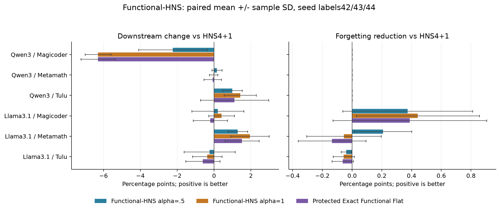

# Functional-HNS：两模型 × 三任务 × 三种子（2026-09-14）

状态：complete；368cells中已评分 368，完整同范围cohort 18/18；extension 308/308cells。更新时间UTC：2026-09-14T05:40:41.155491+00:00。

新增seed43/44共12个源checkpoint、36个新adapter。Qwen短测对照完全匹配，复用原LoRA/HNS及seed42；Llama短测111个样本的token不匹配，因此三seed的全部五方法与Base统一重新评测，seed42原pilot保留，不混用旧Llama成绩。GPU工作全部只使用一张B300，不重新训练。统一HNS4+1，functional α=0/.5/1，floor=.1 median(q)，原LoRA rank/alpha/scaling/target modules/base均不变。



Slurm作业 1023：COMPLETED，exit 0:0，用时 02:31:17；GPU已释放：True。

## 结果解读

- Functional-HNS α=0.5：Target ΔHNS +0.025 pp，Off ΔHNS -0.205 pp，FG reduction +0.091 pp；Target/Off Pareto改善 5/18。
- Functional-HNS α=1：Target ΔHNS -0.488 pp，Off ΔHNS -0.507 pp，FG reduction +0.055 pp；Target/Off Pareto改善 3/18。
- Protected Exact Functional Flat：Target ΔHNS -0.762 pp，Off ΔHNS -0.451 pp，FG reduction +0.032 pp；Target/Off Pareto改善 4/18。

## 方法、数据与协议

$\bar q_i=\max(q_i,0.1\operatorname{median}(q))$；$g_i=\sigma_i(\bar q_i/\operatorname{median}(q))^{\alpha/2}$；$\tilde\sigma_i=\mathrm{HNS}_{4+1}(g)_i/(\bar q_i/\operatorname{median}(q))^{\alpha/2}$；$t_i=\tilde\sigma_i\sum\sigma/\sum\tilde\sigma$。Protected Exact Functional Flat用$t_i\propto1/\sqrt{\bar q_i}$，恢复同一nuclear budget。固定源U/V与方向顺序；α0核验原HNS。

复用已经采集的源basis activation moments，256条训练分布SFT样本（含assistant响应）、最长512tokens、sampling seed42；generation seed同样固定42，不能随训练checkpoint seed改变。q依赖任务输入和adapter V，当前版本不属于data-free/task-data-free。编辑后PR用frozen Base缓存，是retrospective proxy。完整二阶矩PR与source方向能量PR分开报告。

HumanEval pass@1、GSM8K strict accuracy、IFEval prompt strict accuracy、Commonsense 8-task macro，完整复用三种子prompt/chat、生成参数、parser、metric和scripts。Retention/Off是其他三类任务百分成绩等权平均；FG是其他三类max(Base−adapter,0)再平均，FG越小越好。原Base/LoRA/HNS先做脚本、dataset、checkpoint哈希审计和四benchmark逐token短测试；不一致则同批重新生成全部对照。

max_num_seqs短测试4096起，长任务2048，short任务4096；65536 batched tokens，adapter block5；OOM逐级降低。同一个Slurm job只请求gpu:1，两个Base按顺序运行。

## 完整逐种子 downstream

| Base | Task | Seed | LoRA | HNS α=0 (4+1) | Functional-HNS α=0.5 | Functional-HNS α=1 | Protected Exact Functional Flat |
| --- | --- | --- | --- | --- | --- | --- | --- |
| Qwen3-8B | magicoder | 42 | 65.244 | 75.000 | 70.732 | 68.293 | 67.683 |
| Qwen3-8B | magicoder | 43 | 62.805 | 74.390 | 73.780 | 68.902 | 68.902 |
| Qwen3-8B | magicoder | 44 | 64.634 | 74.390 | 72.561 | 67.683 | 68.293 |
| Qwen3-8B | metamath | 42 | 84.155 | 88.173 | 88.249 | 87.945 | 87.566 |
| Qwen3-8B | metamath | 43 | 84.003 | 86.808 | 86.732 | 86.732 | 86.884 |
| Qwen3-8B | metamath | 44 | 84.003 | 87.415 | 87.870 | 87.642 | 87.718 |
| Qwen3-8B | tulu | 42 | 67.837 | 70.795 | 72.089 | 73.198 | 73.752 |
| Qwen3-8B | tulu | 43 | 66.174 | 72.458 | 72.828 | 73.198 | 71.719 |
| Qwen3-8B | tulu | 44 | 66.913 | 70.980 | 72.274 | 72.089 | 72.089 |
| Llama-3.1-8B-Instruct | magicoder | 42 | 53.659 | 54.878 | 54.268 | 54.878 | 54.878 |
| Llama-3.1-8B-Instruct | magicoder | 43 | 56.098 | 55.488 | 54.878 | 55.488 | 54.268 |
| Llama-3.1-8B-Instruct | magicoder | 44 | 53.659 | 53.659 | 55.488 | 54.878 | 54.268 |
| Llama-3.1-8B-Instruct | metamath | 42 | 77.104 | 80.667 | 81.350 | 81.425 | 81.122 |
| Llama-3.1-8B-Instruct | metamath | 43 | 75.057 | 78.393 | 79.985 | 81.122 | 80.440 |
| Llama-3.1-8B-Instruct | metamath | 44 | 74.450 | 78.999 | 80.591 | 81.350 | 81.046 |
| Llama-3.1-8B-Instruct | tulu | 42 | 63.216 | 64.880 | 65.989 | 64.880 | 65.250 |
| Llama-3.1-8B-Instruct | tulu | 43 | 62.847 | 65.250 | 63.586 | 63.956 | 64.510 |
| Llama-3.1-8B-Instruct | tulu | 44 | 62.107 | 64.880 | 64.695 | 65.065 | 63.401 |

## 完整逐种子 forgetting

| Base | Task | Seed | Method | Off | FG | Off ΔHNS | FG reduction vs HNS |
| --- | --- | --- | --- | --- | --- | --- | --- |
| Qwen3-8B | magicoder | 42 | LoRA | 77.798 | 1.900 | -3.535 | -1.900 |
| Qwen3-8B | magicoder | 42 | HNS α=0 (4+1) | 81.333 | 0.000 | 0.000 | 0.000 |
| Qwen3-8B | magicoder | 42 | Functional-HNS α=0.5 | 80.407 | 0.000 | -0.926 | 0.000 |
| Qwen3-8B | magicoder | 42 | Functional-HNS α=1 | 80.018 | 0.000 | -1.315 | 0.000 |
| Qwen3-8B | magicoder | 42 | Protected Exact Functional Flat | 79.967 | 0.000 | -1.366 | 0.000 |
| Qwen3-8B | magicoder | 43 | LoRA | 77.759 | 1.986 | -3.432 | -1.986 |
| Qwen3-8B | magicoder | 43 | HNS α=0 (4+1) | 81.191 | 0.000 | 0.000 | 0.000 |
| Qwen3-8B | magicoder | 43 | Functional-HNS α=0.5 | 80.825 | 0.000 | -0.367 | 0.000 |
| Qwen3-8B | magicoder | 43 | Functional-HNS α=1 | 80.184 | 0.000 | -1.007 | 0.000 |
| Qwen3-8B | magicoder | 43 | Protected Exact Functional Flat | 80.209 | 0.000 | -0.983 | 0.000 |
| Qwen3-8B | magicoder | 44 | LoRA | 78.553 | 1.111 | -2.704 | -1.111 |
| Qwen3-8B | magicoder | 44 | HNS α=0 (4+1) | 81.257 | 0.000 | 0.000 | 0.000 |
| Qwen3-8B | magicoder | 44 | Functional-HNS α=0.5 | 80.231 | 0.000 | -1.026 | 0.000 |
| Qwen3-8B | magicoder | 44 | Functional-HNS α=1 | 80.373 | 0.000 | -0.884 | 0.000 |
| Qwen3-8B | magicoder | 44 | Protected Exact Functional Flat | 80.314 | 0.000 | -0.944 | 0.000 |
| Qwen3-8B | metamath | 42 | LoRA | 71.293 | 1.799 | -3.627 | -1.799 |
| Qwen3-8B | metamath | 42 | HNS α=0 (4+1) | 74.920 | 0.000 | 0.000 | 0.000 |
| Qwen3-8B | metamath | 42 | Functional-HNS α=0.5 | 75.249 | 0.000 | 0.328 | 0.000 |
| Qwen3-8B | metamath | 42 | Functional-HNS α=1 | 75.925 | 0.000 | 1.004 | 0.000 |
| Qwen3-8B | metamath | 42 | Protected Exact Functional Flat | 75.703 | 0.000 | 0.783 | 0.000 |
| Qwen3-8B | metamath | 43 | LoRA | 69.666 | 3.523 | -6.985 | -3.523 |
| Qwen3-8B | metamath | 43 | HNS α=0 (4+1) | 76.650 | 0.000 | 0.000 | 0.000 |
| Qwen3-8B | metamath | 43 | Functional-HNS α=0.5 | 77.195 | 0.000 | 0.544 | 0.000 |
| Qwen3-8B | metamath | 43 | Functional-HNS α=1 | 77.689 | 0.000 | 1.039 | 0.000 |
| Qwen3-8B | metamath | 43 | Protected Exact Functional Flat | 77.517 | 0.000 | 0.866 | 0.000 |
| Qwen3-8B | metamath | 44 | LoRA | 63.515 | 9.522 | -10.745 | -9.522 |
| Qwen3-8B | metamath | 44 | HNS α=0 (4+1) | 74.259 | 0.000 | 0.000 | 0.000 |
| Qwen3-8B | metamath | 44 | Functional-HNS α=0.5 | 73.947 | 0.000 | -0.312 | 0.000 |
| Qwen3-8B | metamath | 44 | Functional-HNS α=1 | 74.417 | 0.000 | 0.158 | 0.000 |
| Qwen3-8B | metamath | 44 | Protected Exact Functional Flat | 74.787 | 0.000 | 0.528 | 0.000 |
| Qwen3-8B | tulu | 42 | LoRA | 86.018 | 0.000 | 0.655 | 0.000 |
| Qwen3-8B | tulu | 42 | HNS α=0 (4+1) | 85.363 | 0.000 | 0.000 | 0.000 |
| Qwen3-8B | tulu | 42 | Functional-HNS α=0.5 | 85.448 | 0.000 | 0.086 | 0.000 |
| Qwen3-8B | tulu | 42 | Functional-HNS α=1 | 84.976 | 0.000 | -0.387 | 0.000 |
| Qwen3-8B | tulu | 42 | Protected Exact Functional Flat | 84.779 | 0.000 | -0.584 | 0.000 |
| Qwen3-8B | tulu | 43 | LoRA | 85.125 | 0.000 | 0.171 | 0.000 |
| Qwen3-8B | tulu | 43 | HNS α=0 (4+1) | 84.954 | 0.000 | 0.000 | 0.000 |
| Qwen3-8B | tulu | 43 | Functional-HNS α=0.5 | 84.573 | 0.000 | -0.380 | 0.000 |
| Qwen3-8B | tulu | 43 | Functional-HNS α=1 | 84.579 | 0.000 | -0.374 | 0.000 |
| Qwen3-8B | tulu | 43 | Protected Exact Functional Flat | 84.346 | 0.000 | -0.608 | 0.000 |
| Qwen3-8B | tulu | 44 | LoRA | 85.738 | 0.000 | 1.262 | 0.000 |
| Qwen3-8B | tulu | 44 | HNS α=0 (4+1) | 84.476 | 0.000 | 0.000 | 0.000 |
| Qwen3-8B | tulu | 44 | Functional-HNS α=0.5 | 84.544 | 0.000 | 0.068 | 0.000 |
| Qwen3-8B | tulu | 44 | Functional-HNS α=1 | 82.948 | 0.000 | -1.528 | 0.000 |
| Qwen3-8B | tulu | 44 | Protected Exact Functional Flat | 83.154 | 0.000 | -1.322 | 0.000 |
| Llama-3.1-8B-Instruct | magicoder | 42 | LoRA | 60.320 | 4.978 | -4.473 | -4.069 |
| Llama-3.1-8B-Instruct | magicoder | 42 | HNS α=0 (4+1) | 64.793 | 0.910 | 0.000 | 0.000 |
| Llama-3.1-8B-Instruct | magicoder | 42 | Functional-HNS α=0.5 | 64.278 | 1.020 | -0.514 | -0.110 |
| Llama-3.1-8B-Instruct | magicoder | 42 | Functional-HNS α=1 | 65.231 | 0.876 | 0.438 | 0.033 |
| Llama-3.1-8B-Instruct | magicoder | 42 | Protected Exact Functional Flat | 64.930 | 1.102 | 0.137 | -0.192 |
| Llama-3.1-8B-Instruct | magicoder | 43 | LoRA | 60.943 | 4.810 | -5.085 | -3.208 |
| Llama-3.1-8B-Instruct | magicoder | 43 | HNS α=0 (4+1) | 66.028 | 1.602 | 0.000 | 0.000 |
| Llama-3.1-8B-Instruct | magicoder | 43 | Functional-HNS α=0.5 | 66.164 | 0.863 | 0.136 | 0.739 |
| Llama-3.1-8B-Instruct | magicoder | 43 | Functional-HNS α=1 | 65.739 | 0.739 | -0.289 | 0.863 |
| Llama-3.1-8B-Instruct | magicoder | 43 | Protected Exact Functional Flat | 65.830 | 0.801 | -0.198 | 0.801 |
| Llama-3.1-8B-Instruct | magicoder | 44 | LoRA | 62.333 | 4.002 | -4.251 | -2.646 |
| Llama-3.1-8B-Instruct | magicoder | 44 | HNS α=0 (4+1) | 66.584 | 1.356 | 0.000 | 0.000 |
| Llama-3.1-8B-Instruct | magicoder | 44 | Functional-HNS α=0.5 | 66.470 | 0.863 | -0.114 | 0.493 |
| Llama-3.1-8B-Instruct | magicoder | 44 | Functional-HNS α=1 | 65.958 | 0.924 | -0.626 | 0.431 |
| Llama-3.1-8B-Instruct | magicoder | 44 | Protected Exact Functional Flat | 66.213 | 0.801 | -0.371 | 0.555 |
| Llama-3.1-8B-Instruct | metamath | 42 | LoRA | 57.884 | 4.705 | -5.454 | -3.015 |
| Llama-3.1-8B-Instruct | metamath | 42 | HNS α=0 (4+1) | 63.338 | 1.690 | 0.000 | 0.000 |
| Llama-3.1-8B-Instruct | metamath | 42 | Functional-HNS α=0.5 | 63.310 | 1.312 | -0.028 | 0.378 |
| Llama-3.1-8B-Instruct | metamath | 42 | Functional-HNS α=1 | 62.545 | 1.467 | -0.793 | 0.223 |
| Llama-3.1-8B-Instruct | metamath | 42 | Protected Exact Functional Flat | 62.305 | 1.910 | -1.033 | -0.220 |
| Llama-3.1-8B-Instruct | metamath | 43 | LoRA | 58.245 | 4.141 | -4.048 | -3.895 |
| Llama-3.1-8B-Instruct | metamath | 43 | HNS α=0 (4+1) | 62.293 | 0.246 | 0.000 | 0.000 |
| Llama-3.1-8B-Instruct | metamath | 43 | Functional-HNS α=0.5 | 63.198 | 0.000 | 0.905 | 0.246 |
| Llama-3.1-8B-Instruct | metamath | 43 | Functional-HNS α=1 | 61.977 | 0.511 | -0.316 | -0.265 |
| Llama-3.1-8B-Instruct | metamath | 43 | Protected Exact Functional Flat | 62.343 | 0.123 | 0.050 | 0.123 |
| Llama-3.1-8B-Instruct | metamath | 44 | LoRA | 59.646 | 3.350 | -2.853 | -3.288 |
| Llama-3.1-8B-Instruct | metamath | 44 | HNS α=0 (4+1) | 62.498 | 0.062 | 0.000 | 0.000 |
| Llama-3.1-8B-Instruct | metamath | 44 | Functional-HNS α=0.5 | 62.955 | 0.062 | 0.456 | 0.000 |
| Llama-3.1-8B-Instruct | metamath | 44 | Functional-HNS α=1 | 62.652 | 0.185 | 0.154 | -0.123 |
| Llama-3.1-8B-Instruct | metamath | 44 | Protected Exact Functional Flat | 62.254 | 0.370 | -0.244 | -0.308 |
| Llama-3.1-8B-Instruct | tulu | 42 | LoRA | 63.826 | 1.908 | -2.589 | -1.580 |
| Llama-3.1-8B-Instruct | tulu | 42 | HNS α=0 (4+1) | 66.415 | 0.328 | 0.000 | 0.000 |
| Llama-3.1-8B-Instruct | tulu | 42 | Functional-HNS α=0.5 | 65.703 | 0.382 | -0.713 | -0.053 |
| Llama-3.1-8B-Instruct | tulu | 42 | Functional-HNS α=1 | 64.301 | 0.338 | -2.114 | -0.009 |
| Llama-3.1-8B-Instruct | tulu | 42 | Protected Exact Functional Flat | 64.750 | 0.345 | -1.666 | -0.016 |
| Llama-3.1-8B-Instruct | tulu | 43 | LoRA | 67.566 | 0.000 | -0.120 | 0.000 |
| Llama-3.1-8B-Instruct | tulu | 43 | HNS α=0 (4+1) | 67.686 | 0.000 | 0.000 | 0.000 |
| Llama-3.1-8B-Instruct | tulu | 43 | Functional-HNS α=0.5 | 66.234 | 0.000 | -1.452 | 0.000 |
| Llama-3.1-8B-Instruct | tulu | 43 | Functional-HNS α=1 | 66.565 | 0.022 | -1.121 | -0.022 |
| Llama-3.1-8B-Instruct | tulu | 43 | Protected Exact Functional Flat | 67.193 | 0.029 | -0.493 | -0.029 |
| Llama-3.1-8B-Instruct | tulu | 44 | LoRA | 65.696 | 1.011 | -0.512 | -1.011 |
| Llama-3.1-8B-Instruct | tulu | 44 | HNS α=0 (4+1) | 66.208 | 0.000 | 0.000 | 0.000 |
| Llama-3.1-8B-Instruct | tulu | 44 | Functional-HNS α=0.5 | 65.821 | 0.064 | -0.387 | -0.064 |
| Llama-3.1-8B-Instruct | tulu | 44 | Functional-HNS α=1 | 65.036 | 0.139 | -1.172 | -0.139 |
| Llama-3.1-8B-Instruct | tulu | 44 | Protected Exact Functional Flat | 65.537 | 0.146 | -0.672 | -0.146 |

## 三种子 mean ± sample SD

| Base | Task | Method | Target | Off | FG |
| --- | --- | --- | --- | --- | --- |
| Qwen3-8B | magicoder | LoRA | 64.228 ± 1.269 | 78.037 ± 0.448 | 1.666 ± 0.483 |
| Qwen3-8B | magicoder | HNS α=0 (4+1) | 74.593 ± 0.352 | 81.261 ± 0.071 | 0.000 ± 0.000 |
| Qwen3-8B | magicoder | Functional-HNS α=0.5 | 72.358 ± 1.535 | 80.488 ± 0.305 | 0.000 ± 0.000 |
| Qwen3-8B | magicoder | Functional-HNS α=1 | 68.293 ± 0.610 | 80.192 ± 0.178 | 0.000 ± 0.000 |
| Qwen3-8B | magicoder | Protected Exact Functional Flat | 68.293 ± 0.610 | 80.163 ± 0.178 | 0.000 ± 0.000 |
| Qwen3-8B | metamath | LoRA | 84.054 ± 0.088 | 68.158 ± 4.103 | 4.948 ± 4.054 |
| Qwen3-8B | metamath | HNS α=0 (4+1) | 87.465 ± 0.684 | 75.277 ± 1.235 | 0.000 ± 0.000 |
| Qwen3-8B | metamath | Functional-HNS α=0.5 | 87.617 ± 0.789 | 75.464 ± 1.634 | 0.000 ± 0.000 |
| Qwen3-8B | metamath | Functional-HNS α=1 | 87.440 ± 0.631 | 76.010 ± 1.638 | 0.000 ± 0.000 |
| Qwen3-8B | metamath | Protected Exact Functional Flat | 87.389 ± 0.444 | 76.002 ± 1.389 | 0.000 ± 0.000 |
| Qwen3-8B | tulu | LoRA | 66.975 ± 0.834 | 85.627 ± 0.457 | 0.000 ± 0.000 |
| Qwen3-8B | tulu | HNS α=0 (4+1) | 71.411 ± 0.912 | 84.931 ± 0.444 | 0.000 ± 0.000 |
| Qwen3-8B | tulu | Functional-HNS α=0.5 | 72.397 ± 0.385 | 84.855 ± 0.514 | 0.000 ± 0.000 |
| Qwen3-8B | tulu | Functional-HNS α=1 | 72.828 ± 0.640 | 84.168 ± 1.075 | 0.000 ± 0.000 |
| Qwen3-8B | tulu | Protected Exact Functional Flat | 72.520 ± 1.083 | 84.093 ± 0.842 | 0.000 ± 0.000 |
| Llama-3.1-8B-Instruct | magicoder | LoRA | 54.472 ± 1.408 | 61.198 ± 1.030 | 4.597 ± 0.522 |
| Llama-3.1-8B-Instruct | magicoder | HNS α=0 (4+1) | 54.675 ± 0.931 | 65.802 ± 0.917 | 1.289 ± 0.351 |
| Llama-3.1-8B-Instruct | magicoder | Functional-HNS α=0.5 | 54.878 ± 0.610 | 65.638 ± 1.187 | 0.915 ± 0.091 |
| Llama-3.1-8B-Instruct | magicoder | Functional-HNS α=1 | 55.081 ± 0.352 | 65.643 ± 0.373 | 0.847 ± 0.096 |
| Llama-3.1-8B-Instruct | magicoder | Protected Exact Functional Flat | 54.472 ± 0.352 | 65.657 ± 0.659 | 0.901 ± 0.174 |
| Llama-3.1-8B-Instruct | metamath | LoRA | 75.537 ± 1.390 | 58.591 ± 0.931 | 4.066 ± 0.681 |
| Llama-3.1-8B-Instruct | metamath | HNS α=0 (4+1) | 79.353 ± 1.178 | 62.710 ± 0.554 | 0.666 ± 0.892 |
| Llama-3.1-8B-Instruct | metamath | Functional-HNS α=0.5 | 80.642 ± 0.684 | 63.154 ± 0.182 | 0.458 ± 0.740 |
| Llama-3.1-8B-Instruct | metamath | Functional-HNS α=1 | 81.299 ± 0.158 | 62.391 ± 0.363 | 0.721 ± 0.666 |
| Llama-3.1-8B-Instruct | metamath | Protected Exact Functional Flat | 80.869 ± 0.374 | 62.301 ± 0.044 | 0.801 ± 0.969 |
| Llama-3.1-8B-Instruct | tulu | LoRA | 62.723 ± 0.565 | 65.696 ± 1.870 | 0.973 ± 0.955 |
| Llama-3.1-8B-Instruct | tulu | HNS α=0 (4+1) | 65.003 ± 0.213 | 66.770 ± 0.800 | 0.109 ± 0.190 |
| Llama-3.1-8B-Instruct | tulu | Functional-HNS α=0.5 | 64.757 ± 1.203 | 65.919 ± 0.279 | 0.149 ± 0.204 |
| Llama-3.1-8B-Instruct | tulu | Functional-HNS α=1 | 64.633 ± 0.594 | 65.301 ± 1.155 | 0.166 ± 0.159 |
| Llama-3.1-8B-Instruct | tulu | Protected Exact Functional Flat | 64.387 ± 0.930 | 65.827 ± 1.247 | 0.173 ± 0.160 |

## 同范围完整cohort汇总

| Method | n | Target | ΔLoRA | ΔHNS | Off | Off ΔHNS | FG | FG reduction vs HNS | Target vs HNS W/T/L | FG vs HNS W/T/L |
| --- | --- | --- | --- | --- | --- | --- | --- | --- | --- | --- |
| LoRA | 18 | 67.998 | 0.000 | -4.085 | 69.551 | -3.240 | 2.708 | -2.364 | [1, 1, 16] | [0, 4, 14] |
| HNS α=0 (4+1) | 18 | 72.083 | 4.085 | 0.000 | 72.792 | 0.000 | 0.344 | 0.000 | [0, 18, 0] | [0, 18, 0] |
| Functional-HNS α=0.5 | 18 | 72.108 | 4.110 | 0.025 | 72.586 | -0.205 | 0.254 | 0.091 | [10, 0, 8] | [4, 11, 3] |
| Functional-HNS α=1 | 18 | 71.596 | 3.598 | -0.488 | 72.284 | -0.507 | 0.289 | 0.055 | [9, 3, 6] | [4, 9, 5] |
| Protected Exact Functional Flat | 18 | 71.322 | 3.324 | -0.762 | 72.340 | -0.451 | 0.313 | 0.032 | [9, 1, 8] | [3, 9, 6] |

表中均值跨benchmark等权，仅作描述性比较；未齐全cohort不进入方法比较。所有vs LoRA/HNS的Target/Off/FG win/tie/loss、per-base/task/seed统计见method_summary.tsv、grouped_summary.tsv。

## Per-base / per-task / per-seed均值

| Group | Method | n | Target | ΔHNS | Off | Off ΔHNS | FG | FG reduction vs HNS |
| --- | --- | --- | --- | --- | --- | --- | --- | --- |
| base/Qwen3-8B | LoRA | 9 | 71.752 | -6.071 | 77.274 | -3.216 | 2.205 | -2.205 |
| base/Qwen3-8B | HNS α=0 (4+1) | 9 | 77.823 | 0.000 | 80.489 | 0.000 | 0.000 | 0.000 |
| base/Qwen3-8B | Functional-HNS α=0.5 | 9 | 77.457 | -0.366 | 80.269 | -0.220 | 0.000 | 0.000 |
| base/Qwen3-8B | Functional-HNS α=1 | 9 | 76.187 | -1.636 | 80.123 | -0.366 | 0.000 | 0.000 |
| base/Qwen3-8B | Protected Exact Functional Flat | 9 | 76.067 | -1.756 | 80.086 | -0.403 | 0.000 | 0.000 |
| base/Llama-3.1-8B-Instruct | LoRA | 9 | 64.244 | -2.100 | 61.829 | -3.265 | 3.212 | -2.524 |
| base/Llama-3.1-8B-Instruct | HNS α=0 (4+1) | 9 | 66.344 | 0.000 | 65.094 | 0.000 | 0.688 | 0.000 |
| base/Llama-3.1-8B-Instruct | Functional-HNS α=0.5 | 9 | 66.759 | 0.415 | 64.904 | -0.190 | 0.507 | 0.181 |
| base/Llama-3.1-8B-Instruct | Functional-HNS α=1 | 9 | 67.005 | 0.661 | 64.445 | -0.649 | 0.578 | 0.110 |
| base/Llama-3.1-8B-Instruct | Protected Exact Functional Flat | 9 | 66.576 | 0.232 | 64.595 | -0.499 | 0.625 | 0.063 |
| task/magicoder | LoRA | 6 | 59.350 | -5.285 | 69.618 | -3.914 | 3.131 | -2.487 |
| task/magicoder | HNS α=0 (4+1) | 6 | 64.634 | 0.000 | 73.531 | 0.000 | 0.645 | 0.000 |
| task/magicoder | Functional-HNS α=0.5 | 6 | 63.618 | -1.016 | 73.063 | -0.468 | 0.457 | 0.187 |
| task/magicoder | Functional-HNS α=1 | 6 | 61.687 | -2.947 | 72.917 | -0.614 | 0.423 | 0.221 |
| task/magicoder | Protected Exact Functional Flat | 6 | 61.382 | -3.252 | 72.910 | -0.621 | 0.451 | 0.194 |
| task/metamath | LoRA | 6 | 79.795 | -3.614 | 63.374 | -5.619 | 4.507 | -4.174 |
| task/metamath | HNS α=0 (4+1) | 6 | 83.409 | 0.000 | 68.993 | 0.000 | 0.333 | 0.000 |
| task/metamath | Functional-HNS α=0.5 | 6 | 84.129 | 0.720 | 69.309 | 0.316 | 0.229 | 0.104 |
| task/metamath | Functional-HNS α=1 | 6 | 84.369 | 0.960 | 69.201 | 0.208 | 0.361 | -0.028 |
| task/metamath | Protected Exact Functional Flat | 6 | 84.129 | 0.720 | 69.151 | 0.158 | 0.401 | -0.068 |
| task/tulu | LoRA | 6 | 64.849 | -3.358 | 75.662 | -0.189 | 0.486 | -0.432 |
| task/tulu | HNS α=0 (4+1) | 6 | 68.207 | 0.000 | 75.850 | 0.000 | 0.055 | 0.000 |
| task/tulu | Functional-HNS α=0.5 | 6 | 68.577 | 0.370 | 75.387 | -0.463 | 0.074 | -0.020 |
| task/tulu | Functional-HNS α=1 | 6 | 68.731 | 0.524 | 74.734 | -1.116 | 0.083 | -0.028 |
| task/tulu | Protected Exact Functional Flat | 6 | 68.453 | 0.246 | 74.960 | -0.891 | 0.087 | -0.032 |
| seed/42 | LoRA | 6 | 68.536 | -3.863 | 69.523 | -3.171 | 2.548 | -2.060 |
| seed/42 | HNS α=0 (4+1) | 6 | 72.399 | 0.000 | 72.694 | 0.000 | 0.488 | 0.000 |
| seed/42 | Functional-HNS α=0.5 | 6 | 72.113 | -0.286 | 72.399 | -0.295 | 0.452 | 0.036 |
| seed/42 | Functional-HNS α=1 | 6 | 71.770 | -0.629 | 72.166 | -0.528 | 0.447 | 0.041 |
| seed/42 | Protected Exact Functional Flat | 6 | 71.709 | -0.690 | 72.072 | -0.622 | 0.559 | -0.071 |
| seed/43 | LoRA | 6 | 67.830 | -4.301 | 69.884 | -3.250 | 2.410 | -2.102 |
| seed/43 | HNS α=0 (4+1) | 6 | 72.131 | 0.000 | 73.134 | 0.000 | 0.308 | 0.000 |
| seed/43 | Functional-HNS α=0.5 | 6 | 71.965 | -0.166 | 73.031 | -0.102 | 0.144 | 0.164 |
| seed/43 | Functional-HNS α=1 | 6 | 71.566 | -0.565 | 72.789 | -0.345 | 0.212 | 0.096 |
| seed/43 | Protected Exact Functional Flat | 6 | 71.121 | -1.011 | 72.906 | -0.227 | 0.159 | 0.149 |
| seed/44 | LoRA | 6 | 67.628 | -4.093 | 69.247 | -3.300 | 3.166 | -2.930 |
| seed/44 | HNS α=0 (4+1) | 6 | 71.720 | 0.000 | 72.547 | 0.000 | 0.236 | 0.000 |
| seed/44 | Functional-HNS α=0.5 | 6 | 72.246 | 0.526 | 72.328 | -0.219 | 0.165 | 0.071 |
| seed/44 | Functional-HNS α=1 | 6 | 71.451 | -0.269 | 71.897 | -0.650 | 0.208 | 0.028 |
| seed/44 | Protected Exact Functional Flat | 6 | 71.136 | -0.585 | 72.043 | -0.504 | 0.219 | 0.017 |

## 全部四benchmark原始成绩

| Base | Task | Seed | Method | magicoder | metamath | tulu | commonsense |
| --- | --- | --- | --- | --- | --- | --- | --- |
| Qwen3-8B | magicoder | 42 | LoRA | 65.244 | 83.927 | 65.804 | 83.662 |
| Qwen3-8B | magicoder | 42 | HNS α=0 (4+1) | 75.000 | 88.628 | 71.719 | 83.653 |
| Qwen3-8B | magicoder | 42 | Functional-HNS α=0.5 | 70.732 | 87.794 | 70.240 | 83.188 |
| Qwen3-8B | magicoder | 42 | Functional-HNS α=1 | 68.293 | 86.657 | 70.425 | 82.973 |
| Qwen3-8B | magicoder | 42 | Protected Exact Functional Flat | 67.683 | 86.277 | 70.610 | 83.014 |
| Qwen3-8B | magicoder | 43 | LoRA | 62.805 | 82.563 | 66.913 | 83.803 |
| Qwen3-8B | magicoder | 43 | HNS α=0 (4+1) | 74.390 | 88.779 | 71.349 | 83.445 |
| Qwen3-8B | magicoder | 43 | Functional-HNS α=0.5 | 73.780 | 88.021 | 71.165 | 83.288 |
| Qwen3-8B | magicoder | 43 | Functional-HNS α=1 | 68.902 | 86.732 | 70.795 | 83.026 |
| Qwen3-8B | magicoder | 43 | Protected Exact Functional Flat | 68.902 | 86.808 | 70.795 | 83.023 |
| Qwen3-8B | magicoder | 44 | LoRA | 64.634 | 84.079 | 68.022 | 83.558 |
| Qwen3-8B | magicoder | 44 | HNS α=0 (4+1) | 74.390 | 89.310 | 70.980 | 83.482 |
| Qwen3-8B | magicoder | 44 | Functional-HNS α=0.5 | 72.561 | 87.870 | 69.686 | 83.139 |
| Qwen3-8B | magicoder | 44 | Functional-HNS α=1 | 67.683 | 87.036 | 71.165 | 82.919 |
| Qwen3-8B | magicoder | 44 | Protected Exact Functional Flat | 68.293 | 86.353 | 71.534 | 83.053 |
| Qwen3-8B | metamath | 42 | LoRA | 64.024 | 84.155 | 66.728 | 83.127 |
| Qwen3-8B | metamath | 42 | HNS α=0 (4+1) | 67.683 | 88.173 | 72.458 | 84.620 |
| Qwen3-8B | metamath | 42 | Functional-HNS α=0.5 | 69.512 | 88.249 | 71.719 | 84.515 |
| Qwen3-8B | metamath | 42 | Functional-HNS α=1 | 71.341 | 87.945 | 72.089 | 84.344 |
| Qwen3-8B | metamath | 42 | Protected Exact Functional Flat | 69.512 | 87.566 | 73.383 | 84.214 |
| Qwen3-8B | metamath | 43 | LoRA | 57.927 | 84.003 | 67.652 | 83.417 |
| Qwen3-8B | metamath | 43 | HNS α=0 (4+1) | 73.171 | 86.808 | 72.089 | 84.692 |
| Qwen3-8B | metamath | 43 | Functional-HNS α=0.5 | 75.610 | 86.732 | 71.534 | 84.441 |
| Qwen3-8B | metamath | 43 | Functional-HNS α=1 | 78.049 | 86.732 | 70.795 | 84.224 |
| Qwen3-8B | metamath | 43 | Protected Exact Functional Flat | 76.829 | 86.884 | 71.534 | 84.187 |
| Qwen3-8B | metamath | 44 | LoRA | 40.854 | 84.003 | 66.728 | 82.962 |
| Qwen3-8B | metamath | 44 | HNS α=0 (4+1) | 67.683 | 87.415 | 70.610 | 84.485 |
| Qwen3-8B | metamath | 44 | Functional-HNS α=0.5 | 66.463 | 87.870 | 70.980 | 84.399 |
| Qwen3-8B | metamath | 44 | Functional-HNS α=1 | 67.073 | 87.642 | 71.904 | 84.274 |
| Qwen3-8B | metamath | 44 | Protected Exact Functional Flat | 68.902 | 87.718 | 71.165 | 84.294 |
| Qwen3-8B | tulu | 42 | LoRA | 84.756 | 89.007 | 67.837 | 84.291 |
| Qwen3-8B | tulu | 42 | HNS α=0 (4+1) | 82.927 | 88.704 | 70.795 | 84.458 |
| Qwen3-8B | tulu | 42 | Functional-HNS α=0.5 | 83.537 | 88.400 | 72.089 | 84.408 |
| Qwen3-8B | tulu | 42 | Functional-HNS α=1 | 81.707 | 89.007 | 73.198 | 84.214 |
| Qwen3-8B | tulu | 42 | Protected Exact Functional Flat | 81.098 | 88.931 | 73.752 | 84.308 |
| Qwen3-8B | tulu | 43 | LoRA | 81.707 | 89.158 | 66.174 | 84.508 |
| Qwen3-8B | tulu | 43 | HNS α=0 (4+1) | 80.488 | 89.765 | 72.458 | 84.608 |
| Qwen3-8B | tulu | 43 | Functional-HNS α=0.5 | 79.878 | 89.310 | 72.828 | 84.532 |
| Qwen3-8B | tulu | 43 | Functional-HNS α=1 | 80.488 | 88.855 | 73.198 | 84.395 |
| Qwen3-8B | tulu | 43 | Protected Exact Functional Flat | 79.878 | 88.779 | 71.719 | 84.381 |
| Qwen3-8B | tulu | 44 | LoRA | 84.146 | 88.704 | 66.913 | 84.364 |
| Qwen3-8B | tulu | 44 | HNS α=0 (4+1) | 80.488 | 88.400 | 70.980 | 84.540 |
| Qwen3-8B | tulu | 44 | Functional-HNS α=0.5 | 80.488 | 88.779 | 72.274 | 84.364 |
| Qwen3-8B | tulu | 44 | Functional-HNS α=1 | 75.610 | 88.855 | 72.089 | 84.379 |
| Qwen3-8B | tulu | 44 | Protected Exact Functional Flat | 76.220 | 88.855 | 72.089 | 84.387 |
| Llama-3.1-8B-Instruct | magicoder | 42 | LoRA | 53.659 | 56.406 | 55.453 | 69.100 |
| Llama-3.1-8B-Instruct | magicoder | 42 | HNS α=0 (4+1) | 54.878 | 63.609 | 60.444 | 70.326 |
| Llama-3.1-8B-Instruct | magicoder | 42 | Functional-HNS α=0.5 | 54.268 | 61.941 | 60.259 | 70.636 |
| Llama-3.1-8B-Instruct | magicoder | 42 | Functional-HNS α=1 | 54.878 | 64.822 | 60.074 | 70.796 |
| Llama-3.1-8B-Instruct | magicoder | 42 | Protected Exact Functional Flat | 54.878 | 64.594 | 59.519 | 70.675 |
| Llama-3.1-8B-Instruct | magicoder | 43 | LoRA | 56.098 | 63.760 | 48.059 | 71.009 |
| Llama-3.1-8B-Instruct | magicoder | 43 | HNS α=0 (4+1) | 55.488 | 68.613 | 57.301 | 72.170 |
| Llama-3.1-8B-Instruct | magicoder | 43 | Functional-HNS α=0.5 | 54.878 | 66.945 | 59.519 | 72.027 |
| Llama-3.1-8B-Instruct | magicoder | 43 | Functional-HNS α=1 | 55.488 | 65.580 | 59.889 | 71.748 |
| Llama-3.1-8B-Instruct | magicoder | 43 | Protected Exact Functional Flat | 54.268 | 66.187 | 59.704 | 71.599 |
| Llama-3.1-8B-Instruct | magicoder | 44 | LoRA | 53.659 | 65.504 | 50.277 | 71.217 |
| Llama-3.1-8B-Instruct | magicoder | 44 | HNS α=0 (4+1) | 53.659 | 69.750 | 58.041 | 71.961 |
| Llama-3.1-8B-Instruct | magicoder | 44 | Functional-HNS α=0.5 | 55.488 | 67.854 | 59.519 | 72.037 |
| Llama-3.1-8B-Instruct | magicoder | 44 | Functional-HNS α=1 | 54.878 | 66.566 | 59.335 | 71.974 |
| Llama-3.1-8B-Instruct | magicoder | 44 | Protected Exact Functional Flat | 54.268 | 66.945 | 59.704 | 71.989 |
| Llama-3.1-8B-Instruct | metamath | 42 | LoRA | 54.268 | 77.104 | 54.344 | 65.039 |
| Llama-3.1-8B-Instruct | metamath | 42 | HNS α=0 (4+1) | 61.585 | 80.667 | 58.780 | 69.649 |
| Llama-3.1-8B-Instruct | metamath | 42 | Functional-HNS α=0.5 | 60.366 | 81.350 | 59.889 | 69.675 |
| Llama-3.1-8B-Instruct | metamath | 42 | Functional-HNS α=1 | 58.537 | 81.425 | 59.335 | 69.762 |
| Llama-3.1-8B-Instruct | metamath | 42 | Protected Exact Functional Flat | 59.146 | 81.122 | 57.856 | 69.912 |
| Llama-3.1-8B-Instruct | metamath | 43 | LoRA | 53.659 | 75.057 | 57.301 | 63.774 |
| Llama-3.1-8B-Instruct | metamath | 43 | HNS α=0 (4+1) | 53.659 | 78.393 | 61.368 | 71.851 |
| Llama-3.1-8B-Instruct | metamath | 43 | Functional-HNS α=0.5 | 53.659 | 79.985 | 63.031 | 72.903 |
| Llama-3.1-8B-Instruct | metamath | 43 | Functional-HNS α=1 | 51.829 | 81.122 | 61.183 | 72.918 |
| Llama-3.1-8B-Instruct | metamath | 43 | Protected Exact Functional Flat | 52.439 | 80.440 | 61.738 | 72.852 |
| Llama-3.1-8B-Instruct | metamath | 44 | LoRA | 55.488 | 74.450 | 59.335 | 64.114 |
| Llama-3.1-8B-Instruct | metamath | 44 | HNS α=0 (4+1) | 53.659 | 78.999 | 61.922 | 71.913 |
| Llama-3.1-8B-Instruct | metamath | 44 | Functional-HNS α=0.5 | 54.268 | 80.591 | 61.922 | 72.673 |
| Llama-3.1-8B-Instruct | metamath | 44 | Functional-HNS α=1 | 53.659 | 81.350 | 61.553 | 72.746 |
| Llama-3.1-8B-Instruct | metamath | 44 | Protected Exact Functional Flat | 53.049 | 81.046 | 60.998 | 72.716 |
| Llama-3.1-8B-Instruct | tulu | 42 | LoRA | 63.415 | 56.785 | 63.216 | 71.278 |
| Llama-3.1-8B-Instruct | tulu | 42 | HNS α=0 (4+1) | 62.805 | 66.035 | 64.880 | 70.407 |
| Llama-3.1-8B-Instruct | tulu | 42 | Functional-HNS α=0.5 | 61.585 | 65.277 | 65.989 | 70.246 |
| Llama-3.1-8B-Instruct | tulu | 42 | Functional-HNS α=1 | 58.537 | 63.988 | 64.880 | 70.379 |
| Llama-3.1-8B-Instruct | tulu | 42 | Protected Exact Functional Flat | 59.146 | 64.746 | 65.250 | 70.357 |
| Llama-3.1-8B-Instruct | tulu | 43 | LoRA | 64.024 | 64.898 | 62.847 | 73.776 |
| Llama-3.1-8B-Instruct | tulu | 43 | HNS α=0 (4+1) | 63.415 | 67.248 | 65.250 | 72.395 |
| Llama-3.1-8B-Instruct | tulu | 43 | Functional-HNS α=0.5 | 59.756 | 67.172 | 63.586 | 71.773 |
| Llama-3.1-8B-Instruct | tulu | 43 | Functional-HNS α=1 | 59.756 | 68.613 | 63.956 | 71.325 |
| Llama-3.1-8B-Instruct | tulu | 43 | Protected Exact Functional Flat | 61.585 | 68.688 | 64.510 | 71.305 |
| Llama-3.1-8B-Instruct | tulu | 44 | LoRA | 64.024 | 59.363 | 62.107 | 73.701 |
| Llama-3.1-8B-Instruct | tulu | 44 | HNS α=0 (4+1) | 62.805 | 64.064 | 64.880 | 71.756 |
| Llama-3.1-8B-Instruct | tulu | 44 | Functional-HNS α=0.5 | 63.415 | 62.851 | 64.695 | 71.199 |
| Llama-3.1-8B-Instruct | tulu | 44 | Functional-HNS α=1 | 61.585 | 62.547 | 65.065 | 70.975 |
| Llama-3.1-8B-Instruct | tulu | 44 | Protected Exact Functional Flat | 62.805 | 62.851 | 63.401 | 70.954 |

## 功能谱与编辑剂量

| Base | Task | Seed | Method | Raw PR | Protected PR | Full-moment PR | RMS ratio | Energy ratio | Fro ratio | Max gain | Floor fraction |
| --- | --- | --- | --- | --- | --- | --- | --- | --- | --- | --- | --- |
| Qwen3-8B | magicoder | 42 | LoRA | 1.045 | 1.045 | 1.036 | 1.000 | 1.000 | 1.000 | 1.000 | 0.001 |
| Qwen3-8B | magicoder | 42 | HNS α=0 (4+1) | 2.436 | 2.436 | 2.019 | 0.141 | 0.020 | 0.522 | 16.870 | 0.001 |
| Qwen3-8B | magicoder | 42 | Functional-HNS α=0.5 | 8.916 | 8.916 | 5.781 | 0.076 | 0.006 | 0.531 | 10.085 | 0.001 |
| Qwen3-8B | magicoder | 42 | Functional-HNS α=1 | 15.970 | 15.970 | 11.955 | 0.064 | 0.004 | 0.543 | 7.404 | 0.001 |
| Qwen3-8B | magicoder | 42 | Protected Exact Functional Flat | 16.000 | 16.000 | 12.096 | 0.062 | 0.004 | 0.544 | 35.870 | 0.001 |
| Qwen3-8B | magicoder | 43 | LoRA | 1.077 | 1.077 | 1.052 | 1.000 | 1.000 | 1.000 | 1.000 | 0.001 |
| Qwen3-8B | magicoder | 43 | HNS α=0 (4+1) | 2.676 | 2.676 | 2.138 | 0.160 | 0.026 | 0.601 | 17.636 | 0.001 |
| Qwen3-8B | magicoder | 43 | Functional-HNS α=0.5 | 9.426 | 9.426 | 5.938 | 0.089 | 0.008 | 0.611 | 10.294 | 0.001 |
| Qwen3-8B | magicoder | 43 | Functional-HNS α=1 | 15.971 | 15.971 | 12.102 | 0.076 | 0.006 | 0.625 | 7.417 | 0.001 |
| Qwen3-8B | magicoder | 43 | Protected Exact Functional Flat | 16.000 | 16.000 | 12.126 | 0.073 | 0.005 | 0.626 | 35.984 | 0.001 |
| Qwen3-8B | magicoder | 44 | LoRA | 1.062 | 1.062 | 1.039 | 1.000 | 1.000 | 1.000 | 1.000 | 0.001 |
| Qwen3-8B | magicoder | 44 | HNS α=0 (4+1) | 2.644 | 2.644 | 2.157 | 0.158 | 0.025 | 0.602 | 16.372 | 0.001 |
| Qwen3-8B | magicoder | 44 | Functional-HNS α=0.5 | 9.328 | 9.328 | 6.147 | 0.087 | 0.007 | 0.612 | 13.354 | 0.001 |
| Qwen3-8B | magicoder | 44 | Functional-HNS α=1 | 15.969 | 15.969 | 12.209 | 0.073 | 0.005 | 0.626 | 7.147 | 0.001 |
| Qwen3-8B | magicoder | 44 | Protected Exact Functional Flat | 16.000 | 16.000 | 12.238 | 0.071 | 0.005 | 0.627 | 37.841 | 0.001 |
| Qwen3-8B | metamath | 42 | LoRA | 1.315 | 1.315 | 1.246 | 1.000 | 1.000 | 1.000 | 1.000 | 0.001 |
| Qwen3-8B | metamath | 42 | HNS α=0 (4+1) | 6.785 | 6.785 | 4.265 | 0.214 | 0.046 | 0.609 | 12.568 | 0.001 |
| Qwen3-8B | metamath | 42 | Functional-HNS α=0.5 | 12.753 | 12.753 | 7.304 | 0.166 | 0.028 | 0.620 | 14.108 | 0.001 |
| Qwen3-8B | metamath | 42 | Functional-HNS α=1 | 15.979 | 15.979 | 10.484 | 0.150 | 0.023 | 0.642 | 11.252 | 0.001 |
| Qwen3-8B | metamath | 42 | Protected Exact Functional Flat | 16.000 | 16.000 | 10.538 | 0.148 | 0.022 | 0.644 | 32.173 | 0.001 |
| Qwen3-8B | metamath | 43 | LoRA | 1.672 | 1.672 | 1.555 | 1.000 | 1.000 | 1.000 | 1.000 | 0.002 |
| Qwen3-8B | metamath | 43 | HNS α=0 (4+1) | 7.945 | 7.945 | 5.073 | 0.244 | 0.060 | 0.662 | 11.913 | 0.002 |
| Qwen3-8B | metamath | 43 | Functional-HNS α=0.5 | 13.291 | 13.291 | 7.988 | 0.194 | 0.038 | 0.674 | 13.584 | 0.002 |
| Qwen3-8B | metamath | 43 | Functional-HNS α=1 | 15.982 | 15.982 | 10.701 | 0.175 | 0.031 | 0.698 | 11.758 | 0.002 |
| Qwen3-8B | metamath | 43 | Protected Exact Functional Flat | 16.000 | 16.000 | 10.678 | 0.174 | 0.030 | 0.699 | 21.264 | 0.002 |
| Qwen3-8B | metamath | 44 | LoRA | 1.636 | 1.636 | 1.512 | 1.000 | 1.000 | 1.000 | 1.000 | 0.001 |
| Qwen3-8B | metamath | 44 | HNS α=0 (4+1) | 7.664 | 7.664 | 4.965 | 0.244 | 0.060 | 0.663 | 15.140 | 0.001 |
| Qwen3-8B | metamath | 44 | Functional-HNS α=0.5 | 13.254 | 13.254 | 7.935 | 0.193 | 0.037 | 0.675 | 14.506 | 0.001 |
| Qwen3-8B | metamath | 44 | Functional-HNS α=1 | 15.982 | 15.982 | 10.541 | 0.174 | 0.030 | 0.699 | 11.739 | 0.001 |
| Qwen3-8B | metamath | 44 | Protected Exact Functional Flat | 16.000 | 16.000 | 10.519 | 0.173 | 0.030 | 0.700 | 30.196 | 0.001 |
| Qwen3-8B | tulu | 42 | LoRA | 2.201 | 2.201 | 1.936 | 1.000 | 1.000 | 1.000 | 1.000 | 0.002 |
| Qwen3-8B | tulu | 42 | HNS α=0 (4+1) | 10.025 | 10.025 | 7.164 | 0.423 | 0.179 | 0.757 | 18.990 | 0.002 |
| Qwen3-8B | tulu | 42 | Functional-HNS α=0.5 | 14.161 | 14.161 | 9.805 | 0.366 | 0.134 | 0.768 | 17.671 | 0.002 |
| Qwen3-8B | tulu | 42 | Functional-HNS α=1 | 15.985 | 15.985 | 11.818 | 0.338 | 0.114 | 0.792 | 15.126 | 0.002 |
| Qwen3-8B | tulu | 42 | Protected Exact Functional Flat | 16.000 | 16.000 | 11.847 | 0.338 | 0.114 | 0.792 | 41.151 | 0.002 |
| Qwen3-8B | tulu | 43 | LoRA | 2.611 | 2.611 | 2.332 | 1.000 | 1.000 | 1.000 | 1.000 | 0.000 |
| Qwen3-8B | tulu | 43 | HNS α=0 (4+1) | 10.918 | 10.918 | 7.500 | 0.466 | 0.217 | 0.810 | 15.136 | 0.000 |
| Qwen3-8B | tulu | 43 | Functional-HNS α=0.5 | 14.545 | 14.545 | 10.122 | 0.408 | 0.166 | 0.819 | 17.437 | 0.000 |
| Qwen3-8B | tulu | 43 | Functional-HNS α=1 | 15.986 | 15.986 | 11.886 | 0.381 | 0.145 | 0.841 | 17.073 | 0.000 |
| Qwen3-8B | tulu | 43 | Protected Exact Functional Flat | 16.000 | 16.000 | 11.883 | 0.380 | 0.145 | 0.841 | 26.533 | 0.000 |
| Qwen3-8B | tulu | 44 | LoRA | 2.396 | 2.396 | 2.096 | 1.000 | 1.000 | 1.000 | 1.000 | 0.001 |
| Qwen3-8B | tulu | 44 | HNS α=0 (4+1) | 10.690 | 10.690 | 7.508 | 0.458 | 0.210 | 0.793 | 15.824 | 0.001 |
| Qwen3-8B | tulu | 44 | Functional-HNS α=0.5 | 14.525 | 14.525 | 9.977 | 0.399 | 0.160 | 0.803 | 18.200 | 0.001 |
| Qwen3-8B | tulu | 44 | Functional-HNS α=1 | 15.986 | 15.986 | 11.890 | 0.372 | 0.138 | 0.824 | 16.918 | 0.001 |
| Qwen3-8B | tulu | 44 | Protected Exact Functional Flat | 16.000 | 16.000 | 11.894 | 0.372 | 0.138 | 0.825 | 31.657 | 0.001 |
| Llama-3.1-8B-Instruct | magicoder | 42 | LoRA | 1.255 | 1.255 | 1.221 | 1.000 | 1.000 | 1.000 | 1.000 | 0.001 |
| Llama-3.1-8B-Instruct | magicoder | 42 | HNS α=0 (4+1) | 4.771 | 4.771 | 3.978 | 0.160 | 0.026 | 0.642 | 6.394 | 0.001 |
| Llama-3.1-8B-Instruct | magicoder | 42 | Functional-HNS α=0.5 | 12.414 | 12.414 | 9.305 | 0.095 | 0.009 | 0.652 | 7.084 | 0.001 |
| Llama-3.1-8B-Instruct | magicoder | 42 | Functional-HNS α=1 | 15.984 | 15.984 | 13.027 | 0.081 | 0.007 | 0.668 | 6.050 | 0.001 |
| Llama-3.1-8B-Instruct | magicoder | 42 | Protected Exact Functional Flat | 16.000 | 16.000 | 13.077 | 0.080 | 0.006 | 0.668 | 9.804 | 0.001 |
| Llama-3.1-8B-Instruct | magicoder | 43 | LoRA | 1.240 | 1.240 | 1.193 | 1.000 | 1.000 | 1.000 | 1.000 | 0.000 |
| Llama-3.1-8B-Instruct | magicoder | 43 | HNS α=0 (4+1) | 4.142 | 4.142 | 3.438 | 0.182 | 0.033 | 0.689 | 6.817 | 0.000 |
| Llama-3.1-8B-Instruct | magicoder | 43 | Functional-HNS α=0.5 | 11.484 | 11.484 | 8.594 | 0.104 | 0.011 | 0.700 | 7.197 | 0.000 |
| Llama-3.1-8B-Instruct | magicoder | 43 | Functional-HNS α=1 | 15.983 | 15.983 | 13.221 | 0.088 | 0.008 | 0.716 | 5.449 | 0.000 |
| Llama-3.1-8B-Instruct | magicoder | 43 | Protected Exact Functional Flat | 16.000 | 16.000 | 13.252 | 0.087 | 0.008 | 0.717 | 18.347 | 0.000 |
| Llama-3.1-8B-Instruct | magicoder | 44 | LoRA | 1.222 | 1.222 | 1.181 | 1.000 | 1.000 | 1.000 | 1.000 | 0.001 |
| Llama-3.1-8B-Instruct | magicoder | 44 | HNS α=0 (4+1) | 4.373 | 4.373 | 3.548 | 0.177 | 0.031 | 0.685 | 8.949 | 0.001 |
| Llama-3.1-8B-Instruct | magicoder | 44 | Functional-HNS α=0.5 | 11.523 | 11.523 | 8.866 | 0.101 | 0.010 | 0.695 | 9.266 | 0.001 |
| Llama-3.1-8B-Instruct | magicoder | 44 | Functional-HNS α=1 | 15.984 | 15.984 | 13.233 | 0.085 | 0.007 | 0.712 | 5.630 | 0.001 |
| Llama-3.1-8B-Instruct | magicoder | 44 | Protected Exact Functional Flat | 16.000 | 16.000 | 13.272 | 0.085 | 0.007 | 0.712 | 15.725 | 0.001 |
| Llama-3.1-8B-Instruct | metamath | 42 | LoRA | 3.437 | 3.437 | 3.105 | 1.000 | 1.000 | 1.000 | 1.000 | 0.000 |
| Llama-3.1-8B-Instruct | metamath | 42 | HNS α=0 (4+1) | 12.034 | 12.034 | 9.650 | 0.544 | 0.296 | 0.873 | 9.440 | 0.000 |
| Llama-3.1-8B-Instruct | metamath | 42 | Functional-HNS α=0.5 | 15.026 | 15.026 | 11.985 | 0.493 | 0.243 | 0.880 | 11.474 | 0.000 |
| Llama-3.1-8B-Instruct | metamath | 42 | Functional-HNS α=1 | 15.987 | 15.987 | 13.189 | 0.469 | 0.220 | 0.895 | 11.446 | 0.000 |
| Llama-3.1-8B-Instruct | metamath | 42 | Protected Exact Functional Flat | 16.000 | 16.000 | 13.196 | 0.469 | 0.220 | 0.894 | 15.069 | 0.000 |
| Llama-3.1-8B-Instruct | metamath | 43 | LoRA | 1.681 | 1.681 | 1.435 | 1.000 | 1.000 | 1.000 | 1.000 | 0.001 |
| Llama-3.1-8B-Instruct | metamath | 43 | HNS α=0 (4+1) | 5.068 | 5.068 | 3.137 | 0.285 | 0.081 | 0.797 | 13.581 | 0.001 |
| Llama-3.1-8B-Instruct | metamath | 43 | Functional-HNS α=0.5 | 11.724 | 11.724 | 6.881 | 0.178 | 0.032 | 0.812 | 8.798 | 0.001 |
| Llama-3.1-8B-Instruct | metamath | 43 | Functional-HNS α=1 | 15.984 | 15.984 | 10.925 | 0.149 | 0.022 | 0.841 | 6.841 | 0.001 |
| Llama-3.1-8B-Instruct | metamath | 43 | Protected Exact Functional Flat | 16.000 | 16.000 | 10.906 | 0.149 | 0.022 | 0.840 | 19.864 | 0.001 |
| Llama-3.1-8B-Instruct | metamath | 44 | LoRA | 1.673 | 1.673 | 1.423 | 1.000 | 1.000 | 1.000 | 1.000 | 0.001 |
| Llama-3.1-8B-Instruct | metamath | 44 | HNS α=0 (4+1) | 4.896 | 4.896 | 3.288 | 0.290 | 0.084 | 0.800 | 15.694 | 0.001 |
| Llama-3.1-8B-Instruct | metamath | 44 | Functional-HNS α=0.5 | 11.827 | 11.827 | 6.867 | 0.183 | 0.033 | 0.816 | 12.891 | 0.001 |
| Llama-3.1-8B-Instruct | metamath | 44 | Functional-HNS α=1 | 15.984 | 15.984 | 10.764 | 0.153 | 0.023 | 0.845 | 8.502 | 0.001 |
| Llama-3.1-8B-Instruct | metamath | 44 | Protected Exact Functional Flat | 16.000 | 16.000 | 10.745 | 0.153 | 0.023 | 0.844 | 36.728 | 0.001 |
| Llama-3.1-8B-Instruct | tulu | 42 | LoRA | 3.874 | 3.874 | 3.381 | 1.000 | 1.000 | 1.000 | 1.000 | 0.000 |
| Llama-3.1-8B-Instruct | tulu | 42 | HNS α=0 (4+1) | 12.136 | 12.136 | 9.334 | 0.347 | 0.120 | 0.860 | 3.431 | 0.000 |
| Llama-3.1-8B-Instruct | tulu | 42 | Functional-HNS α=0.5 | 15.060 | 15.060 | 11.783 | 0.274 | 0.075 | 0.869 | 3.767 | 0.000 |
| Llama-3.1-8B-Instruct | tulu | 42 | Functional-HNS α=1 | 15.987 | 15.987 | 13.288 | 0.248 | 0.062 | 0.888 | 4.502 | 0.000 |
| Llama-3.1-8B-Instruct | tulu | 42 | Protected Exact Functional Flat | 16.000 | 16.000 | 13.318 | 0.248 | 0.062 | 0.887 | 4.471 | 0.000 |
| Llama-3.1-8B-Instruct | tulu | 43 | LoRA | 3.544 | 3.544 | 3.192 | 1.000 | 1.000 | 1.000 | 1.000 | 0.000 |
| Llama-3.1-8B-Instruct | tulu | 43 | HNS α=0 (4+1) | 11.743 | 11.743 | 9.246 | 0.346 | 0.120 | 0.857 | 3.310 | 0.000 |
| Llama-3.1-8B-Instruct | tulu | 43 | Functional-HNS α=0.5 | 14.964 | 14.964 | 11.925 | 0.273 | 0.074 | 0.866 | 3.665 | 0.000 |
| Llama-3.1-8B-Instruct | tulu | 43 | Functional-HNS α=1 | 15.987 | 15.987 | 13.431 | 0.246 | 0.061 | 0.886 | 4.754 | 0.000 |
| Llama-3.1-8B-Instruct | tulu | 43 | Protected Exact Functional Flat | 16.000 | 16.000 | 13.409 | 0.246 | 0.061 | 0.885 | 4.528 | 0.000 |
| Llama-3.1-8B-Instruct | tulu | 44 | LoRA | 3.463 | 3.463 | 3.264 | 1.000 | 1.000 | 1.000 | 1.000 | 0.000 |
| Llama-3.1-8B-Instruct | tulu | 44 | HNS α=0 (4+1) | 11.266 | 11.266 | 8.655 | 0.343 | 0.118 | 0.855 | 3.628 | 0.000 |
| Llama-3.1-8B-Instruct | tulu | 44 | Functional-HNS α=0.5 | 14.884 | 14.884 | 11.759 | 0.272 | 0.074 | 0.864 | 4.256 | 0.000 |
| Llama-3.1-8B-Instruct | tulu | 44 | Functional-HNS α=1 | 15.988 | 15.988 | 13.368 | 0.246 | 0.060 | 0.884 | 5.043 | 0.000 |
| Llama-3.1-8B-Instruct | tulu | 44 | Protected Exact Functional Flat | 16.000 | 16.000 | 13.353 | 0.246 | 0.060 | 0.883 | 5.107 | 0.000 |

PR为module median，RMS ratio为sqrt(total edited functional energy / source energy)，Energy ratio是其平方。build历史字段functional_energy_ratio实际存RMS；checkpoint_summary.tsv用显式字段区分。固定核预算不固定功能能量和Fro，不能把性能变化单独归因于PR。

## GPU和数值审计

| Base | Phase | Token mismatch | Basis audit |
| --- | --- | --- | --- |
| Qwen3-8B | complete | 0 | pass |
| Llama-3.1-8B-Instruct | complete | 111 | pass |

最终artifact audit：pass；同一张B300，无GPU array。source-basis hash逐module完全一致，保存后nuclear与重构相对误差须<1e-5。

## 命令与adapter路径

```bash
/dataset1/zailong/envs/peft-sft-lab/bin/python scripts/prepare_functional_hns_seed_extension.py --prepare
sbatch slurm/functional_hns_seed_extension_1gpu.slurm
/dataset1/zailong/envs/peft-sft-lab/bin/python scripts/summarize_functional_hns_three_seed.py
/dataset1/zailong/envs/peft-sft-lab/bin/python scripts/audit_functional_hns_three_seed.py
```

| Base | Task | Seed | Method | Adapter path |
| --- | --- | --- | --- | --- |
| Qwen3-8B | magicoder | 42 | LoRA | /dataset1/zailong/models/spectral-surgery/Qwen3-8B-Magicoder-50K-LoRA-E1 |
| Qwen3-8B | magicoder | 42 | HNS α=0 (4+1) | /dataset1/zailong/runs/peft-sft-lab/hns-step-grid-2x4-20260912/adapters/Qwen3-8B/magicoder/hns_f4_s1 |
| Qwen3-8B | magicoder | 42 | Functional-HNS α=0.5 | /dataset1/zailong/workspace/peft-sft-lab/reports/functional_hns_pilot_2x3_seed42_20260914/adapters/Qwen3-8B/magicoder/functional_hns_a05 |
| Qwen3-8B | magicoder | 42 | Functional-HNS α=1 | /dataset1/zailong/workspace/peft-sft-lab/reports/functional_hns_pilot_2x3_seed42_20260914/adapters/Qwen3-8B/magicoder/functional_hns_a10 |
| Qwen3-8B | magicoder | 42 | Protected Exact Functional Flat | /dataset1/zailong/workspace/peft-sft-lab/reports/functional_hns_pilot_2x3_seed42_20260914/adapters/Qwen3-8B/magicoder/functional_flat |
| Qwen3-8B | magicoder | 43 | LoRA | /dataset1/zailong/runs/peft-sft-lab/hns-training-seeds-3task-20260912/Qwen3-8B/seed43/lora/magicoder |
| Qwen3-8B | magicoder | 43 | HNS α=0 (4+1) | /dataset1/zailong/runs/peft-sft-lab/hns-training-seeds-3task-20260912/Qwen3-8B/seed43/hns_step_grid/adapters/Qwen3-8B/magicoder/hns_f4_s1 |
| Qwen3-8B | magicoder | 43 | Functional-HNS α=0.5 | /dataset1/zailong/workspace/peft-sft-lab/reports/functional_hns_three_seed_20260914/adapters/Qwen3-8B/magicoder/seed43/functional_hns_a05 |
| Qwen3-8B | magicoder | 43 | Functional-HNS α=1 | /dataset1/zailong/workspace/peft-sft-lab/reports/functional_hns_three_seed_20260914/adapters/Qwen3-8B/magicoder/seed43/functional_hns_a10 |
| Qwen3-8B | magicoder | 43 | Protected Exact Functional Flat | /dataset1/zailong/workspace/peft-sft-lab/reports/functional_hns_three_seed_20260914/adapters/Qwen3-8B/magicoder/seed43/functional_flat |
| Qwen3-8B | magicoder | 44 | LoRA | /dataset1/zailong/runs/peft-sft-lab/hns-training-seeds-3task-20260912/Qwen3-8B/seed44/lora/magicoder |
| Qwen3-8B | magicoder | 44 | HNS α=0 (4+1) | /dataset1/zailong/runs/peft-sft-lab/hns-training-seeds-3task-20260912/Qwen3-8B/seed44/hns_step_grid/adapters/Qwen3-8B/magicoder/hns_f4_s1 |
| Qwen3-8B | magicoder | 44 | Functional-HNS α=0.5 | /dataset1/zailong/workspace/peft-sft-lab/reports/functional_hns_three_seed_20260914/adapters/Qwen3-8B/magicoder/seed44/functional_hns_a05 |
| Qwen3-8B | magicoder | 44 | Functional-HNS α=1 | /dataset1/zailong/workspace/peft-sft-lab/reports/functional_hns_three_seed_20260914/adapters/Qwen3-8B/magicoder/seed44/functional_hns_a10 |
| Qwen3-8B | magicoder | 44 | Protected Exact Functional Flat | /dataset1/zailong/workspace/peft-sft-lab/reports/functional_hns_three_seed_20260914/adapters/Qwen3-8B/magicoder/seed44/functional_flat |
| Qwen3-8B | metamath | 42 | LoRA | /dataset1/zailong/models/spectral-surgery/Qwen3-8B-MetaMathQA-50K-LoRA |
| Qwen3-8B | metamath | 42 | HNS α=0 (4+1) | /dataset1/zailong/runs/peft-sft-lab/hns-step-grid-2x4-20260912/adapters/Qwen3-8B/metamath/hns_f4_s1 |
| Qwen3-8B | metamath | 42 | Functional-HNS α=0.5 | /dataset1/zailong/workspace/peft-sft-lab/reports/functional_hns_pilot_2x3_seed42_20260914/adapters/Qwen3-8B/metamath/functional_hns_a05 |
| Qwen3-8B | metamath | 42 | Functional-HNS α=1 | /dataset1/zailong/workspace/peft-sft-lab/reports/functional_hns_pilot_2x3_seed42_20260914/adapters/Qwen3-8B/metamath/functional_hns_a10 |
| Qwen3-8B | metamath | 42 | Protected Exact Functional Flat | /dataset1/zailong/workspace/peft-sft-lab/reports/functional_hns_pilot_2x3_seed42_20260914/adapters/Qwen3-8B/metamath/functional_flat |
| Qwen3-8B | metamath | 43 | LoRA | /dataset1/zailong/runs/peft-sft-lab/hns-training-seeds-3task-20260912/Qwen3-8B/seed43/lora/metamath |
| Qwen3-8B | metamath | 43 | HNS α=0 (4+1) | /dataset1/zailong/runs/peft-sft-lab/hns-training-seeds-3task-20260912/Qwen3-8B/seed43/hns_step_grid/adapters/Qwen3-8B/metamath/hns_f4_s1 |
| Qwen3-8B | metamath | 43 | Functional-HNS α=0.5 | /dataset1/zailong/workspace/peft-sft-lab/reports/functional_hns_three_seed_20260914/adapters/Qwen3-8B/metamath/seed43/functional_hns_a05 |
| Qwen3-8B | metamath | 43 | Functional-HNS α=1 | /dataset1/zailong/workspace/peft-sft-lab/reports/functional_hns_three_seed_20260914/adapters/Qwen3-8B/metamath/seed43/functional_hns_a10 |
| Qwen3-8B | metamath | 43 | Protected Exact Functional Flat | /dataset1/zailong/workspace/peft-sft-lab/reports/functional_hns_three_seed_20260914/adapters/Qwen3-8B/metamath/seed43/functional_flat |
| Qwen3-8B | metamath | 44 | LoRA | /dataset1/zailong/runs/peft-sft-lab/hns-training-seeds-3task-20260912/Qwen3-8B/seed44/lora/metamath |
| Qwen3-8B | metamath | 44 | HNS α=0 (4+1) | /dataset1/zailong/runs/peft-sft-lab/hns-training-seeds-3task-20260912/Qwen3-8B/seed44/hns_step_grid/adapters/Qwen3-8B/metamath/hns_f4_s1 |
| Qwen3-8B | metamath | 44 | Functional-HNS α=0.5 | /dataset1/zailong/workspace/peft-sft-lab/reports/functional_hns_three_seed_20260914/adapters/Qwen3-8B/metamath/seed44/functional_hns_a05 |
| Qwen3-8B | metamath | 44 | Functional-HNS α=1 | /dataset1/zailong/workspace/peft-sft-lab/reports/functional_hns_three_seed_20260914/adapters/Qwen3-8B/metamath/seed44/functional_hns_a10 |
| Qwen3-8B | metamath | 44 | Protected Exact Functional Flat | /dataset1/zailong/workspace/peft-sft-lab/reports/functional_hns_three_seed_20260914/adapters/Qwen3-8B/metamath/seed44/functional_flat |
| Qwen3-8B | tulu | 42 | LoRA | /dataset1/zailong/models/spectral-surgery/Qwen3-8B-InstructionFollowing-LoRA |
| Qwen3-8B | tulu | 42 | HNS α=0 (4+1) | /dataset1/zailong/runs/peft-sft-lab/hns-step-grid-2x4-20260912/adapters/Qwen3-8B/tulu/hns_f4_s1 |
| Qwen3-8B | tulu | 42 | Functional-HNS α=0.5 | /dataset1/zailong/workspace/peft-sft-lab/reports/functional_hns_pilot_2x3_seed42_20260914/adapters/Qwen3-8B/tulu/functional_hns_a05 |
| Qwen3-8B | tulu | 42 | Functional-HNS α=1 | /dataset1/zailong/workspace/peft-sft-lab/reports/functional_hns_pilot_2x3_seed42_20260914/adapters/Qwen3-8B/tulu/functional_hns_a10 |
| Qwen3-8B | tulu | 42 | Protected Exact Functional Flat | /dataset1/zailong/workspace/peft-sft-lab/reports/functional_hns_pilot_2x3_seed42_20260914/adapters/Qwen3-8B/tulu/functional_flat |
| Qwen3-8B | tulu | 43 | LoRA | /dataset1/zailong/runs/peft-sft-lab/hns-training-seeds-3task-20260912/Qwen3-8B/seed43/lora/tulu |
| Qwen3-8B | tulu | 43 | HNS α=0 (4+1) | /dataset1/zailong/runs/peft-sft-lab/hns-training-seeds-3task-20260912/Qwen3-8B/seed43/hns_step_grid/adapters/Qwen3-8B/tulu/hns_f4_s1 |
| Qwen3-8B | tulu | 43 | Functional-HNS α=0.5 | /dataset1/zailong/workspace/peft-sft-lab/reports/functional_hns_three_seed_20260914/adapters/Qwen3-8B/tulu/seed43/functional_hns_a05 |
| Qwen3-8B | tulu | 43 | Functional-HNS α=1 | /dataset1/zailong/workspace/peft-sft-lab/reports/functional_hns_three_seed_20260914/adapters/Qwen3-8B/tulu/seed43/functional_hns_a10 |
| Qwen3-8B | tulu | 43 | Protected Exact Functional Flat | /dataset1/zailong/workspace/peft-sft-lab/reports/functional_hns_three_seed_20260914/adapters/Qwen3-8B/tulu/seed43/functional_flat |
| Qwen3-8B | tulu | 44 | LoRA | /dataset1/zailong/runs/peft-sft-lab/hns-training-seeds-3task-20260912/Qwen3-8B/seed44/lora/tulu |
| Qwen3-8B | tulu | 44 | HNS α=0 (4+1) | /dataset1/zailong/runs/peft-sft-lab/hns-training-seeds-3task-20260912/Qwen3-8B/seed44/hns_step_grid/adapters/Qwen3-8B/tulu/hns_f4_s1 |
| Qwen3-8B | tulu | 44 | Functional-HNS α=0.5 | /dataset1/zailong/workspace/peft-sft-lab/reports/functional_hns_three_seed_20260914/adapters/Qwen3-8B/tulu/seed44/functional_hns_a05 |
| Qwen3-8B | tulu | 44 | Functional-HNS α=1 | /dataset1/zailong/workspace/peft-sft-lab/reports/functional_hns_three_seed_20260914/adapters/Qwen3-8B/tulu/seed44/functional_hns_a10 |
| Qwen3-8B | tulu | 44 | Protected Exact Functional Flat | /dataset1/zailong/workspace/peft-sft-lab/reports/functional_hns_three_seed_20260914/adapters/Qwen3-8B/tulu/seed44/functional_flat |
| Llama-3.1-8B-Instruct | magicoder | 42 | LoRA | /dataset1/zailong/models/spectral-surgery/Llama-3.1-8B-Instruct-Magicoder-50K-LoRA-E1 |
| Llama-3.1-8B-Instruct | magicoder | 42 | HNS α=0 (4+1) | /dataset1/zailong/runs/peft-sft-lab/hns-step-grid-2x4-20260912/adapters/Llama-3.1-8B-Instruct/magicoder/hns_f4_s1 |
| Llama-3.1-8B-Instruct | magicoder | 42 | Functional-HNS α=0.5 | /dataset1/zailong/workspace/peft-sft-lab/reports/functional_hns_pilot_2x3_seed42_20260914/adapters/Llama-3.1-8B-Instruct/magicoder/functional_hns_a05 |
| Llama-3.1-8B-Instruct | magicoder | 42 | Functional-HNS α=1 | /dataset1/zailong/workspace/peft-sft-lab/reports/functional_hns_pilot_2x3_seed42_20260914/adapters/Llama-3.1-8B-Instruct/magicoder/functional_hns_a10 |
| Llama-3.1-8B-Instruct | magicoder | 42 | Protected Exact Functional Flat | /dataset1/zailong/workspace/peft-sft-lab/reports/functional_hns_pilot_2x3_seed42_20260914/adapters/Llama-3.1-8B-Instruct/magicoder/functional_flat |
| Llama-3.1-8B-Instruct | magicoder | 43 | LoRA | /dataset1/zailong/runs/peft-sft-lab/hns-training-seeds-3task-20260912/Llama-3.1-8B-Instruct/seed43/lora/magicoder |
| Llama-3.1-8B-Instruct | magicoder | 43 | HNS α=0 (4+1) | /dataset1/zailong/runs/peft-sft-lab/hns-training-seeds-3task-20260912/Llama-3.1-8B-Instruct/seed43/hns_step_grid/adapters/Llama-3.1-8B-Instruct/magicoder/hns_f4_s1 |
| Llama-3.1-8B-Instruct | magicoder | 43 | Functional-HNS α=0.5 | /dataset1/zailong/workspace/peft-sft-lab/reports/functional_hns_three_seed_20260914/adapters/Llama-3.1-8B-Instruct/magicoder/seed43/functional_hns_a05 |
| Llama-3.1-8B-Instruct | magicoder | 43 | Functional-HNS α=1 | /dataset1/zailong/workspace/peft-sft-lab/reports/functional_hns_three_seed_20260914/adapters/Llama-3.1-8B-Instruct/magicoder/seed43/functional_hns_a10 |
| Llama-3.1-8B-Instruct | magicoder | 43 | Protected Exact Functional Flat | /dataset1/zailong/workspace/peft-sft-lab/reports/functional_hns_three_seed_20260914/adapters/Llama-3.1-8B-Instruct/magicoder/seed43/functional_flat |
| Llama-3.1-8B-Instruct | magicoder | 44 | LoRA | /dataset1/zailong/runs/peft-sft-lab/hns-training-seeds-3task-20260912/Llama-3.1-8B-Instruct/seed44/lora/magicoder |
| Llama-3.1-8B-Instruct | magicoder | 44 | HNS α=0 (4+1) | /dataset1/zailong/runs/peft-sft-lab/hns-training-seeds-3task-20260912/Llama-3.1-8B-Instruct/seed44/hns_step_grid/adapters/Llama-3.1-8B-Instruct/magicoder/hns_f4_s1 |
| Llama-3.1-8B-Instruct | magicoder | 44 | Functional-HNS α=0.5 | /dataset1/zailong/workspace/peft-sft-lab/reports/functional_hns_three_seed_20260914/adapters/Llama-3.1-8B-Instruct/magicoder/seed44/functional_hns_a05 |
| Llama-3.1-8B-Instruct | magicoder | 44 | Functional-HNS α=1 | /dataset1/zailong/workspace/peft-sft-lab/reports/functional_hns_three_seed_20260914/adapters/Llama-3.1-8B-Instruct/magicoder/seed44/functional_hns_a10 |
| Llama-3.1-8B-Instruct | magicoder | 44 | Protected Exact Functional Flat | /dataset1/zailong/workspace/peft-sft-lab/reports/functional_hns_three_seed_20260914/adapters/Llama-3.1-8B-Instruct/magicoder/seed44/functional_flat |
| Llama-3.1-8B-Instruct | metamath | 42 | LoRA | /dataset1/zailong/models/spectral-surgery/Llama-3.1-8B-Instruct-MetaMathQA-50K-LoRA |
| Llama-3.1-8B-Instruct | metamath | 42 | HNS α=0 (4+1) | /dataset1/zailong/runs/peft-sft-lab/hns-step-grid-2x4-20260912/adapters/Llama-3.1-8B-Instruct/metamath/hns_f4_s1 |
| Llama-3.1-8B-Instruct | metamath | 42 | Functional-HNS α=0.5 | /dataset1/zailong/workspace/peft-sft-lab/reports/functional_hns_pilot_2x3_seed42_20260914/adapters/Llama-3.1-8B-Instruct/metamath/functional_hns_a05 |
| Llama-3.1-8B-Instruct | metamath | 42 | Functional-HNS α=1 | /dataset1/zailong/workspace/peft-sft-lab/reports/functional_hns_pilot_2x3_seed42_20260914/adapters/Llama-3.1-8B-Instruct/metamath/functional_hns_a10 |
| Llama-3.1-8B-Instruct | metamath | 42 | Protected Exact Functional Flat | /dataset1/zailong/workspace/peft-sft-lab/reports/functional_hns_pilot_2x3_seed42_20260914/adapters/Llama-3.1-8B-Instruct/metamath/functional_flat |
| Llama-3.1-8B-Instruct | metamath | 43 | LoRA | /dataset1/zailong/runs/peft-sft-lab/hns-training-seeds-3task-20260912/Llama-3.1-8B-Instruct/seed43/lora/metamath |
| Llama-3.1-8B-Instruct | metamath | 43 | HNS α=0 (4+1) | /dataset1/zailong/runs/peft-sft-lab/hns-training-seeds-3task-20260912/Llama-3.1-8B-Instruct/seed43/hns_step_grid/adapters/Llama-3.1-8B-Instruct/metamath/hns_f4_s1 |
| Llama-3.1-8B-Instruct | metamath | 43 | Functional-HNS α=0.5 | /dataset1/zailong/workspace/peft-sft-lab/reports/functional_hns_three_seed_20260914/adapters/Llama-3.1-8B-Instruct/metamath/seed43/functional_hns_a05 |
| Llama-3.1-8B-Instruct | metamath | 43 | Functional-HNS α=1 | /dataset1/zailong/workspace/peft-sft-lab/reports/functional_hns_three_seed_20260914/adapters/Llama-3.1-8B-Instruct/metamath/seed43/functional_hns_a10 |
| Llama-3.1-8B-Instruct | metamath | 43 | Protected Exact Functional Flat | /dataset1/zailong/workspace/peft-sft-lab/reports/functional_hns_three_seed_20260914/adapters/Llama-3.1-8B-Instruct/metamath/seed43/functional_flat |
| Llama-3.1-8B-Instruct | metamath | 44 | LoRA | /dataset1/zailong/runs/peft-sft-lab/hns-training-seeds-3task-20260912/Llama-3.1-8B-Instruct/seed44/lora/metamath |
| Llama-3.1-8B-Instruct | metamath | 44 | HNS α=0 (4+1) | /dataset1/zailong/runs/peft-sft-lab/hns-training-seeds-3task-20260912/Llama-3.1-8B-Instruct/seed44/hns_step_grid/adapters/Llama-3.1-8B-Instruct/metamath/hns_f4_s1 |
| Llama-3.1-8B-Instruct | metamath | 44 | Functional-HNS α=0.5 | /dataset1/zailong/workspace/peft-sft-lab/reports/functional_hns_three_seed_20260914/adapters/Llama-3.1-8B-Instruct/metamath/seed44/functional_hns_a05 |
| Llama-3.1-8B-Instruct | metamath | 44 | Functional-HNS α=1 | /dataset1/zailong/workspace/peft-sft-lab/reports/functional_hns_three_seed_20260914/adapters/Llama-3.1-8B-Instruct/metamath/seed44/functional_hns_a10 |
| Llama-3.1-8B-Instruct | metamath | 44 | Protected Exact Functional Flat | /dataset1/zailong/workspace/peft-sft-lab/reports/functional_hns_three_seed_20260914/adapters/Llama-3.1-8B-Instruct/metamath/seed44/functional_flat |
| Llama-3.1-8B-Instruct | tulu | 42 | LoRA | /dataset1/zailong/models/spectral-surgery/Llama-3.1-8B-Instruct-InstructionFollowing-LoRA |
| Llama-3.1-8B-Instruct | tulu | 42 | HNS α=0 (4+1) | /dataset1/zailong/runs/peft-sft-lab/hns-step-grid-2x4-20260912/adapters/Llama-3.1-8B-Instruct/tulu/hns_f4_s1 |
| Llama-3.1-8B-Instruct | tulu | 42 | Functional-HNS α=0.5 | /dataset1/zailong/workspace/peft-sft-lab/reports/functional_hns_pilot_2x3_seed42_20260914/adapters/Llama-3.1-8B-Instruct/tulu/functional_hns_a05 |
| Llama-3.1-8B-Instruct | tulu | 42 | Functional-HNS α=1 | /dataset1/zailong/workspace/peft-sft-lab/reports/functional_hns_pilot_2x3_seed42_20260914/adapters/Llama-3.1-8B-Instruct/tulu/functional_hns_a10 |
| Llama-3.1-8B-Instruct | tulu | 42 | Protected Exact Functional Flat | /dataset1/zailong/workspace/peft-sft-lab/reports/functional_hns_pilot_2x3_seed42_20260914/adapters/Llama-3.1-8B-Instruct/tulu/functional_flat |
| Llama-3.1-8B-Instruct | tulu | 43 | LoRA | /dataset1/zailong/runs/peft-sft-lab/hns-training-seeds-3task-20260912/Llama-3.1-8B-Instruct/seed43/lora/tulu |
| Llama-3.1-8B-Instruct | tulu | 43 | HNS α=0 (4+1) | /dataset1/zailong/runs/peft-sft-lab/hns-training-seeds-3task-20260912/Llama-3.1-8B-Instruct/seed43/hns_step_grid/adapters/Llama-3.1-8B-Instruct/tulu/hns_f4_s1 |
| Llama-3.1-8B-Instruct | tulu | 43 | Functional-HNS α=0.5 | /dataset1/zailong/workspace/peft-sft-lab/reports/functional_hns_three_seed_20260914/adapters/Llama-3.1-8B-Instruct/tulu/seed43/functional_hns_a05 |
| Llama-3.1-8B-Instruct | tulu | 43 | Functional-HNS α=1 | /dataset1/zailong/workspace/peft-sft-lab/reports/functional_hns_three_seed_20260914/adapters/Llama-3.1-8B-Instruct/tulu/seed43/functional_hns_a10 |
| Llama-3.1-8B-Instruct | tulu | 43 | Protected Exact Functional Flat | /dataset1/zailong/workspace/peft-sft-lab/reports/functional_hns_three_seed_20260914/adapters/Llama-3.1-8B-Instruct/tulu/seed43/functional_flat |
| Llama-3.1-8B-Instruct | tulu | 44 | LoRA | /dataset1/zailong/runs/peft-sft-lab/hns-training-seeds-3task-20260912/Llama-3.1-8B-Instruct/seed44/lora/tulu |
| Llama-3.1-8B-Instruct | tulu | 44 | HNS α=0 (4+1) | /dataset1/zailong/runs/peft-sft-lab/hns-training-seeds-3task-20260912/Llama-3.1-8B-Instruct/seed44/hns_step_grid/adapters/Llama-3.1-8B-Instruct/tulu/hns_f4_s1 |
| Llama-3.1-8B-Instruct | tulu | 44 | Functional-HNS α=0.5 | /dataset1/zailong/workspace/peft-sft-lab/reports/functional_hns_three_seed_20260914/adapters/Llama-3.1-8B-Instruct/tulu/seed44/functional_hns_a05 |
| Llama-3.1-8B-Instruct | tulu | 44 | Functional-HNS α=1 | /dataset1/zailong/workspace/peft-sft-lab/reports/functional_hns_three_seed_20260914/adapters/Llama-3.1-8B-Instruct/tulu/seed44/functional_hns_a10 |
| Llama-3.1-8B-Instruct | tulu | 44 | Protected Exact Functional Flat | /dataset1/zailong/workspace/peft-sft-lab/reports/functional_hns_three_seed_20260914/adapters/Llama-3.1-8B-Instruct/tulu/seed44/functional_flat |

manifest.json冻结12个新增source的实际路径/权重/config、activation与评测脚本/dataset哈希；seed42来源由pilot_manifest哈希固定。每个adapter的functional_hns_meta.json记录逐module q/保护/目标谱/范数；eval/<Base>/commands.json记录真实参数与时间，submission.json记录Slurm单GPU分配。matrix.tsv保存全部368cells和metric路径；artifact_integrity_audit.json保存权重/预测/scored哈希。

seed42两处Llama训练seed证据未完全验证，且与43/44历史训练recipe不同；三seed mean±SD是对现有checkpoint标签的描述统计，不能视为严格固定recipe的独立重复或直接作显著性结论。


## Functional PR 的具体实现

### 定义与 Functional-HNS 的关系

对一个 LoRA 线性模块，实际更新为 $\Delta W=cBA=cU\operatorname{diag}(s)V^\top$，其中 $c$ 保持原 adapter scaling，本实验为 $32/16=2$。原 LoRA 的 $s=\sigma$，编辑后 $s=t$。令 $h_a$ 为 calibration 中第 $a$ 个有效 token 在该模块的输入 hidden state，$z_a=V^\top h_a$。缓存以下**未中心化二阶矩**，不减均值：

$$
M=\sum_{a=1}^{N}z_az_a^\top,\qquad
C_V=M/N,\qquad q_i=(C_V)_{ii}=\frac1N\sum_a(v_i^\top h_a)^2.
$$

方向 $i$ 的输出更新能量及其占比为

$$
E_i=(cs_i)^2q_i,\qquad
\pi_i=\frac{E_i}{\sum_jE_j}.
$$

报告字段 `functional_pr`（Raw PR）的定义是

$$
\boxed{\mathrm{Functional\ PR}=\frac{1}{\sum_i\pi_i^2}
=\frac{(\sum_i s_i^2q_i)^2}{\sum_i(s_i^2q_i)^2}}.
$$

公共 scaling $c^2$ 在占比中抵消；绝对能量统计仍包含 $c^2$。总能量满足 $\mathbb E\|\Delta Wh\|_2^2=\sum_iE_i$，因为 $U$ 的列正交。PR 衡量能量有效分布在多少个**源 SVD 方向**上，非零总能量时介于 1 与方向数 $r$ 之间；本实验 $r=16$。它不同于参数谱的 $r_2=(\sum_i\sigma_i)^2/\sum_i\sigma_i^2$，也不是只用 $\sigma_i^2$ 的参数能量 participation ratio。

Functional-HNS 使用 $g_i=\sigma_i(\bar q_i/\operatorname{median}(q))^{\alpha/2}$ 进行编辑，最后恢复参数 nuclear mass；PR 本身不是优化目标。编辑后 $t$ 仍按原 $V$ 的方向顺序与 $q$ 配对，不重新排序 functional gains。本报告的编辑后 PR 使用同一个冻结 Base activation 缓存，不代表编辑后模型自身轨迹上的实测 PR。

### Activation 实际如何采集

- 实现位于 [collect_functional_activation_three_seed.py](../scripts/collect_functional_activation_three_seed.py) 的 `run()` 与模块 forward hook；输入渲染复用 [measure_lora_modification.py](../scripts/measure_lora_modification.py) 的 `render()`。各任务从对应训练 SFT 数据固定取 256 个样本，sampling seed=42、最长 512 tokens，chat template 包含已有 assistant 响应，`add_generation_prompt=False`，Qwen 关闭 thinking。
- 模型为冻结 pretrained Base，`eval()`、`torch.inference_mode()`、`use_cache=False`；不加载 LoRA 到 forward 轨迹。hook 读取 LoRA 所对应线性层的 `inputs[0]`，与各 checkpoint 自己的 $V^\top$ 投影。seed43/44 的 $V$ 不同，因此必须各自采集方向统计；同一 Base/Task 的三个 seed 共享完全相同的输入与 Base forward。
- `z = F.linear(hidden, joined_Vh).float()`；用 `attention_mask` 把 padding 投影置零；将 batch/token 维展平为 `flat`，累积 `flat.T @ flat`。所有有效 prompt、assistant 及模板 token 都计入；不只取最后 token，也不只取 assistant token。$N$ 是 256 条截断后序列的有效 token 数总和，因此按 token 加权，长样本贡献更多。
- Base 权重与 $V^\top$ 投影使用 bf16；投影结果转 fp32，矩阵乘积 fp32，累积矩阵 fp64。TF32 关闭。源 compact SVD 的 fp32 $V^\top$ SHA256 必须与构建 adapter 时逐模块完全一致，再使用同样的 bf16 投影。batch 短测和 OOM 回退不改变取样；OOM 时回滚已累积矩阵，避免重复计数。
- NPZ 保存 `names`、`sigma`、`scales`、`coordinate_second_moment_sum`（每模块 16×16 的 $M$）、`per_sample_coordinate_energy`、`token_counts`、`sample_indices`、`basis_sha256`。逐方向矩阵对角线与逐样本能量之和核验相对误差小于 $2\times10^{-5}$。保存的是源方向投影二阶矩，不是完整 hidden covariance；不能用于任意新 $V$。

### Raw PR、Protected PR 与 Full-moment PR

`protected_functional_pr` 用 $\bar q_i=\max(q_i,0.1\operatorname{median}(q))$ 替换 $q_i$ 后计算同一 PR。Raw PR 始终使用未加下限的真实缓存 $q$。Protected Exact Functional Flat 满足 $t_i^2\bar q_i$ 相等，因此 Protected PR 为 16；Raw PR 只有在下限未改变方向能量时才必然为 16。当前数据各项结果以真实计算值为准。

`cov_functional_pr`（Full-moment PR）额外考虑不同方向 activation 的相关性。令

$$
G=\operatorname{diag}(s)C_V\operatorname{diag}(s),\quad
\lambda_i=\operatorname{eigval}(G)_i,\quad
\omega_i=\lambda_i/\sum_j\lambda_j,
$$

$$
\mathrm{Full\!\!\!-moment\ PR}=1/\sum_i\omega_i^2.
$$

实际代码用 $M$ 代替 $C_V$，公共 $N$ 和 $c^2$ 抵消。特征值使用 `np.linalg.eigvalsh(G).clip(min=0)`，去除数值舍入导致的负值。它等于输出更新未中心化二阶矩非零特征谱的 participation ratio，区别于 Raw PR 的方向能量占比。非零总能量下 Full-moment PR 不大于 Raw PR，因为 $\operatorname{tr}(G^2)=\sum_iG_{ii}^2+\sum_{i\ne j}G_{ij}^2$。缓存 $C_V$ 为对角矩阵时二者相等。

`functional_erank` 同时报告 $\exp(-\sum_i\pi_i\log\pi_i)$；`cov_functional_erank` 对 $\omega$ 使用相同定义。当前源谱与各编辑谱能量均正，因此 Raw entropy 的实现直接使用 `pi*np.log(pi)`；Full-moment entropy 为避免零特征值的 log(0)，log 输入裁剪为最小 $10^{-300}$，零项仍乘零。

### 与本次运行一致的 NumPy 计算

实现为 `scripts/prepare_functional_hns_seed_extension.py`（本地保留） 的 `functional_stats()`；seed42 pilot 的同名函数采用相同计算。以下展示每模块核心运算，`s` 为所评测 adapter 的 16 个 singular gains：

```python
z = np.load(activation_npz)
M = z['coordinate_second_moment_sum'][module_index].astype(np.float64)
N = z['token_counts'].sum()
q = np.diag(M) / N
s = np.asarray(singular_gains, dtype=np.float64)

energy = s**2 * q
pi = energy / energy.sum()
functional_pr = float(1 / np.square(pi).sum())
functional_erank = float(np.exp(-(pi * np.log(pi)).sum()))

q_protected = np.maximum(q, 0.1 * np.median(q))
protected_energy = s**2 * q_protected
protected_pi = protected_energy / protected_energy.sum()
protected_functional_pr = float(1 / np.square(protected_pi).sum())

G = M * s[:, None] * s[None, :]
eig = np.linalg.eigvalsh(G).clip(min=0)
omega = eig / eig.sum()
cov_functional_pr = float(1 / np.square(omega).sum())
cov_functional_erank = float(
    np.exp(-(omega * np.log(omega.clip(min=1e-300))).sum())
)
absolute_functional_energy = float(energy.sum() * scaling**2)
```

同一模块归一化前确认 $q$、谱及能量有限且总能量为正；Functional-HNS 对非正 $\operatorname{median}(q)$ 直接报错，不伪造 activation fallback。$\operatorname{median}$ 对 rank16 的中间两个值取平均；torch 使用 `quantile(q, .5)` 与 NumPy 对齐。

### 模块汇总、结果文件与可复核性

单 checkpoint 的 `functional_pr`、Protected PR、Full-moment PR 和 entropy 均为**全部 LoRA 模块的 median**，各模块等权，不是先拼接全部方向再算 PR。跨 checkpoint 方法均值是 18 个 checkpoint median 的算术平均；Base×Task 的 mean±SD 是 seed42/43/44 三个 checkpoint median 的均值与 **sample SD（ddof=1）**。

绝对 functional energy 跨模块求和；`functional_rms_ratio` 为 $\sqrt{\sum_m E'_m/\sum_m E_m}$，`functional_squared_energy_ratio` 为其平方。固定 nuclear budget 不固定 Frobenius norm 或 functional energy；因此 PR 变化与剂量变化共存，不能仅凭这些结果断言 PR 是收益的独立原因。

`functional_pr_module_results.tsv.gz` 保存全部 90 个 adapter/对照的逐模块 $s,q,\bar q$、方向能量、三类 PR、entropy 和源缓存 SHA；`evaluation_metrics_snapshot.json.gz` 保存最终全部 368 项指标原文；`evaluation_commands.json` 保存两 Base 的实际评测/评分命令。它们由 `scripts/export_functional_hns_results.py`（本地保留） 从已经完成的结果生成，并核对逐模块重新计算后的 median 与 `summary.json` 一致。完整模型权重、原始逐样本预测和 activation NPZ 保留在报告所列路径，这些明细、指标快照、审计、哈希及相关脚本均保留在本地；本次 Git 提交仅包含实验报告、报告引用的配图和 seed42 重评对照表。


## 判断与重评记录

α=.5是本次功能版本中整体最稳的候选：平均Target基本持平HNS，平均FG更低，但Off更低，尚未全面超过原方法。α=1和Protected Exact Functional Flat把方向能量PR推近16，却降低整体Target；数据不支持机械最大化PR。Qwen与Llama、三个任务的效应不同，详见分组与配对图。此处不作显著性或因果结论。

Llama seed42旧pilot与本次统一重评的15个方法/任务对照见 [seed42_reevaluation_comparison.tsv](functional_hns_three_seed_20260914/seed42_reevaluation_comparison.tsv)；最终三种子统计使用本次重评成绩，原pilot文件保留。
