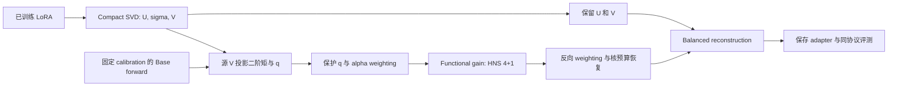

# Functional PR 与 Functional-HNS（α）：背景、实现与三种子实验效果

日期：2026-09-14。范围：两种 Base × 三种训练任务 × seed42/43/44，共 18 个已训练 LoRA。本文介绍诊断量与编辑算法，全部性能来自本仓库最终审计通过的同协议评测，不使用模型卡成绩，不重新训练。

**主要判断：Functional PR 是方向能量集中度的诊断量；Functional-HNS α=.5 是值得继续检验的编辑候选，但本次结果没有证明它全面超过原 HNS，也不支持直接最大化 PR。**

## 1. 背景：为什么从参数谱转向功能谱

对一个 LoRA 线性模块，$D=BA=U\operatorname{diag}(\sigma)V^\top$，实际权重更新为 $\Delta W=cD$，$c$ 是 adapter 原来的 scaling。参数谱只告诉我们每个方向的增益 $\sigma_i$，没有告诉我们真实输入使用该方向的频率和强度。

令 $h$ 是模块输入，$q_i=\mathbb E[(v_i^\top h)^2]$，则第 $i$ 个源 SVD 方向的平均输出更新能量为

$$E_i=(c\sigma_i)^2q_i.$$

例如两个方向的奇异值都为 2，但 $q=(9,1)$，它们的输出更新能量为 $c^2(36,4)$。参数谱完全相同，功能能量却按 9:1 分配。由于 $U$ 列正交，总输出更新能量恰好为 $\sum_iE_i$；不同方向 activation 的相关性不会改变这个总量，但会改变输出二阶矩的特征谱。

这构成使用 activation-weighted 统计的动机，不意味着能量大必然有害、方向越均匀性能越好。相关工作已经使用 activation 信息：EVA 对 activation 做 SVD 来初始化 LoRA；CorDA 使用输入 covariance 引导分解并研究知识保留。当前工作研究的是**已经训练完成的 adapter 的 post-hoc 诊断和固定方向编辑**，不是这两种初始化方法的复现。[EVA](https://arxiv.org/abs/2410.07170)、[CorDA](https://arxiv.org/abs/2406.05223)

## 2. Functional PR：定义、计算与边界

### 2.1 原始方向能量 participation ratio

对所评测 adapter 的增益向量 $s$，原 LoRA 用 $s=\sigma$，编辑后用 $s=t$。定义

$$\pi_i=\frac{(cs_i)^2q_i}{\sum_j(cs_j)^2q_j},\qquad
\boxed{\mathrm{FPR}=\frac1{\sum_i\pi_i^2}
=\frac{(\sum_i s_i^2q_i)^2}{\sum_i(s_i^2q_i)^2}}.$$

非零总能量时 $1\le\mathrm{FPR}\le r$，本实验 $r=16$。FPR 接近 1 表示能量主要落在少数源方向；接近 16 表示方向能量接近均匀。公共 scaling 在占比中抵消。它是经典 participation ratio 应用于 activation-weighted 方向能量，不把 participation ratio 本身作为新数学定义。

辅助 entropy 指标为 $\mathrm{FErank}=\exp(-\sum_i\pi_i\log\pi_i)$。FPR 与 entropy 对谱分布的敏感性不同，但都忽略公共幅度。参数量 $r_2=(\sum_i\sigma_i)^2/\sum_i\sigma_i^2$ 使用奇异值质量；这里的 FPR 使用 $\sigma_i^2q_i$，二者不能混用。

### 2.2 三类实现字段

| 字段 | 计算对象 | 含义 |
| --- | --- | --- |
| `functional_pr` / Raw PR | $s_i^2q_i$ 的归一化占比 | 源方向上的真实缓存能量集中度 |
| `protected_functional_pr` | $s_i^2\bar q_i$，$\bar q_i=\max(q_i,.1\operatorname{median}(q))$ | 与编辑保护下限一致的方向能量 PR |
| `cov_functional_pr` / Full-moment PR | $G=\operatorname{diag}(s)C_V\operatorname{diag}(s)$ 的特征值占比 | 包含方向间相关性的输出更新二阶矩 PR |

这里 $C_V=\mathbb E[(V^\top h)(V^\top h)^\top]$ 为未中心化二阶矩。实际代码用求和矩阵 $M=NC_V$，公共 $N$ 与 $c^2$ 抵消。Full-moment PR 使用 `np.linalg.eigvalsh(G).clip(min=0)`，舍弃舍入造成的负特征值；它不大于 Raw PR，因为 $\operatorname{tr}(G^2)$ 还包含非对角项平方。两者只在相应非对角项为零时相等。

checkpoint 的 PR 和 entropy 是全部 LoRA 模块的 **median，各模块等权**；方法汇总是 18 个 checkpoint median 的算术平均。不是拼接所有模块方向后再计算一次 PR。

### 2.3 两个恒等式与方向依赖

对任意公共标量 $a>0$，$\mathrm{FPR}(as,q)=\mathrm{FPR}(s,q)$。因此 FPR 对每模块的标量剂量严格失明。

对任意参数平坦谱 $s_i=\mu$，

$$\mathrm{FPR}\big|_{\mathrm{parameter\ flat}}=
\frac{(\sum_iq_i)^2}{\sum_iq_i^2}=\mathrm{PR}(q).$$

同一个源 checkpoint 的 Flat-Fro 与 Flat-Nuclear 只差公共增益，FPR 必然相同，不能凭它解释这两种干预的性能差异。这是定义造成的不可识别性，不是扩大样本量能修复的问题。

不过 $q_i=v_i^\top C_{\mathrm{Base}}v_i$，其中 $v_i$ 来自具体 adapter，因此 $q$ 并非纯 Base 属性。准确地说，参数谱平坦后 FPR 反映 Base activation 在**该 adapter 源方向**上的不均衡。Raw PR 还依赖方向基：平坦谱下联合旋转 $U,V$ 能保持更新矩阵不变，却改变 Raw PR。我们固定源方向使计算可复现；Full-moment PR 消除同一子空间内的基旋转依赖，但仍对公共缩放失明。

## 3. Functional-HNS（α）：从诊断到可检验的编辑

### 3.1 参数 α 的意义

原 HNS 对参数增益 $\sigma$ 应用 Hybrid Newton–Schulz 编辑。Functional-HNS 固定 $U,V$，先把增益换成 activation-weighted gain，再编辑并映射回来：

$$\bar q_i=\max(q_i,.1\operatorname{median}(q)),\qquad
w_i=(\bar q_i/\operatorname{median}(q))^{\alpha/2},$$

$$g_i^{(\alpha)}=\sigma_iw_i,\quad
\hat g=\mathrm{HNS}_{4+1}(g),\quad
\tilde\sigma_i=\hat g_i/w_i,\quad
\boxed{t_i=\tilde\sigma_i\frac{\sum_j\sigma_j}{\sum_j\tilde\sigma_j}}.$$

| 配置 | 含义 |
| --- | --- |
| α=0 | 原参数谱 HNS，专门调用原 helper 以确保完全兼容；不是 identity |
| α=.5 | 使用 $(\bar q/\operatorname{median}(q))^{1/4}$，部分 activation weighting |
| α=1 | 使用平方根 weighting，完整 protected functional gain balancing |

这里的 α 是 **functional exponent**，与 LoRA config 的 `lora_alpha=32` 不同。若模块的 $q$ 全部相等，则 weighting 全为 1，三个 α 都退化为原 HNS。median 归一化避免公共单位影响，本实验保持相同保护比例与步数，不按 checkpoint 挑选 α。

### 3.2 复用的 HNS 4+1 内核

内核首先用 Frobenius 长度归一化：$x=g/\max(\|g\|_2,10^{-7})$。逐方向进行四次 Fast 多项式更新、一次 Stable 更新：

$$x\leftarrow x(a+bx^2+dx^4).$$

Fast 系数为 $(a,b,d)=(3.4445,-4.7750,2.0315)$；Stable 为 $(2,-1.5,.5)$。最后截断数值负值并恢复输入向量的 nuclear mass；Functional-HNS 映射回参数增益后，再恢复原 $\sum\sigma$。统一 full rank、strength=1、4 Fast+1 Stable，不使用原 dataclass 的 8+2 默认步数。有限步迭代不等于解析的完全平坦化，也没有保证 PR 随 α 单调改善模型性能。

### 3.3 保护与 Exact Functional Flat 诊断

若直接要求 $t_i^2q_i$ 完全相等，则 $t_i\propto q_i^{-1/2}$，接近零的 $q_i$ 可能吸收过多核预算。第一版用固定 $0.1\operatorname{median}(q)$ 下限；不加额外 $\epsilon$，不调保护比例。

诊断配置为

$$t_i=\frac{\bar q_i^{-1/2}}{\sum_j\bar q_j^{-1/2}}\sum_j\sigma_j.$$

它严格 equalize **protected** 方向能量，因此 Protected PR 为 16；Raw PR 不一定为 16。它是强干预 ablation，不是性能 oracle、通用最优解或推荐默认方法。本次全部 checkpoint 的 Raw PR module median 也接近 16，但 Full-moment PR 仍低于 16。

### 3.4 Compact SVD 与 balanced reconstruction

不构造稠密 $BA$。已有 helper 对 $B$ 和 $A^\top$ 做 reduced QR，在 $r\times r$ 小矩阵上做 SVD：

$$B=Q_BR_B,\quad A^\top=Q_AR_A,\quad
R_BR_A^\top=U_r\operatorname{diag}(\sigma)V_r^\top.$$

恢复 $U=Q_BU_r,V=Q_AV_r$ 后，只编辑增益。Balanced reconstruction 为

$$B'=U\operatorname{diag}(\sqrt t),\qquad
A'=\operatorname{diag}(\sqrt t)V^\top.$$

写回原权重 dtype，复用 adapter load/save。rank16、原 LoRA alpha32、scaling2、Base 和七类 target modules（q/k/v/o、gate/up/down）均保持原 config；保存后重新核验谱与范数。Functional gain 不重新排序，避免错配 $q_i$ 和源方向。



## 4. Activation 采集与代码实现

每个 Base×Task 从对应训练 SFT 数据固定选 256 个样本，sampling seed42，截断最长 512 tokens。复用 chat template，包含数据中已有 assistant 响应，`add_generation_prompt=False`，Qwen 关闭 thinking。采用冻结 Base 的 hidden states，不把 LoRA 加到采集 forward 中；因此这版方法是 training-free，但需要任务 calibration 数据，不能称为严格 data-free 或 task-data-free。

各 LoRA 线性层 hook 读取 `inputs[0]`，用源 $V^\top$ 投影；同一 Base×Task 的三种 seed 共享输入与 Base forward，分别投影各自的 $V$。用 `attention_mask` 将 padding 置零，所有有效模板、prompt、assistant token 都计入。$N=\sum$ `token_counts`；统计按 token 加权，不是对 256 个样本先各自平均再等权。

模型与投影用 bf16，坐标乘积 fp32，矩阵累积 fp64，TF32 关闭。源 compact SVD fp32 $V^\top$ 的逐模块 SHA256 与构建时必须完全一致，再采用相同 bf16 投影。保存每模块完整未中心化 16×16 求和矩阵 $M$、逐样本方向能量、token counts、源谱、scaling 与 basis hash；不保存完整 hidden covariance，因此不能直接应用于任意新 $V$。

每模块 PR 核心计算如下，`s` 是所评测 adapter 的增益，`M` 是相同源方向的冻结 Base 缓存：

```python
q = np.diag(M) / token_counts.sum()
energy = s**2 * q
pi = energy / energy.sum()
raw_pr = 1.0 / np.square(pi).sum()

qbar = np.maximum(q, 0.1 * np.median(q))
protected_pi = s**2 * qbar
protected_pi /= protected_pi.sum()
protected_pr = 1.0 / np.square(protected_pi).sum()

G = M * s[:, None] * s[None, :]
eig = np.linalg.eigvalsh(G).clip(min=0)
omega = eig / eig.sum()
full_moment_pr = 1.0 / np.square(omega).sum()
```

真实能量统计包含 `scaling**2`。Functional-HNS 内部用 float64 编辑，再转回输入谱 dtype；偶数 rank 的 median 使用 `torch.quantile(q,.5)` 与 NumPy 中间两项均值对齐。非有限值、负谱/负 q、非正 median 均报错，不伪造 activation fallback。编辑后 PR 继续使用**冻结 Base 缓存**，没有重新采集编辑后模型自身的 activation；它是固定输入统计下的 retrospective proxy。

| 代码 | 职责 |
| --- | --- |
| [collect_functional_activation_three_seed.py](../scripts/collect_functional_activation_three_seed.py) | 三 seed 源方向 activation 采集、mask、精度、batch/OOM 与缓存审计 |
| `src/finetune/spectral_edit/functional_hns.py`（本地实现） | α weighting、q floor、原 HNS 兼容、反向映射与核预算恢复 |
| [posthoc_hns.py](../src/finetune/spectral_edit/posthoc_hns.py) | Fast/Stable 多项式与核范数恢复 |
| [svd.py](../src/finetune/spectral_edit/svd.py)、[io.py](../src/finetune/spectral_edit/io.py) | Compact SVD、balanced reconstruction、adapter 读写 |
| `scripts/prepare_functional_hns_seed_extension.py`（本地实现） | source 审计、adapters 构建、`functional_stats()` 与逐模块 metadata |
| `scripts/run_functional_hns_seed_extension.py`（本地实现） | 单 GPU 评测、复用短测、失败恢复、增量评分 |
| `scripts/summarize_functional_hns_three_seed.py`（本地实现） | 逐 seed、mean±SD、WTL 与分组统计 |
| `scripts/export_functional_hns_results.py`（本地实现） | 逐模块重新核算与完整指标快照 |
| `tests/test_functional_hns.py`（本地实现） | α0 等价、isotropic q、单位不变性、floor、核预算、方向排列与 exact flat 检查 |

## 5. 实验设计与指标

18 个实际源 checkpoint 从 [source_manifest.json](posthoc_flat_dghard_three_seed_20260913/source_manifest.json) 和三种子 manifest 中定位、核验权重/config；不根据文件名推断路径。先跑两模型×三任务的 seed42 pilot，再新增 seed43/44 共 12 个源 checkpoint 和 36 个 functional adapters；累计 54 个新 adapters，加上 18 个 LoRA 和 18 个固定 HNS 对照，共 90 个方法记录。

| 训练任务 | Target benchmark | 完整样本数 | 主指标 | max new tokens |
| --- | --- | --- | --- | --- |
| Magicoder | HumanEval | 164 | pass@1 | 512 |
| MetaMath | GSM8K | 1,319 | strict accuracy | 512 |
| Tulu | IFEval | 541 | prompt-level strict accuracy | 2,048 |
| Retention 共同第四类 | Commonsense-8 | 22,419 | 八任务等权 macro accuracy | 8 |

Commonsense-8 包含 ARC-Challenge、ARC-Easy、BoolQ、HellaSwag、OpenBookQA、PIQA、SIQA、WinoGrande。IFEval 使用现有协议指定的 `ifeval-train.jsonl`，不替换成其他 split。评测完全复用 [eval_forgetting_matrix_vllm.py](../scripts/eval_forgetting_matrix_vllm.py) 与 [score_forgetting_matrix.py](../scripts/score_forgetting_matrix.py) 的 prompt/chat、parser、metric。生成为 greedy：temperature0、top_p1、generation seed42；训练 seed43/44 不改变 generation/calibration seed。

每个 checkpoint 的对应训练 benchmark 为 Target；其余三类百分成绩等权平均为 Off。Forgetting gap 定义为

$$\mathrm{FG}=\frac13\sum_{b\ne\mathrm{Target}}\max(S_{\mathrm{Base},b}-S_{\mathrm{adapter},b},0).$$

FG 越低越好，FG reduction 是对照 FG 减去新方法 FG，正值代表改善。不同 benchmark 的等权平均只是描述性汇总；FG 截断会产生大量零值，需同时看 Off 与分项结果。Base 每种模型四项对照，加上 90×4 项 adapter 评测，共 368 个唯一 cells。

新增 seed43/44 运行严格最多一张 B300，两个 Base 顺序运行，无 GPU array；此前 seed42 pilot 两模型并行使用两张 B300。新增阶段短测 max_num_seqs 从4096开始，长任务2048、短任务4096、batched tokens65536、adapter block5、显存利用参数.94、最大上下文4096，OOM 才逐级降低。原 config 内的旧 batch 值没有直接当成本次运行参数，实际命令另存。

Qwen 对照短测逐 token 完全一致，允许复用旧 LoRA/HNS 及 seed42。Llama 短测发现111个样本 token 不匹配，因此**三个 seed 的五种方法与 Base 都统一重评**，最终表不混入旧 Llama pilot 成绩；旧 pilot 保留，差异有逐条记录。恢复作业1023仅用一张 GPU，正常结束，exit0:0，用时02:31:17，GPU已释放；失败尝试1020记录在 submission 中。

## 6. 效果：完整三种子结果

### 6.1 18 个 checkpoint 的平均成绩

| 方法 | n | Target↑ | Off↑ | FG↓ | Target ΔLoRA | Target ΔHNS | FG reduction vs HNS |
| --- | --- | --- | --- | --- | --- | --- | --- |
| LoRA | 18 | 67.998 | 69.551 | 2.708 | 0.000 | -4.085 | -2.364 |
| HNS 4+1 / α=0 | 18 | 72.083 | 72.792 | 0.344 | 4.085 | 0.000 | 0.000 |
| Functional-HNS α=.5 | 18 | 72.108 | 72.586 | 0.254 | 4.110 | 0.025 | 0.091 |
| Functional-HNS α=1 | 18 | 71.596 | 72.284 | 0.289 | 3.598 | -0.488 | 0.055 |
| Protected Functional Flat | 18 | 71.322 | 72.340 | 0.313 | 3.324 | -0.762 | 0.032 |

α=.5 比 LoRA 平均 Target 提升4.110pp、FG减少2.455pp；相对 HNS 的 Target 只高0.025pp、FG少0.091pp，Off却低0.205pp。α=1 与 Protected Functional Flat 的平均 Target 分别比 HNS 低0.488pp和0.762pp。当前证据不支持替换原 HNS 为完全功能平衡。

### 6.2 与 LoRA/HNS 的 win / tie / loss

| 方法 | Target vs LoRA | Target vs HNS | Off vs LoRA | Off vs HNS | FG vs LoRA | FG vs HNS |
| --- | --- | --- | --- | --- | --- | --- |
| LoRA | 0/18/0 | 1/1/16 | 0/18/0 | 3/0/15 | 0/18/0 | 0/4/14 |
| HNS 4+1 / α=0 | 16/1/1 | 0/18/0 | 15/0/3 | 0/18/0 | 14/4/0 | 0/18/0 |
| Functional-HNS α=.5 | 17/0/1 | 10/0/8 | 14/0/4 | 7/0/11 | 14/4/0 | 4/11/3 |
| Functional-HNS α=1 | 17/0/1 | 9/3/6 | 13/0/5 | 5/0/13 | 14/3/1 | 4/9/5 |
| Protected Functional Flat | 17/0/1 | 9/1/8 | 13/0/5 | 5/0/13 | 14/3/1 | 3/9/6 |

每列按18个 checkpoint 配对比较；WTL顺序是胜/平/负，FG按“越低越好”计胜。α=.5 的 Target 对HNS为10/0/8，FG为4/11/3，Off为7/0/11；Target和Off同时非劣且至少一项严格改善的checkpoint为5/18。平均FG更低不意味着全部checkpoint均改善。

### 6.3 Base×Task 三 seed mean ± sample SD

下列均为seed42/43/44三个现有checkpoint，SD使用ddof=1；所有配置统一，不按各checkpoint选择最好α。

**Downstream / Target，越高越好：**

| Base | Task | LoRA | HNS 4+1 / α=0 | Functional-HNS α=.5 | Functional-HNS α=1 | Protected Functional Flat |
| --- | --- | --- | --- | --- | --- | --- |
| Qwen3-8B | magicoder | 64.228 ± 1.269 | 74.593 ± 0.352 | 72.358 ± 1.535 | 68.293 ± 0.610 | 68.293 ± 0.610 |
| Qwen3-8B | metamath | 84.054 ± 0.088 | 87.465 ± 0.684 | 87.617 ± 0.789 | 87.440 ± 0.631 | 87.389 ± 0.444 |
| Qwen3-8B | tulu | 66.975 ± 0.834 | 71.411 ± 0.912 | 72.397 ± 0.385 | 72.828 ± 0.640 | 72.520 ± 1.083 |
| Llama-3.1-8B-Instruct | magicoder | 54.472 ± 1.408 | 54.675 ± 0.931 | 54.878 ± 0.610 | 55.081 ± 0.352 | 54.472 ± 0.352 |
| Llama-3.1-8B-Instruct | metamath | 75.537 ± 1.390 | 79.353 ± 1.178 | 80.642 ± 0.684 | 81.299 ± 0.158 | 80.869 ± 0.374 |
| Llama-3.1-8B-Instruct | tulu | 62.723 ± 0.565 | 65.003 ± 0.213 | 64.757 ± 1.203 | 64.633 ± 0.594 | 64.387 ± 0.930 |

**Off，越高越好：**

| Base | Task | LoRA | HNS 4+1 / α=0 | Functional-HNS α=.5 | Functional-HNS α=1 | Protected Functional Flat |
| --- | --- | --- | --- | --- | --- | --- |
| Qwen3-8B | magicoder | 78.037 ± 0.448 | 81.261 ± 0.071 | 80.488 ± 0.305 | 80.192 ± 0.178 | 80.163 ± 0.178 |
| Qwen3-8B | metamath | 68.158 ± 4.103 | 75.277 ± 1.235 | 75.464 ± 1.634 | 76.010 ± 1.638 | 76.002 ± 1.389 |
| Qwen3-8B | tulu | 85.627 ± 0.457 | 84.931 ± 0.444 | 84.855 ± 0.514 | 84.168 ± 1.075 | 84.093 ± 0.842 |
| Llama-3.1-8B-Instruct | magicoder | 61.198 ± 1.030 | 65.802 ± 0.917 | 65.638 ± 1.187 | 65.643 ± 0.373 | 65.657 ± 0.659 |
| Llama-3.1-8B-Instruct | metamath | 58.591 ± 0.931 | 62.710 ± 0.554 | 63.154 ± 0.182 | 62.391 ± 0.363 | 62.301 ± 0.044 |
| Llama-3.1-8B-Instruct | tulu | 65.696 ± 1.870 | 66.770 ± 0.800 | 65.919 ± 0.279 | 65.301 ± 1.155 | 65.827 ± 1.247 |

**Forgetting gap，越低越好：**

| Base | Task | LoRA | HNS 4+1 / α=0 | Functional-HNS α=.5 | Functional-HNS α=1 | Protected Functional Flat |
| --- | --- | --- | --- | --- | --- | --- |
| Qwen3-8B | magicoder | 1.666 ± 0.483 | 0.000 ± 0.000 | 0.000 ± 0.000 | 0.000 ± 0.000 | 0.000 ± 0.000 |
| Qwen3-8B | metamath | 4.948 ± 4.054 | 0.000 ± 0.000 | 0.000 ± 0.000 | 0.000 ± 0.000 | 0.000 ± 0.000 |
| Qwen3-8B | tulu | 0.000 ± 0.000 | 0.000 ± 0.000 | 0.000 ± 0.000 | 0.000 ± 0.000 | 0.000 ± 0.000 |
| Llama-3.1-8B-Instruct | magicoder | 4.597 ± 0.522 | 1.289 ± 0.351 | 0.915 ± 0.091 | 0.847 ± 0.096 | 0.901 ± 0.174 |
| Llama-3.1-8B-Instruct | metamath | 4.066 ± 0.681 | 0.666 ± 0.892 | 0.458 ± 0.740 | 0.721 ± 0.666 | 0.801 ± 0.969 |
| Llama-3.1-8B-Instruct | tulu | 0.973 ± 0.955 | 0.109 ± 0.190 | 0.149 ± 0.204 | 0.166 ± 0.159 | 0.173 ± 0.160 |

### 6.4 分组效果与配对变化

下表是相对固定HNS4+1的组内平均变化。Target/Off Δ越大越好，FG reduction越大越好；Base组n=9、Task组n=6。

| 组 | 方法 | n | Target ΔHNS | Off ΔHNS | FG reduction vs HNS |
| --- | --- | --- | --- | --- | --- |
| base/Qwen3-8B | Functional-HNS α=0.5 | 9 | -0.366 | -0.220 | 0.000 |
| base/Qwen3-8B | Functional-HNS α=1 | 9 | -1.636 | -0.366 | 0.000 |
| base/Qwen3-8B | Protected Exact Functional Flat | 9 | -1.756 | -0.403 | 0.000 |
| base/Llama-3.1-8B-Instruct | Functional-HNS α=0.5 | 9 | 0.415 | -0.190 | 0.181 |
| base/Llama-3.1-8B-Instruct | Functional-HNS α=1 | 9 | 0.661 | -0.649 | 0.110 |
| base/Llama-3.1-8B-Instruct | Protected Exact Functional Flat | 9 | 0.232 | -0.499 | 0.063 |
| task/magicoder | Functional-HNS α=0.5 | 6 | -1.016 | -0.468 | 0.187 |
| task/magicoder | Functional-HNS α=1 | 6 | -2.947 | -0.614 | 0.221 |
| task/magicoder | Protected Exact Functional Flat | 6 | -3.252 | -0.621 | 0.194 |
| task/metamath | Functional-HNS α=0.5 | 6 | 0.720 | 0.316 | 0.104 |
| task/metamath | Functional-HNS α=1 | 6 | 0.960 | 0.208 | -0.028 |
| task/metamath | Protected Exact Functional Flat | 6 | 0.720 | 0.158 | -0.068 |
| task/tulu | Functional-HNS α=0.5 | 6 | 0.370 | -0.463 | -0.020 |
| task/tulu | Functional-HNS α=1 | 6 | 0.524 | -1.116 | -0.028 |
| task/tulu | Protected Exact Functional Flat | 6 | 0.246 | -0.891 | -0.032 |

α=.5 在Qwen平均Target下降0.366pp，在Llama提升0.415pp；其Llama-MetaMath Target提升约1.289pp，Qwen-Magicoder下降约2.236pp。Qwen三任务九个checkpoint的HNS和三种功能编辑FG均为0，但Off仍有差别。Llama-Magicoder与MetaMath的α=.5平均FG低于HNS，Tulu略高，收益不能描述为统一抗遗忘。


图中先对每seed计算方法−HNS，再对三个差值求mean±sample SD；这是描述性SD，不是置信区间。

### 6.5 Functional PR 与功能剂量实际改变了多少

| 方法 | Raw PR↑ | Full-moment PR↑ | RMS ratio | Energy ratio |
| --- | --- | --- | --- | --- |
| LoRA | 2.023 | 1.844 | 1.000 | 1.000 |
| HNS 4+1 / α=0 | 7.345 | 5.392 | 0.288 | 0.097 |
| Functional-HNS α=.5 | 12.728 | 8.831 | 0.219 | 0.064 |
| Functional-HNS α=1 | 15.982 | 12.113 | 0.198 | 0.054 |
| Protected Functional Flat | 16.000 | 12.130 | 0.197 | 0.053 |

PR列是18个checkpoint的module median再平均。RMS ratio为每checkpoint的 $\sqrt{\sum_m\mathcal E'_m/\sum_m\mathcal E_m}$，Energy ratio为其平方，再分别对18个checkpoint平均；**mean(Energy ratio)不是mean(RMS ratio)的平方**。α加大时，PR上升，同时functional energy与Frobenius剂量改变。因此不能把性能差异单独归因于PR。

原LoRA、HNS、α=.5、α=1、Exact Flat平均Raw PR约为2.023、7.345、12.728、15.982、16；性能并没有沿此序列单调提高。Raw PR接近16时，Full-moment PR仍约12，表明方向activation相关性没有消失。

## 7. 如何解读：已经支持与尚未支持的结论

本次支持：参数谱与功能方向能量可以显著不同；固定核预算下activation weighting确实能改变功能能量分配；部分任务存在较好的functional编辑候选；将PR机械推至最大并非可靠选择。

本次尚未证明：FPR是跨Base/Task通用的性能预测器；PR上升本身导致Target或retention提升；α=.5显著优于HNS；冻结Base统计等于编辑后真实轨迹；只有一个最优α适用于所有checkpoint。

必须保留的限制：

- FPR对标量剂量失明；参数flat时退化为PR(q)，无法排序Flat-Fro/Flat-Nuclear。同一源方向下的恒等式不等于对任意adapter完全无关。
- Calibration来自对应训练SFT分布并含assistant响应；不是无数据方法，也没有从独立retention分布分别采集统计。不同任务/分布上的q能否复用需单独检验。
- 实测PR来自冻结Base源方向缓存。后续模型层activation改变后，其功能能量可能与这套代理统计不同。
- 固定核预算同时改变Fro、总功能能量和方向分配。现有α比较不是剂量匹配实验，不能独立识别形状的因果作用。
- 只有两个Base、三个任务；历史seed42训练recipe与43/44不同，seed42两处Llama训练seed证据未完全验证。mean±SD仅描述现有标签，不能当成严格同recipe的独立重复或直接宣称显著性。

因此建议保留FPR作为诊断轴，保留原HNS为稳定对照，将α=.5视为需要在独立validation、匹配功能剂量和更多分布上继续检验的候选；不以最大化PR为方法目标。本报告没有新增训练、评测或参数筛选。

## 8. 数值审计、复现命令与结果位置

| 检查 | 结果 |
| --- | --- |
| 完整结果 | 18 checkpoint / 90 方法记录 / 368 cells，complete |
| 原结果artifact audit | pass |
| 新增adapter | 36 / 8568 edited modules |
| 扩展source basis | 2856，全部exact hash |
| 保存后最大综合数值误差 | 1.79917822e-06 |
| α0对统一HNS最大谱误差 | 4.02074869e-08 |
| 逐模块结果复核 | 21420记录，最大checkpoint median差异 0.0 |

α0对原helper的精确兼容、isotropic q、q公共缩放、floor、方向排列与核预算均有现有测试。实际扩展构建的2856个源basis逐模块SHA完全一致；保存后核预算及重构误差低于1e-5。完整368cells的样本数、COMPLETE、预测/scored行数与哈希均已核验；全部21420个模块结果重算后的PR与entropy median和summary完全一致。

以下后处理命令不会重训。采集与构建命令只在需要重新产生输入时使用；已有缓存和adapter应按manifest恢复，不在已有结果目录盲目重新prepare。所有Python命令从仓库根目录执行：

```bash
# 结果汇总、逐模块复核与已有审计
/dataset1/zailong/envs/peft-sft-lab/bin/python scripts/summarize_functional_hns_three_seed.py
/dataset1/zailong/envs/peft-sft-lab/bin/python scripts/export_functional_hns_results.py
/dataset1/zailong/envs/peft-sft-lab/bin/python scripts/audit_functional_hns_three_seed.py

# 本报告从冻结完成结果生成
/dataset1/zailong/envs/peft-sft-lab/bin/python scripts/write_functional_pr_hns_overview.py
```

已有采集作业入口为`slurm/functional_activation_three_seed.slurm`；seed42为`slurm/functional_hns_pilot.slurm`；seed43/44为`slurm/functional_hns_seed_extension_1gpu.slurm`。实际generation/scoring命令、时间和参数见下面的commands文件，不能只凭旧task config内默认值复现。

| 文件 | 内容 |
| --- | --- |
| [最终完整实验报告](functional_hns_three_seed_20260914.md) | 全部四benchmark分项、逐seed结果、adapter路径与审计 |
| [checkpoint_summary.tsv](functional_hns_three_seed_20260914/checkpoint_summary.tsv) | 90方法记录、性能、PR与剂量 |
| [three_seed_mean_sd.tsv](functional_hns_three_seed_20260914/three_seed_mean_sd.tsv) | 30个Base×Task×方法组的mean与sample SD |
| [matrix.tsv](functional_hns_three_seed_20260914/matrix.tsv) | 368cells的原指标路径、样本数、score与SHA |
| [functional_pr_module_results.tsv.gz](functional_hns_three_seed_20260914/functional_pr_module_results.tsv.gz) | 21420条模块谱/q/能量/三类PR/entropy与缓存SHA |
| [evaluation_metrics_snapshot.json.gz](functional_hns_three_seed_20260914/evaluation_metrics_snapshot.json.gz) | 最终368cells的完整指标原文 |
| [evaluation_commands.json](functional_hns_three_seed_20260914/evaluation_commands.json) | 实际评测与评分命令 |
| [manifest.json](functional_hns_three_seed_20260914/manifest.json) | source、activation、代码、dataset、输出哈希与协议 |
| [source_manifest.json](posthoc_flat_dghard_three_seed_20260913/source_manifest.json) | 全部18个LoRA实际source路径与权重/config哈希 |
| [collection_manifest.json](functional_activation_three_seed_20260914/collection_manifest.json) | 三seedactivation采集样本、来源与精度 |
| [artifact_integrity_audit.json](functional_hns_three_seed_20260914/artifact_integrity_audit.json) | adapter/预测/scored完整性与数值审计 |
| [seed42_reevaluation_comparison.tsv](functional_hns_three_seed_20260914/seed42_reevaluation_comparison.tsv) | Llama旧seed42与统一重评差异 |
| [本报告输入manifest](functional_pr_functional_hns_overview_20260914/manifest.json) | 本报告SHA、生成器与冻结输入SHA |

seed43/44新adapter在`reports/functional_hns_three_seed_20260914/adapters/<Base>/<Task>/seed<43|44>/<method>/`；seed42在pilot目录，原LoRA/HNS保持source_manifest定位的路径。每个新adapter的`functional_hns_meta.json`包含逐模块目标谱、q、保护下限与范数；原始大权重、activation NPZ和逐样本预测保留在所列本地路径。

## 附录：完整逐 seed 表

### A. Downstream / Target

| Base | Task | Seed | LoRA | HNS 4+1 / α=0 | Functional-HNS α=.5 | Functional-HNS α=1 | Protected Functional Flat |
| --- | --- | --- | --- | --- | --- | --- | --- |
| Qwen3-8B | magicoder | 42 | 65.244 | 75.000 | 70.732 | 68.293 | 67.683 |
| Qwen3-8B | magicoder | 43 | 62.805 | 74.390 | 73.780 | 68.902 | 68.902 |
| Qwen3-8B | magicoder | 44 | 64.634 | 74.390 | 72.561 | 67.683 | 68.293 |
| Qwen3-8B | metamath | 42 | 84.155 | 88.173 | 88.249 | 87.945 | 87.566 |
| Qwen3-8B | metamath | 43 | 84.003 | 86.808 | 86.732 | 86.732 | 86.884 |
| Qwen3-8B | metamath | 44 | 84.003 | 87.415 | 87.870 | 87.642 | 87.718 |
| Qwen3-8B | tulu | 42 | 67.837 | 70.795 | 72.089 | 73.198 | 73.752 |
| Qwen3-8B | tulu | 43 | 66.174 | 72.458 | 72.828 | 73.198 | 71.719 |
| Qwen3-8B | tulu | 44 | 66.913 | 70.980 | 72.274 | 72.089 | 72.089 |
| Llama-3.1-8B-Instruct | magicoder | 42 | 53.659 | 54.878 | 54.268 | 54.878 | 54.878 |
| Llama-3.1-8B-Instruct | magicoder | 43 | 56.098 | 55.488 | 54.878 | 55.488 | 54.268 |
| Llama-3.1-8B-Instruct | magicoder | 44 | 53.659 | 53.659 | 55.488 | 54.878 | 54.268 |
| Llama-3.1-8B-Instruct | metamath | 42 | 77.104 | 80.667 | 81.350 | 81.425 | 81.122 |
| Llama-3.1-8B-Instruct | metamath | 43 | 75.057 | 78.393 | 79.985 | 81.122 | 80.440 |
| Llama-3.1-8B-Instruct | metamath | 44 | 74.450 | 78.999 | 80.591 | 81.350 | 81.046 |
| Llama-3.1-8B-Instruct | tulu | 42 | 63.216 | 64.880 | 65.989 | 64.880 | 65.250 |
| Llama-3.1-8B-Instruct | tulu | 43 | 62.847 | 65.250 | 63.586 | 63.956 | 64.510 |
| Llama-3.1-8B-Instruct | tulu | 44 | 62.107 | 64.880 | 64.695 | 65.065 | 63.401 |

### B. Forgetting gap

| Base | Task | Seed | LoRA | HNS 4+1 / α=0 | Functional-HNS α=.5 | Functional-HNS α=1 | Protected Functional Flat |
| --- | --- | --- | --- | --- | --- | --- | --- |
| Qwen3-8B | magicoder | 42 | 1.900 | 0.000 | 0.000 | 0.000 | 0.000 |
| Qwen3-8B | magicoder | 43 | 1.986 | 0.000 | 0.000 | 0.000 | 0.000 |
| Qwen3-8B | magicoder | 44 | 1.111 | 0.000 | 0.000 | 0.000 | 0.000 |
| Qwen3-8B | metamath | 42 | 1.799 | 0.000 | 0.000 | 0.000 | 0.000 |
| Qwen3-8B | metamath | 43 | 3.523 | 0.000 | 0.000 | 0.000 | 0.000 |
| Qwen3-8B | metamath | 44 | 9.522 | 0.000 | 0.000 | 0.000 | 0.000 |
| Qwen3-8B | tulu | 42 | 0.000 | 0.000 | 0.000 | 0.000 | 0.000 |
| Qwen3-8B | tulu | 43 | 0.000 | 0.000 | 0.000 | 0.000 | 0.000 |
| Qwen3-8B | tulu | 44 | 0.000 | 0.000 | 0.000 | 0.000 | 0.000 |
| Llama-3.1-8B-Instruct | magicoder | 42 | 4.978 | 0.910 | 1.020 | 0.876 | 1.102 |
| Llama-3.1-8B-Instruct | magicoder | 43 | 4.810 | 1.602 | 0.863 | 0.739 | 0.801 |
| Llama-3.1-8B-Instruct | magicoder | 44 | 4.002 | 1.356 | 0.863 | 0.924 | 0.801 |
| Llama-3.1-8B-Instruct | metamath | 42 | 4.705 | 1.690 | 1.312 | 1.467 | 1.910 |
| Llama-3.1-8B-Instruct | metamath | 43 | 4.141 | 0.246 | 0.000 | 0.511 | 0.123 |
| Llama-3.1-8B-Instruct | metamath | 44 | 3.350 | 0.062 | 0.062 | 0.185 | 0.370 |
| Llama-3.1-8B-Instruct | tulu | 42 | 1.908 | 0.328 | 0.382 | 0.338 | 0.345 |
| Llama-3.1-8B-Instruct | tulu | 43 | 0.000 | 0.000 | 0.000 | 0.022 | 0.029 |
| Llama-3.1-8B-Instruct | tulu | 44 | 1.011 | 0.000 | 0.064 | 0.139 | 0.146 |

### C. Off

| Base | Task | Seed | LoRA | HNS 4+1 / α=0 | Functional-HNS α=.5 | Functional-HNS α=1 | Protected Functional Flat |
| --- | --- | --- | --- | --- | --- | --- | --- |
| Qwen3-8B | magicoder | 42 | 77.798 | 81.333 | 80.407 | 80.018 | 79.967 |
| Qwen3-8B | magicoder | 43 | 77.759 | 81.191 | 80.825 | 80.184 | 80.209 |
| Qwen3-8B | magicoder | 44 | 78.553 | 81.257 | 80.231 | 80.373 | 80.314 |
| Qwen3-8B | metamath | 42 | 71.293 | 74.920 | 75.249 | 75.925 | 75.703 |
| Qwen3-8B | metamath | 43 | 69.666 | 76.650 | 77.195 | 77.689 | 77.517 |
| Qwen3-8B | metamath | 44 | 63.515 | 74.259 | 73.947 | 74.417 | 74.787 |
| Qwen3-8B | tulu | 42 | 86.018 | 85.363 | 85.448 | 84.976 | 84.779 |
| Qwen3-8B | tulu | 43 | 85.125 | 84.954 | 84.573 | 84.579 | 84.346 |
| Qwen3-8B | tulu | 44 | 85.738 | 84.476 | 84.544 | 82.948 | 83.154 |
| Llama-3.1-8B-Instruct | magicoder | 42 | 60.320 | 64.793 | 64.278 | 65.231 | 64.930 |
| Llama-3.1-8B-Instruct | magicoder | 43 | 60.943 | 66.028 | 66.164 | 65.739 | 65.830 |
| Llama-3.1-8B-Instruct | magicoder | 44 | 62.333 | 66.584 | 66.470 | 65.958 | 66.213 |
| Llama-3.1-8B-Instruct | metamath | 42 | 57.884 | 63.338 | 63.310 | 62.545 | 62.305 |
| Llama-3.1-8B-Instruct | metamath | 43 | 58.245 | 62.293 | 63.198 | 61.977 | 62.343 |
| Llama-3.1-8B-Instruct | metamath | 44 | 59.646 | 62.498 | 62.955 | 62.652 | 62.254 |
| Llama-3.1-8B-Instruct | tulu | 42 | 63.826 | 66.415 | 65.703 | 64.301 | 64.750 |
| Llama-3.1-8B-Instruct | tulu | 43 | 67.566 | 67.686 | 66.234 | 66.565 | 67.193 |
| Llama-3.1-8B-Instruct | tulu | 44 | 65.696 | 66.208 | 65.821 | 65.036 | 65.537 |
