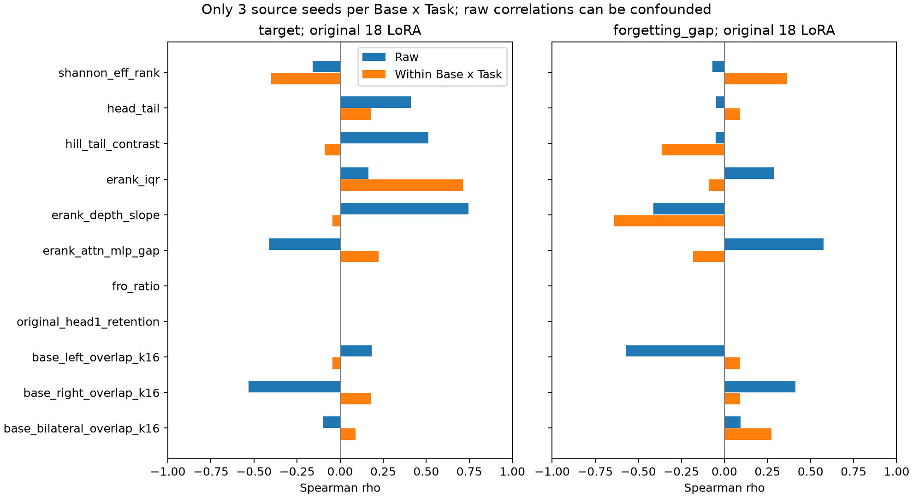
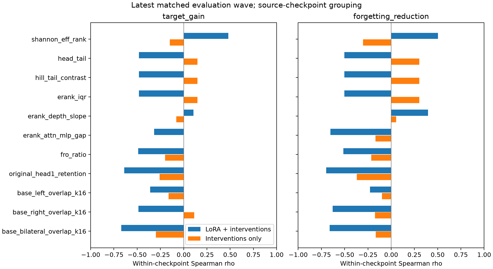

# 有希望的谱量追加试验：三种子、两模型、三任务（2026-09-14）

追加检验用户提出的重尾、头尾结构、跨模块/跨层分布、attention–MLP 差异、功能参与率及 Base 主子空间 overlap。参数谱复用实际 adapter compact SVD 缓存；原始 downstream / forgetting 评测不变，各评测波次分开。数据仍是 18 个源 checkpoint、282 adapters、450 条方法记录；独立训练分组是 18，而不是 module 或 token 数量。

**本轮有值得保留的探索性信号，但没有找到在跨模型、跨任务留出后，稳定同时预测 downstream 和 forgetting 的最优谱量。** 新结构量提供了不同的描述轴；关联较大不代表增量预测已成立。

未编辑源 checkpoint 的 erank_iqr 与 task score：去除 Base×Task 后 ρ=0.713, 精确组内 seed 置换 p=0.0137, FDR q=0.453，多重比较后不足以确认。erank_depth_slope 与绝对 FG 的组内 ρ=-0.639, q=0.399。这些是有限 n=18、每组3种子的候选关联，尚未验证为选择规则。

erank_attn_mlp_gap 与绝对 FG 的 raw ρ=0.575，去除 Base×Task 后变为 -0.183。head_tail 与 HNS target gain 的 raw ρ=0.685，去除组间差异后为 0.000。在当前18-source数据上不能据 raw 相关声称它们不受混杂或已复现用户表中的最佳指标。

源 checkpoint 的嵌套留 seed 单量选择未超过 training-group mean：Target RMSE=1.852 vs 1.184 pp；FG RMSE=4.109 vs 2.131 pp。即使整体 Target R²较高，也主要来自已知模型/任务均值，而非谱量增益。

功能 PR 在六个 seed42 源上的最新 within-checkpoint ρ：ΔTarget=0.622, FG reduction=0.700；edited-only 后为 0.151/0.274。在这批有限干预中 PR、entropy 与 top1 share 给出相同（或反向）的 outcome 秩相关，尚不能声称 full-distribution 功能量更优。

实际用途：保留 erank_iqr / depth slope 作为空间分布候选，保留 functional PR/entropy 作为真实 activation 加权诊断，同时保留 Fro ratio 与原始 head retention 作幅度/方向对照。Base overlap 是另一轴的近似诊断；当前留出结果没有支持它成为跨模型通用最优量。

**阅读时区分三个问题：未编辑源 checkpoint 的质量；某个源 checkpoint 是否更适合 HNS；同一 checkpoint 的已编辑方法谁更好。它们需要不同的 outcome 和统计分组。** 用户表中的已有 ρ 不作复现事实，以下全部重新计算。

## 定义与数值约定

本轮 concentration/shape 量按 module median 聚合，erank/stable rank 不除以 16；上轮的 mean erank/16 单独作为 aggregation comparator。IQR、层斜率和 attention–MLP gap 独立报告。原始 rank=16、alpha=32、scaling=2，不改变 adapters。

| 谱量 | 本轮定义 |
| --- | --- |
| shannon_eff_rank | median module exp(H(s/sum(s))), unnormalized 1..16 |
| r2_participation | median module sum(s)^2/sum(s^2) |
| stable_rank | median module sum(s^2)/max(s)^2, unnormalized 1..16 |
| flatness | median exp(mean(log(s)))/mean(s) |
| gini | median singular-value Gini; zero is flat |
| decay_slope | median OLS slope of log(s_i) against i=1..16 |
| erank_energy | median exp(H(s^2/sum(s^2))), 1..16 |
| entropy_gap | median H(p)-H(q) |
| hill_tail_contrast | median mean_{i<=8} log(lambda_i/lambda_9), lambda=s^2; 1/(alpha_hill-1), zero at flat endpoint |
| d_flat_l1 | median sum(abs(s-mean(s)))/sum(s) |
| soft_rank | median mean(s)/max(s) |
| head_tail | median log(sum(s[:4])/sum(s[12:16])) |
| erank_iqr | IQR of module shannon effective ranks |
| erank_depth_slope | OLS slope of layer-median erank against raw layer index |
| erank_depth_slope_normalized | same slope against depth layer/(layers-1) |
| erank_attn_mlp_gap | median attention erank minus median MLP erank |
| gamma_param | global sum(w*beta), w=source_s^2/sum(source_s^2); equals previous scalar_fit |
| eta_param | 1-gamma^2/sum(w*beta^2); equals previous shape_residual in common U/V |
| fro_ratio | previous aggregate global Frobenius ratio |
| original_head1_retention | previous actual original leading-direction energy retention |
| previous_mean_entropy_rank | previous mean module effective rank/16; aggregation comparator |
| alpha_hill | 1+8/sum_{i<=8} log(lambda_i/lambda_9); undefined for flat/near-flat modules |
| alpha_hill_k4 | same estimator k=4 |
| alpha_hill_k12 | same estimator k=12 |
| alpha_weighted_hill | median alpha_hill*log10(sigma1_scaled^2); Hill-based diagnostic, not official WeightWatcher PL fit |
| alpha_iqr | IQR of module alpha_hill, defined only if every module is nondegenerate |
| kurtosis | median population excess kurtosis of 16 singular values; flat spectrum undefined |
| decay_family | median R2(log(s)~log(i))-R2(log(s)~i); flat spectrum undefined |
| base_left_overlap_k16 | global parameter-energy fraction projected into pretrained top-16 left subspace; randomized-SVD diagnostic |
| base_right_overlap_k16 | global parameter-energy fraction projected into pretrained top-16 right subspace; randomized-SVD diagnostic |
| base_bilateral_overlap_k16 | global parameter-energy fraction projected into pretrained top-16 bilateral subspace; randomized-SVD diagnostic |

$\lambda_i=(c\sigma_i)^2$，Hill 使用 $k=8$，并给出 $k=4,12$ 敏感性。$\alpha=1+1/C_{tail}$，$C_{tail}=\frac1k\sum_{i\le k}\log(\lambda_i/\lambda_{k+1})$；完全平坦时 C=0、alpha 无穷/未定义，不能加 epsilon 或截断成一个看似正常的有限指数。

rank16 只有很少谱点，本轮 alpha_hill 是固定 k 的 LoRA 谱诊断，不是证实了 heavy-tail 分布，也不是 WeightWatcher 官方的 power-law fit。alpha_weighted_hill 明确使用 Hill 估计与 scaled operator norm 的联合量。[WeightWatcher 官方说明](https://weightwatcher.ai/fine_tuned.html) 也指出低秩更新的谱拟合存在 small-n 限制。

相对谱跨度 ≤1e-5 时按平坦端点处理；Hill 的 mean-log contrast ≤1e-4 时记录 None。Kurtosis 与 decay-family 在零方差谱上也未定义。Checkpoint 层 alpha/kurtosis/family 只有所有 modules 定义良好时才汇总，不默默删除难拟合 modules；valid-module fraction 逐记录保存。finite tail-contrast 保留 flat endpoint 0，可进入完整范围 CV。所有量化与判定阈值用于保存误差控制，没有通过成绩挑选阈值。

核 participation $r_2=(\sum\sigma)^2/\sum\sigma^2$ 与固定核预算的 flat-Fro ratio 满足 $\gamma_F^2=r_2/r$；但逐模块代数关系并不自动让不同跨模块聚合方式完全等价。$\gamma_{param}$ 和 $\eta_{param}$ 的权重明确是全模型参数谱能量权重，分别复用上轮 scalar_fit / shape_residual，不能当成独立的新发现。

## 18 个原始 LoRA：源谱量与质量 / 遗忘 / HNS 收益

Raw Spearman 跨所有模型任务，仅用于显示混杂。Within Base×Task Spearman 在六个组内部各自对三个 source seeds 排名、去均值后聚合。精确 p 枚举 6^6=46656 个组内 seed 排列；按 outcome 对全部源谱候选做 BH FDR。这里绝对 FG 的正相关表示更多遗忘；HNS FG reduction 的正相关表示恢复更多。

| 谱量 | Target raw ρ | Target 去组间 ρ | Target q | FG raw ρ | FG 去组间 ρ | HNS ΔTarget 去组间 ρ | HNS FG reduction 去组间 ρ |
| --- | --- | --- | --- | --- | --- | --- | --- |
| shannon_eff_rank | -0.160 | -0.401 | 0.894 | -0.070 | 0.365 | 0.131 | 0.091 |
| r2_participation | -0.124 | -0.401 | 0.894 | -0.117 | 0.365 | 0.131 | 0.091 |
| stable_rank | -0.054 | -0.045 | 0.957 | -0.202 | 0.365 | 0.087 | 0.091 |
| flatness | -0.229 | -0.401 | 0.894 | 0.038 | 0.365 | 0.131 | 0.091 |
| gini | 0.296 | 0.267 | 0.957 | -0.051 | -0.456 | -0.218 | -0.183 |
| decay_slope | -0.593 | 0.089 | 0.957 | 0.016 | 0.091 | -0.044 | -0.183 |
| erank_energy | -0.124 | -0.401 | 0.894 | -0.117 | 0.365 | 0.131 | 0.091 |
| entropy_gap | 0.124 | 0.401 | 0.894 | 0.117 | -0.365 | -0.131 | -0.091 |
| hill_tail_contrast | 0.512 | -0.089 | 0.957 | -0.051 | -0.365 | 0.044 | -0.091 |
| d_flat_l1 | 0.276 | 0.267 | 0.957 | -0.035 | -0.274 | -0.218 | 0.000 |
| soft_rank | -0.119 | -0.178 | 0.957 | -0.116 | 0.365 | 0.087 | 0.091 |
| head_tail | 0.410 | 0.178 | 0.957 | -0.049 | 0.091 | 0.000 | 0.365 |
| erank_iqr | 0.163 | 0.713 | 0.453 | 0.286 | -0.091 | -0.305 | -0.365 |
| erank_depth_slope | 0.744 | -0.045 | 0.957 | -0.413 | -0.639 | -0.087 | -0.365 |
| erank_depth_slope_normalized | 0.744 | -0.045 | 0.957 | -0.413 | -0.639 | -0.087 | -0.365 |
| erank_attn_mlp_gap | -0.413 | 0.223 | 0.957 | 0.575 | -0.183 | -0.087 | 0.091 |
| gamma_param | — | — | — | — | — | — | — |
| eta_param | — | — | — | — | — | — | — |
| fro_ratio | — | — | — | — | — | — | — |
| original_head1_retention | — | — | — | — | — | — | — |
| previous_mean_entropy_rank | -0.154 | -0.134 | 0.957 | -0.083 | 0.274 | 0.218 | 0.000 |
| base_left_overlap_k16 | 0.184 | -0.045 | 0.957 | -0.573 | 0.091 | -0.305 | -0.183 |
| base_right_overlap_k16 | -0.532 | 0.178 | 0.957 | 0.412 | 0.091 | 0.087 | 0.365 |
| base_bilateral_overlap_k16 | -0.100 | 0.089 | 0.957 | 0.093 | 0.274 | 0.261 | 0.548 |
| alpha_hill | -0.512 | 0.089 | 0.957 | 0.051 | 0.365 | -0.044 | 0.091 |
| alpha_hill_k4 | -0.161 | -0.401 | 0.894 | 0.029 | 0.730 | 0.479 | 0.456 |
| alpha_hill_k12 | -0.651 | 0.134 | 0.957 | -0.027 | -0.274 | 0.087 | -0.548 |
| alpha_weighted_hill | 0.665 | -0.089 | 0.957 | -0.471 | 0.274 | -0.131 | 0.000 |
| alpha_iqr | -0.364 | 0.089 | 0.957 | -0.222 | 0.000 | 0.261 | -0.274 |
| kurtosis | -0.176 | 0.045 | 0.957 | 0.152 | -0.365 | -0.087 | -0.091 |
| decay_family | -0.275 | 0.312 | 0.957 | 0.176 | -0.548 | -0.261 | -0.274 |



## 源 checkpoint 的留 seed 预测

只使用 18 个未编辑 LoRA，外层留 seed42/43/44；每折训练集内留 source checkpoint，选择一个线性谱量与 ridge∈{0.01,1,10}。训练 Base×Task 组均值是显式 baseline，再拟合组内中心化的单谱协变量。Feature/目标中心、尺度、baseline 均只使用训练 seeds。联合目标为 target 与绝对 FG，训练残差 SD 标准化后等权。

| 任务 | 谱量模型 RMSE | 训练组均值 RMSE | Skill vs 组均值 | 整体 R²（含组别信息） |
| --- | --- | --- | --- | --- |
| target | 1.852 | 1.184 | -1.448 | 0.962 |
| forgetting_gap | 4.109 | 2.131 | -2.718 | -1.952 |

折内选量：{"shannon_eff_rank": 1, "erank_depth_slope_normalized": 1, "erank_iqr": 1}。完整逐 seed 预测与折内训练/测试 source 清单见 source_cv_predictions.tsv / source_cv_folds.json。整体 R² 可被模型/任务均值主导，判断谱量是否增益应看 Skill vs group mean。

## 同一 source 内的谱编辑关联

与上一轮一致：checkpoint 内含 ties 的 ranks，source-cluster bootstrap 2000 次，checkpoint 内置换 2000 次、BH FDR。完整数据同时展示 raw / within / 控制 log Frobenius 的 partial Pearson。

| 谱量 | 最新 ΔTarget ρ | 最新 FG reduction ρ | 最新 edited-only ΔTarget ρ | 最新 edited-only FG ρ | HNS target网格 edited-only ρ | HNS retention网格 edited-only FG ρ |
| --- | --- | --- | --- | --- | --- | --- |
| shannon_eff_rank | 0.479 | 0.504 | -0.149 | -0.302 | -0.143 | -0.015 |
| r2_participation | 0.479 | 0.504 | -0.149 | -0.302 | -0.128 | 0.004 |
| stable_rank | 0.479 | 0.504 | -0.149 | -0.302 | -0.117 | 0.011 |
| flatness | 0.479 | 0.504 | -0.149 | -0.302 | -0.142 | -0.015 |
| gini | -0.479 | -0.504 | 0.149 | 0.302 | 0.133 | -0.003 |
| decay_slope | 0.479 | 0.504 | -0.149 | -0.302 | -0.122 | 0.003 |
| erank_energy | 0.479 | 0.504 | -0.149 | -0.302 | -0.131 | 0.004 |
| entropy_gap | -0.479 | -0.504 | 0.149 | 0.302 | 0.146 | 0.015 |
| hill_tail_contrast | -0.479 | -0.504 | 0.149 | 0.302 | 0.149 | 0.010 |
| d_flat_l1 | -0.479 | -0.504 | 0.149 | 0.302 | 0.139 | -0.003 |
| soft_rank | 0.479 | 0.504 | -0.149 | -0.302 | -0.120 | 0.006 |
| head_tail | -0.479 | -0.504 | 0.149 | 0.302 | 0.130 | -0.003 |
| erank_iqr | -0.479 | -0.504 | 0.149 | 0.302 | 0.141 | 0.003 |
| erank_depth_slope | 0.107 | 0.396 | -0.079 | 0.054 | 0.090 | 0.024 |
| erank_depth_slope_normalized | 0.140 | 0.332 | 0.050 | -0.034 | 0.067 | 0.000 |
| erank_attn_mlp_gap | -0.319 | -0.654 | 0.000 | -0.168 | -0.019 | -0.116 |
| gamma_param | -0.627 | -0.671 | -0.229 | -0.291 | -0.247 | -0.002 |
| eta_param | 0.458 | 0.522 | -0.143 | -0.136 | 0.232 | 0.021 |
| fro_ratio | -0.488 | -0.514 | -0.200 | -0.213 | 0.123 | -0.011 |
| original_head1_retention | -0.639 | -0.698 | -0.257 | -0.368 | -0.241 | 0.001 |
| previous_mean_entropy_rank | 0.479 | 0.504 | -0.149 | -0.302 | -0.113 | 0.032 |
| base_left_overlap_k16 | -0.360 | -0.226 | -0.162 | -0.100 | -0.043 | 0.029 |
| base_right_overlap_k16 | -0.486 | -0.630 | 0.114 | -0.174 | -0.193 | 0.050 |
| base_bilateral_overlap_k16 | -0.671 | -0.662 | -0.298 | -0.166 | -0.145 | 0.118 |



未定义 Hill/kurtosis/decay-family 的记录不进入完整范围候选 CV；仅对各量自己的有限子集计算补充关联，并明确报告 missing_rows。不同子集的相关大小不可直接作为最佳量排名。完全平坦与不同标量幅度会有相同 shape/functional PR，强关联也不等于能排序 Flat-Fro、Flat-Nuclear、HNS。

## 谱量能否预测未见干预

外层按 seed/base/task 完全留出源 checkpoint，内层留 source 选择 feature、一次/二次曲线、ridge。单量完整候选为上表可定义的参数/结构量以及 primary Base overlap k16；双量仅固定的五种结构/头尾量 × {Fro ratio,H1}。每批次使用自己的 LoRA baseline，目标 ΔTarget 与 FG reduction 等权标准化（只有 diagonal 的 HNS 网格仅预测 target）。HNS 主对照始终固定4+1，多配置只作为观测网格，不给每个 checkpoint 挑最佳设置。

| 批次 | 模型 | 留出 | Skill vs train mean | Target R² | FG reduction R² | 折内选量 |
| --- | --- | --- | --- | --- | --- | --- |
| joint_flat_hns | single | seed | 0.101 | 0.437 | -0.386 | {"base_bilateral_overlap_k16": 1, "shannon_eff_rank": 2} |
| joint_flat_hns | single | base | -1.710 | -3.774 | -0.631 | {"entropy_gap": 1, "base_bilateral_overlap_k16": 1} |
| joint_flat_hns | single | train_task | 0.017 | -0.125 | -0.995 | {"head_tail": 1, "base_right_overlap_k16": 1, "entropy_gap": 1} |
| joint_flat_hns | shape_plus_strength | seed | 0.102 | 0.325 | -0.101 | {"head_tail+original_head1_retention": 2, "head_tail+fro_ratio": 1} |
| joint_flat_hns | shape_plus_strength | base | -0.714 | -3.521 | -1.815 | {"hill_tail_contrast+fro_ratio": 1, "erank_attn_mlp_gap+original_head1_retention": 1} |
| joint_flat_hns | shape_plus_strength | train_task | -0.599 | -0.872 | -2.071 | {"erank_attn_mlp_gap+original_head1_retention": 1, "erank_depth_slope+original_head1_retention": 1, "hill_tail_contrast+fro_ratio": 1} |
| hns_grid_target | single | seed | 0.258 | 0.204 | — | {"base_bilateral_overlap_k16": 1, "shannon_eff_rank": 2} |
| hns_grid_target | single | base | -0.497 | -1.484 | — | {"erank_iqr": 1, "entropy_gap": 1} |
| hns_grid_target | single | train_task | -0.009 | -0.235 | — | {"flatness": 2, "shannon_eff_rank": 1} |
| hns_grid_target | shape_plus_strength | seed | 0.397 | 0.340 | — | {"erank_attn_mlp_gap+fro_ratio": 1, "erank_depth_slope+fro_ratio": 2} |
| hns_grid_target | shape_plus_strength | base | -0.465 | -3.271 | — | {"hill_tail_contrast+fro_ratio": 1, "erank_depth_slope+original_head1_retention": 1} |
| hns_grid_target | shape_plus_strength | train_task | -1.433 | -2.224 | — | {"erank_attn_mlp_gap+original_head1_retention": 1, "erank_depth_slope+fro_ratio": 2} |
| hns_grid_retention | single | seed | 0.176 | 0.427 | -0.026 | {"flatness": 2} |
| hns_grid_retention | single | base | -0.692 | -2.206 | -1.673 | {"erank_attn_mlp_gap": 1, "erank_iqr": 1} |
| hns_grid_retention | single | train_task | -0.211 | -0.459 | -2.357 | {"fro_ratio": 1, "base_right_overlap_k16": 1, "base_bilateral_overlap_k16": 1} |
| hns_grid_retention | shape_plus_strength | seed | 0.239 | 0.420 | 0.085 | {"erank_attn_mlp_gap+fro_ratio": 2} |
| hns_grid_retention | shape_plus_strength | base | -15.629 | -57.913 | -118.083 | {"erank_iqr+fro_ratio": 1, "erank_attn_mlp_gap+original_head1_retention": 1} |
| hns_grid_retention | shape_plus_strength | train_task | -3.543 | -7.351 | -4.619 | {"erank_depth_slope+fro_ratio": 3} |
| scalar_common_basis_seed42 | single | base | 0.022 | -0.396 | -0.540 | {"original_head1_retention": 1, "gamma_param": 1} |
| scalar_common_basis_seed42 | single | train_task | 0.081 | 0.029 | -0.653 | {"original_head1_retention": 2, "gamma_param": 1} |
| scalar_common_basis_seed42 | shape_plus_strength | base | -0.034 | -0.743 | -0.502 | {"head_tail+original_head1_retention": 1, "erank_attn_mlp_gap+fro_ratio": 1} |
| scalar_common_basis_seed42 | shape_plus_strength | train_task | 0.068 | -0.033 | -0.694 | {"hill_tail_contrast+original_head1_retention": 1, "erank_depth_slope+fro_ratio": 1, "head_tail+fro_ratio": 1} |

| 批次 | 候选族 | 全数据 inner winner（探索性） | 次数 | ridge | inner loss |
| --- | --- | --- | --- | --- | --- |
| joint_flat_hns | single | shannon_eff_rank | 2 | 0.01 | 1.331 |
| joint_flat_hns | shape_plus_strength | head_tail + fro_ratio | 2 | 1.0 | 1.515 |
| hns_grid_target | single | shannon_eff_rank | 2 | 10.0 | 0.656 |
| hns_grid_target | shape_plus_strength | erank_depth_slope + fro_ratio | 2 | 1.0 | 0.612 |
| hns_grid_retention | single | base_bilateral_overlap_k16 | 2 | 0.01 | 1.549 |
| hns_grid_retention | shape_plus_strength | erank_iqr + fro_ratio | 2 | 0.01 | 1.198 |
| scalar_common_basis_seed42 | single | gamma_param | 1 | 0.01 | 1.993 |
| scalar_common_basis_seed42 | shape_plus_strength | head_tail + fro_ratio | 1 | 0.01 | 2.006 |

## 功能参与率与 entropy：六个 seed42 源 checkpoint 的诊断

| 功能量 | 定义 |
| --- | --- |
| functional_participation | median 1/sum(pi^2), pi=source_response_energy*beta^2 / module total |
| functional_erank | median exp(H(pi)) |
| functional_top1 | median max(pi) |
| functional_erank_iqr | IQR of module exp(H(pi)) |
| functional_attn_mlp_gap | attention median functional erank minus MLP median |
| functional_energy_ratio | sqrt(sum source_response_energy*beta^2 / sum source_response_energy) |
| gamma_functional | sum(wE*beta), wE=source_response_energy/sum(source_response_energy) |
| eta_functional | 1-gamma_functional^2/sum(wE*beta^2) |

功能谱来自 frozen pretrained-base 的训练分布固定256样本、最长512 tokens；输入源路径与 source audit 逐一核验。保存的 response_energy 是 sigma_i²q_i，重新加权 beta_i² 得到不同谱编辑的方向能量。q 来自 cached source direction basis，不能把修改后重新排序的 spectrum 直接与它相乘。使用原 U/V 方向序列的目标谱并核验实际保存 spectrum，属于固定轨迹、共享 U/V 的诊断近似，未进行新的 forward inference。

| 功能量 | 最新 ΔTarget ρ | 最新 FG reduction ρ | scalar ΔTarget ρ | scalar FG reduction ρ |
| --- | --- | --- | --- | --- |
| functional_participation | 0.622 | 0.700 | 0.181 | 0.196 |
| functional_erank | 0.622 | 0.700 | 0.181 | 0.196 |
| functional_top1 | -0.622 | -0.700 | -0.181 | -0.196 |
| functional_erank_iqr | 0.261 | 0.213 | 0.014 | 0.317 |
| functional_attn_mlp_gap | -0.099 | 0.030 | -0.014 | 0.317 |
| functional_energy_ratio | -0.718 | -0.597 | -0.590 | -0.601 |
| gamma_functional | -0.718 | -0.597 | -0.578 | -0.601 |
| eta_functional | 0.718 | 0.597 | 0.117 | 0.197 |

完整 edited-only 与六源 Base/task 留出 CV 在 functional_edited_only_correlations.tsv 和 functional_cv/。这里无 seed43/44 functional 数据，无法称作完整三种子功能谱验证；训练分布功能谱也不等价于 off-task 分布的损伤风险。

## Base-subspace overlap 的计算审计

对两 Base 共476个被 LoRA 修改的 pretrained projection matrices 计算 top-k 主子空间，k∈{4,16,32}，k16 为主候选，k4/k32 为敏感性。left/right/bilateral 均按实际 adapter 更新参数能量全模型聚合。CPU randomized SVD q96、12次 power iteration，必要时增加到q128/24或q192/36，k16双侧相对残差<0.01、k32<0.02才通过。它是近似主子空间，不是 exact SVD；残差与k32边界gap逐module报告，k边界接近时解释需谨慎。

Base 权重路径从原始 source manifest 的 base_model 与 safetensors index 解析，LoRA 权重路径复用已审计 manifest。用低秩因子直接计算 ||U0ᵀBA||、||BAV0||、||U0ᵀBAV0||；不构造稠密 LoRA BA，不修改原 Base 或 LoRA。

独立随机种子、更强 q128/power24 在预定义两层×七类投影×两Base（28 modules）复查：

| k | 左子空间 RMS sin(angle) 平均 / 最大 | 右子空间 RMS sin(angle) 平均 / 最大 |
| --- | --- | --- |
| 4 | 0.00023 / 0.00122 | 0.00018 / 0.00109 |
| 16 | 0.00187 / 0.01286 | 0.00196 / 0.01455 |
| 32 | 0.01173 / 0.04855 | 0.01195 / 0.05155 |

该复查支持采样 modules 的近似稳定性，并不能证明所有 matrices 的 top-k 完全精确；k32 比 k4/k16 更依赖边界谱。

## 完整逐种子主表

| Base | Task | Seed | Method | erank median | erank IQR | attn−MLP gap | depth slope | head_tail | F-ratio | Base bilateral k16 | Target | Off | FG |
| --- | --- | --- | --- | --- | --- | --- | --- | --- | --- | --- | --- | --- | --- |
| Qwen3-8B | magicoder | 42 | original_lora | 9.904 | 3.166 | 1.682 | -0.036 | 1.828 | 1.000 | 0.00060 | 65.244 | 77.798 | 1.900 |
| Qwen3-8B | magicoder | 42 | flat_fro | 16.000 | 0.000 | 0.000 | 0.000 | 0.000 | 1.000 | 0.00006 | 76.829 | 81.351 | 0.000 |
| Qwen3-8B | magicoder | 42 | flat_nuclear | 16.000 | 0.000 | 0.000 | 0.000 | 0.000 | 0.522 | 0.00005 | 75.610 | 81.002 | 0.000 |
| Qwen3-8B | magicoder | 42 | hns_f4_s1 | 15.998 | 0.001 | 0.000 | -0.000 | 0.037 | 0.522 | 0.00005 | 75.000 | 81.333 | 0.000 |
| Qwen3-8B | metamath | 42 | original_lora | 10.920 | 2.937 | 1.148 | 0.044 | 1.816 | 1.000 | 0.00026 | 84.155 | 71.293 | 1.799 |
| Qwen3-8B | metamath | 42 | flat_fro | 16.000 | 0.000 | 0.000 | 0.000 | 0.000 | 1.000 | 0.00005 | 87.642 | 73.866 | 0.203 |
| Qwen3-8B | metamath | 42 | flat_nuclear | 16.000 | 0.000 | 0.000 | 0.000 | 0.000 | 0.609 | 0.00004 | 88.173 | 75.200 | 0.000 |
| Qwen3-8B | metamath | 42 | hns_f4_s1 | 15.998 | 0.001 | -0.000 | 0.000 | 0.036 | 0.609 | 0.00004 | 88.173 | 74.920 | 0.000 |
| Qwen3-8B | tulu | 42 | original_lora | 12.100 | 2.277 | -0.330 | 0.044 | 1.655 | 1.000 | 0.00015 | 67.837 | 86.018 | 0.000 |
| Qwen3-8B | tulu | 42 | flat_fro | 16.000 | 0.000 | 0.000 | 0.000 | 0.000 | 1.000 | 0.00005 | 69.316 | 85.037 | 0.000 |
| Qwen3-8B | tulu | 42 | flat_nuclear | 16.000 | 0.000 | 0.000 | 0.000 | 0.000 | 0.757 | 0.00004 | 71.165 | 85.527 | 0.000 |
| Qwen3-8B | tulu | 42 | hns_f4_s1 | 15.998 | 0.001 | -0.000 | 0.000 | 0.036 | 0.757 | 0.00004 | 70.795 | 85.363 | 0.000 |
| Qwen3-8B | magicoder | 43 | original_lora | 10.620 | 2.672 | 1.195 | -0.006 | 1.790 | 1.000 | 0.00044 | 62.805 | 77.759 | 1.986 |
| Qwen3-8B | magicoder | 43 | flat_fro | 16.000 | 0.000 | 0.000 | 0.000 | 0.000 | 1.000 | 0.00006 | 76.220 | 80.821 | 0.000 |
| Qwen3-8B | magicoder | 43 | flat_nuclear | 16.000 | 0.000 | 0.000 | 0.000 | 0.000 | 0.601 | 0.00005 | 73.171 | 81.028 | 0.000 |
| Qwen3-8B | magicoder | 43 | hns_f4_s1 | 15.998 | 0.001 | -0.000 | -0.000 | 0.037 | 0.601 | 0.00005 | 74.390 | 81.191 | 0.000 |
| Qwen3-8B | metamath | 43 | original_lora | 11.540 | 2.671 | 1.103 | 0.034 | 1.744 | 1.000 | 0.00025 | 84.003 | 69.666 | 3.523 |
| Qwen3-8B | metamath | 43 | flat_fro | 16.000 | 0.000 | 0.000 | 0.000 | 0.000 | 1.000 | 0.00005 | 87.263 | 74.881 | 0.000 |
| Qwen3-8B | metamath | 43 | flat_nuclear | 16.000 | 0.000 | 0.000 | 0.000 | 0.000 | 0.662 | 0.00004 | 87.036 | 76.531 | 0.000 |
| Qwen3-8B | metamath | 43 | hns_f4_s1 | 15.998 | 0.001 | -0.000 | 0.000 | 0.036 | 0.662 | 0.00004 | 86.808 | 76.650 | 0.000 |
| Qwen3-8B | tulu | 43 | original_lora | 13.009 | 1.841 | -0.579 | 0.033 | 1.459 | 1.000 | 0.00012 | 66.174 | 85.125 | 0.000 |
| Qwen3-8B | tulu | 43 | flat_fro | 16.000 | 0.000 | 0.000 | 0.000 | 0.000 | 1.000 | 0.00005 | 71.349 | 85.186 | 0.000 |
| Qwen3-8B | tulu | 43 | flat_nuclear | 16.000 | 0.000 | 0.000 | 0.000 | 0.000 | 0.810 | 0.00004 | 72.274 | 85.117 | 0.000 |
| Qwen3-8B | tulu | 43 | hns_f4_s1 | 15.999 | 0.001 | -0.000 | 0.000 | 0.033 | 0.810 | 0.00004 | 72.458 | 84.954 | 0.000 |
| Qwen3-8B | magicoder | 44 | original_lora | 10.495 | 2.520 | 1.166 | -0.023 | 1.783 | 1.000 | 0.00044 | 64.634 | 78.553 | 1.111 |
| Qwen3-8B | magicoder | 44 | flat_fro | 16.000 | 0.000 | 0.000 | 0.000 | 0.000 | 1.000 | 0.00006 | 72.561 | 81.024 | 0.000 |
| Qwen3-8B | magicoder | 44 | flat_nuclear | 16.000 | 0.000 | 0.000 | 0.000 | 0.000 | 0.602 | 0.00005 | 74.390 | 80.745 | 0.000 |
| Qwen3-8B | magicoder | 44 | hns_f4_s1 | 15.998 | 0.001 | -0.000 | -0.000 | 0.037 | 0.602 | 0.00005 | 74.390 | 81.257 | 0.000 |
| Qwen3-8B | metamath | 44 | original_lora | 11.757 | 2.810 | 0.968 | 0.033 | 1.736 | 1.000 | 0.00026 | 84.003 | 63.515 | 9.522 |
| Qwen3-8B | metamath | 44 | flat_fro | 16.000 | 0.000 | 0.000 | 0.000 | 0.000 | 1.000 | 0.00005 | 88.476 | 73.930 | 0.203 |
| Qwen3-8B | metamath | 44 | flat_nuclear | 16.000 | 0.000 | 0.000 | 0.000 | 0.000 | 0.663 | 0.00004 | 87.415 | 74.750 | 0.000 |
| Qwen3-8B | metamath | 44 | hns_f4_s1 | 15.998 | 0.001 | -0.000 | 0.000 | 0.036 | 0.663 | 0.00004 | 87.415 | 74.259 | 0.000 |
| Qwen3-8B | tulu | 44 | original_lora | 12.783 | 2.174 | -0.622 | 0.043 | 1.502 | 1.000 | 0.00015 | 66.913 | 85.738 | 0.000 |
| Qwen3-8B | tulu | 44 | flat_fro | 16.000 | 0.000 | 0.000 | 0.000 | 0.000 | 1.000 | 0.00005 | 69.316 | 84.071 | 0.000 |
| Qwen3-8B | tulu | 44 | flat_nuclear | 16.000 | 0.000 | 0.000 | 0.000 | 0.000 | 0.793 | 0.00004 | 71.534 | 84.796 | 0.000 |
| Qwen3-8B | tulu | 44 | hns_f4_s1 | 15.999 | 0.001 | -0.000 | 0.000 | 0.034 | 0.793 | 0.00004 | 70.980 | 84.476 | 0.000 |
| Llama-3.1-8B-Instruct | magicoder | 42 | original_lora | 12.700 | 2.407 | 1.983 | -0.058 | 1.351 | 1.000 | 0.00020 | 53.659 | 60.202 | 5.039 |
| Llama-3.1-8B-Instruct | magicoder | 42 | flat_fro | 16.000 | 0.000 | 0.000 | 0.000 | 0.000 | 1.000 | 0.00003 | 53.049 | 64.189 | 1.052 |
| Llama-3.1-8B-Instruct | magicoder | 42 | flat_nuclear | 16.000 | 0.000 | 0.000 | 0.000 | 0.000 | 0.642 | 0.00003 | 54.878 | 63.701 | 1.540 |
| Llama-3.1-8B-Instruct | magicoder | 42 | hns_f4_s1 | 15.999 | 0.001 | 0.000 | -0.000 | 0.031 | 0.642 | 0.00003 | 54.878 | 64.807 | 0.838 |
| Llama-3.1-8B-Instruct | metamath | 42 | original_lora | 14.021 | 1.298 | 0.025 | -0.020 | 1.201 | 1.000 | 0.00002 | 77.255 | 57.819 | 4.713 |
| Llama-3.1-8B-Instruct | metamath | 42 | flat_fro | 16.000 | 0.000 | 0.000 | 0.000 | 0.000 | 1.000 | 0.00002 | 79.985 | 61.139 | 2.206 |
| Llama-3.1-8B-Instruct | metamath | 42 | flat_nuclear | 16.000 | 0.000 | 0.000 | 0.000 | 0.000 | 0.873 | 0.00002 | 80.895 | 63.241 | 1.323 |
| Llama-3.1-8B-Instruct | metamath | 42 | hns_f4_s1 | 15.999 | 0.001 | -0.000 | 0.000 | 0.031 | 0.873 | 0.00002 | 80.819 | 63.153 | 1.817 |
| Llama-3.1-8B-Instruct | tulu | 42 | original_lora | 14.578 | 1.002 | 0.253 | -0.015 | 1.007 | 1.000 | 0.00009 | 63.216 | 63.726 | 1.809 |
| Llama-3.1-8B-Instruct | tulu | 42 | flat_fro | 16.000 | 0.000 | 0.000 | 0.000 | 0.000 | 1.000 | 0.00003 | 64.695 | 65.764 | 0.200 |
| Llama-3.1-8B-Instruct | tulu | 42 | flat_nuclear | 16.000 | 0.000 | 0.000 | 0.000 | 0.000 | 0.860 | 0.00003 | 63.216 | 66.689 | 0.338 |
| Llama-3.1-8B-Instruct | tulu | 42 | hns_f4_s1 | 15.999 | 0.001 | 0.000 | 0.000 | 0.031 | 0.860 | 0.00003 | 65.434 | 66.404 | 0.319 |
| Llama-3.1-8B-Instruct | magicoder | 43 | original_lora | 12.897 | 2.530 | 2.124 | -0.049 | 1.328 | 1.000 | 0.00016 | 55.488 | 61.085 | 4.686 |
| Llama-3.1-8B-Instruct | magicoder | 43 | flat_fro | 16.000 | 0.000 | 0.000 | 0.000 | 0.000 | 1.000 | 0.00003 | 54.878 | 65.361 | 2.095 |
| Llama-3.1-8B-Instruct | magicoder | 43 | flat_nuclear | 16.000 | 0.000 | 0.000 | 0.000 | 0.000 | 0.689 | 0.00003 | 54.268 | 66.616 | 0.678 |
| Llama-3.1-8B-Instruct | magicoder | 43 | hns_f4_s1 | 15.999 | 0.001 | 0.000 | 0.000 | 0.031 | 0.689 | 0.00003 | 56.098 | 65.938 | 1.725 |
| Llama-3.1-8B-Instruct | metamath | 43 | original_lora | 13.174 | 1.158 | 0.593 | -0.002 | 1.406 | 1.000 | 0.00006 | 74.829 | 58.317 | 4.215 |
| Llama-3.1-8B-Instruct | metamath | 43 | flat_fro | 16.000 | 0.000 | 0.000 | 0.000 | 0.000 | 1.000 | 0.00002 | 76.801 | 61.144 | 1.388 |
| Llama-3.1-8B-Instruct | metamath | 43 | flat_nuclear | 16.000 | 0.000 | 0.000 | 0.000 | 0.000 | 0.797 | 0.00002 | 78.772 | 61.628 | 0.431 |
| Llama-3.1-8B-Instruct | metamath | 43 | hns_f4_s1 | 15.999 | 0.001 | -0.000 | -0.000 | 0.033 | 0.797 | 0.00002 | 78.393 | 62.092 | 0.370 |
| Llama-3.1-8B-Instruct | tulu | 43 | original_lora | 14.538 | 1.039 | 0.171 | -0.008 | 1.002 | 1.000 | 0.00009 | 63.216 | 67.571 | 0.000 |
| Llama-3.1-8B-Instruct | tulu | 43 | flat_fro | 16.000 | 0.000 | 0.000 | 0.000 | 0.000 | 1.000 | 0.00003 | 64.880 | 67.940 | 0.000 |
| Llama-3.1-8B-Instruct | tulu | 43 | flat_nuclear | 16.000 | 0.000 | 0.000 | 0.000 | 0.000 | 0.857 | 0.00003 | 64.510 | 67.738 | 0.000 |
| Llama-3.1-8B-Instruct | tulu | 43 | hns_f4_s1 | 15.999 | 0.001 | 0.000 | -0.000 | 0.030 | 0.857 | 0.00003 | 65.250 | 67.745 | 0.000 |
| Llama-3.1-8B-Instruct | magicoder | 44 | original_lora | 12.934 | 2.476 | 2.276 | -0.045 | 1.324 | 1.000 | 0.00017 | 53.659 | 62.164 | 4.139 |
| Llama-3.1-8B-Instruct | magicoder | 44 | flat_fro | 16.000 | 0.000 | 0.000 | 0.000 | 0.000 | 1.000 | 0.00003 | 54.878 | 66.124 | 1.479 |
| Llama-3.1-8B-Instruct | magicoder | 44 | flat_nuclear | 16.000 | 0.000 | 0.000 | 0.000 | 0.000 | 0.685 | 0.00003 | 55.488 | 66.300 | 1.602 |
| Llama-3.1-8B-Instruct | magicoder | 44 | hns_f4_s1 | 15.999 | 0.001 | 0.000 | 0.000 | 0.030 | 0.685 | 0.00003 | 53.659 | 66.306 | 1.540 |
| Llama-3.1-8B-Instruct | metamath | 44 | original_lora | 13.215 | 1.127 | 0.467 | -0.001 | 1.391 | 1.000 | 0.00006 | 74.602 | 59.581 | 3.357 |
| Llama-3.1-8B-Instruct | metamath | 44 | flat_fro | 16.000 | 0.000 | 0.000 | 0.000 | 0.000 | 1.000 | 0.00002 | 78.696 | 62.254 | 0.887 |
| Llama-3.1-8B-Instruct | metamath | 44 | flat_nuclear | 16.000 | 0.000 | 0.000 | 0.000 | 0.000 | 0.800 | 0.00002 | 78.393 | 61.845 | 0.616 |
| Llama-3.1-8B-Instruct | metamath | 44 | hns_f4_s1 | 15.999 | 0.001 | -0.000 | 0.000 | 0.033 | 0.800 | 0.00002 | 79.151 | 62.551 | 0.000 |
| Llama-3.1-8B-Instruct | tulu | 44 | original_lora | 14.570 | 1.028 | 0.195 | -0.011 | 1.012 | 1.000 | 0.00009 | 63.031 | 65.757 | 0.960 |
| Llama-3.1-8B-Instruct | tulu | 44 | flat_fro | 16.000 | 0.000 | 0.000 | 0.000 | 0.000 | 1.000 | 0.00003 | 64.325 | 65.703 | 0.329 |
| Llama-3.1-8B-Instruct | tulu | 44 | flat_nuclear | 16.000 | 0.000 | 0.000 | 0.000 | 0.000 | 0.855 | 0.00003 | 65.065 | 65.497 | 0.000 |
| Llama-3.1-8B-Instruct | tulu | 44 | hns_f4_s1 | 15.999 | 0.001 | -0.000 | -0.000 | 0.030 | 0.855 | 0.00003 | 64.880 | 66.004 | 0.000 |

## 三种子 mean ± sample SD

| Base | Task | Method | erank IQR | attn−MLP gap | head_tail | Target | FG |
| --- | --- | --- | --- | --- | --- | --- | --- |
| Qwen3-8B | magicoder | original_lora | 2.786 ± 0.337 | 1.348 ± 0.290 | 1.800 ± 0.024 | 64.228 ± 1.269 | 1.666 ± 0.483 |
| Qwen3-8B | magicoder | flat_fro | 0.000 ± 0.000 | 0.000 ± 0.000 | 0.000 ± 0.000 | 75.203 ± 2.308 | 0.000 ± 0.000 |
| Qwen3-8B | magicoder | flat_nuclear | 0.000 ± 0.000 | 0.000 ± 0.000 | 0.000 ± 0.000 | 74.390 ± 1.220 | 0.000 ± 0.000 |
| Qwen3-8B | magicoder | hns_f4_s1 | 0.001 ± 0.000 | 0.000 ± 0.000 | 0.037 ± 0.000 | 74.593 ± 0.352 | 0.000 ± 0.000 |
| Qwen3-8B | metamath | original_lora | 2.806 ± 0.133 | 1.073 ± 0.093 | 1.766 ± 0.044 | 84.054 ± 0.088 | 4.948 ± 4.054 |
| Qwen3-8B | metamath | flat_fro | 0.000 ± 0.000 | 0.000 ± 0.000 | 0.000 ± 0.000 | 87.794 ± 0.621 | 0.136 ± 0.117 |
| Qwen3-8B | metamath | flat_nuclear | 0.000 ± 0.000 | 0.000 ± 0.000 | 0.000 ± 0.000 | 87.541 ± 0.579 | 0.000 ± 0.000 |
| Qwen3-8B | metamath | hns_f4_s1 | 0.001 ± 0.000 | -0.000 ± 0.000 | 0.036 ± 0.000 | 87.465 ± 0.684 | 0.000 ± 0.000 |
| Qwen3-8B | tulu | original_lora | 2.097 ± 0.228 | -0.510 ± 0.157 | 1.539 ± 0.103 | 66.975 ± 0.834 | 0.000 ± 0.000 |
| Qwen3-8B | tulu | flat_fro | 0.000 ± 0.000 | 0.000 ± 0.000 | 0.000 ± 0.000 | 69.994 ± 1.174 | 0.000 ± 0.000 |
| Qwen3-8B | tulu | flat_nuclear | 0.000 ± 0.000 | 0.000 ± 0.000 | 0.000 ± 0.000 | 71.657 ± 0.565 | 0.000 ± 0.000 |
| Qwen3-8B | tulu | hns_f4_s1 | 0.001 ± 0.000 | -0.000 ± 0.000 | 0.034 ± 0.002 | 71.411 ± 0.912 | 0.000 ± 0.000 |
| Llama-3.1-8B-Instruct | magicoder | original_lora | 2.471 ± 0.062 | 2.128 ± 0.146 | 1.335 ± 0.014 | 54.268 ± 1.056 | 4.621 ± 0.454 |
| Llama-3.1-8B-Instruct | magicoder | flat_fro | 0.000 ± 0.000 | 0.000 ± 0.000 | 0.000 ± 0.000 | 54.268 ± 1.056 | 1.542 ± 0.524 |
| Llama-3.1-8B-Instruct | magicoder | flat_nuclear | 0.000 ± 0.000 | 0.000 ± 0.000 | 0.000 ± 0.000 | 54.878 ± 0.610 | 1.273 ± 0.517 |
| Llama-3.1-8B-Instruct | magicoder | hns_f4_s1 | 0.001 ± 0.000 | 0.000 ± 0.000 | 0.031 ± 0.000 | 54.878 ± 1.220 | 1.368 ± 0.468 |
| Llama-3.1-8B-Instruct | metamath | original_lora | 1.194 ± 0.091 | 0.362 ± 0.298 | 1.333 ± 0.114 | 75.562 ± 1.471 | 4.095 ± 0.686 |
| Llama-3.1-8B-Instruct | metamath | flat_fro | 0.000 ± 0.000 | 0.000 ± 0.000 | 0.000 ± 0.000 | 78.494 ± 1.602 | 1.494 ± 0.666 |
| Llama-3.1-8B-Instruct | metamath | flat_nuclear | 0.000 ± 0.000 | 0.000 ± 0.000 | 0.000 ± 0.000 | 79.353 ± 1.348 | 0.790 ± 0.471 |
| Llama-3.1-8B-Instruct | metamath | hns_f4_s1 | 0.001 ± 0.000 | -0.000 ± 0.000 | 0.032 ± 0.001 | 79.454 ± 1.241 | 0.729 ± 0.961 |
| Llama-3.1-8B-Instruct | tulu | original_lora | 1.023 ± 0.019 | 0.206 ± 0.042 | 1.007 ± 0.005 | 63.155 ± 0.107 | 0.923 ± 0.905 |
| Llama-3.1-8B-Instruct | tulu | flat_fro | 0.000 ± 0.000 | 0.000 ± 0.000 | 0.000 ± 0.000 | 64.633 ± 0.282 | 0.176 ± 0.166 |
| Llama-3.1-8B-Instruct | tulu | flat_nuclear | 0.000 ± 0.000 | 0.000 ± 0.000 | 0.000 ± 0.000 | 64.264 ± 0.949 | 0.113 ± 0.195 |
| Llama-3.1-8B-Instruct | tulu | hns_f4_s1 | 0.001 ± 0.000 | 0.000 ± 0.000 | 0.030 ± 0.000 | 65.188 ± 0.282 | 0.106 ± 0.184 |

全部核心谱量和性能/遗忘量的 seed42/43/44 值及 mean ± sample SD 在 three_seed_mean_sd.tsv。旧 seed42 training recipe 与新 seeds43/44 不同，两处历史 Llama seed42 标签未完全验证；18-source 分析与 seed预测仍是现有产物的回顾性检验。

## 重现与完整产物

```bash
/dataset1/zailong/envs/peft-sft-lab/bin/python scripts/try_promising_spectral_metrics_three_seed.py --stage all
```

analysis_plan.json 记录定义、precision、模型候选与限制。本轮全程 CPU，torch 4 threads，GPU数0。绘图复用上一轮 isolated Matplotlib installation，不更改训练环境。

- features.tsv/json：全部450条新参数/结构谱量、原始score与source/adapter路径。
- base_features.tsv/json、base_subspace_audit.json：450条overlap与476个Base modules 的计算诊断；大basis cache保留本地并从Git忽略。
- base_weight_provenance.json：从 source manifest 解析的两Base权重、config和safetensors index的13个输入文件SHA256。
- module_metrics.tsv：实际282个adapter逐module新谱量，非独立统计样本。
- source_correlations.tsv/json：18源 checkpoint 品质、HNS收益的 raw / within 相关和精确置换。
- source_cv_*：训练组均值对照、逐seed预测、折内源列表与选择。
- correlations.tsv/json、edited_only_correlations.tsv/json：各wave、各outcome的完整关联、CI、FDR、partial。
- cv_*：完整候选、内层选择、外层逐checkpoint预测及归一化系数。
- functional_*、functional_cv/：六source cached功能谱、校验、完整关联和留出诊断。
- three_seed_mean_sd.tsv、figures/*.png/pdf：逐seed统计与可导出科学图。
