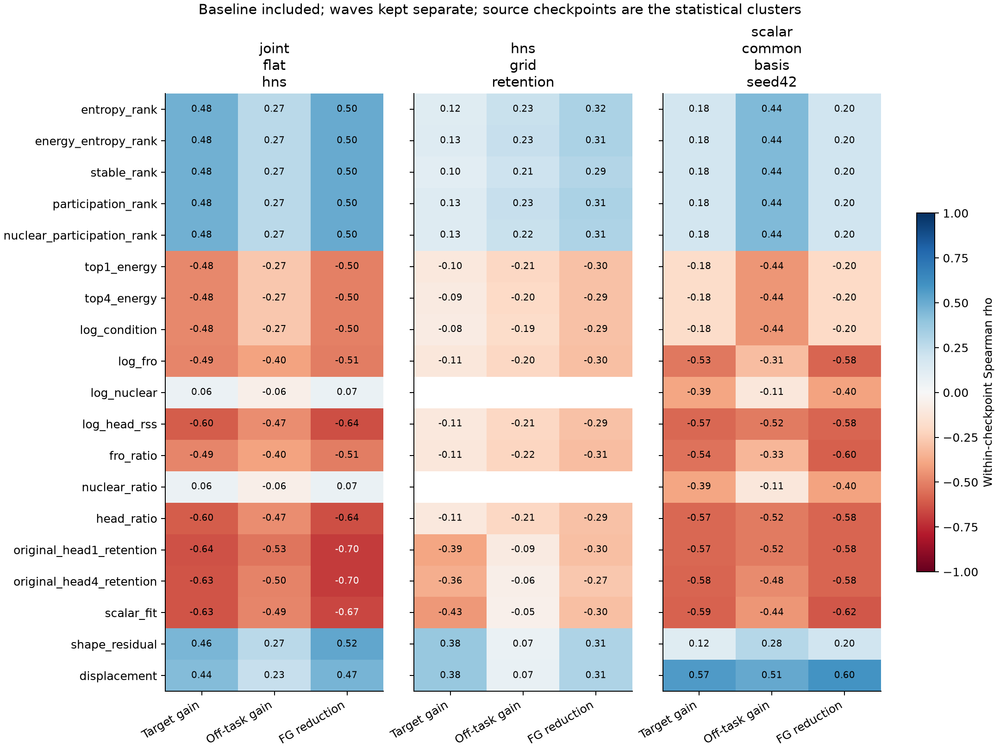
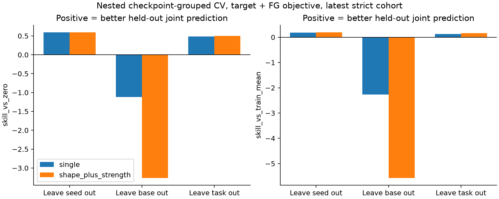
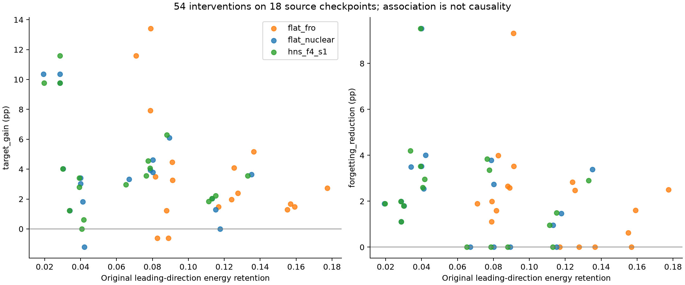

# 三种子 LoRA 谱量与 downstream / forgetting 的回顾性分析（2026-09-14）

本报告重算实际保存 adapter 的 compact SVD，分析 18 个 source checkpoints、282 个 adapter、450 条 checkpoint × 方法记录。只读已有训练与评测产物；没有训练、生成或占用 GPU。

选中的记录对应 1206 个 benchmark cells、6293220 条既有评测样例（包括不同评测批次对同一 adapter 的重复评测）。样例数量用于说明数据覆盖，独立训练分组仍只有 18 个 source checkpoints。

**目前没有找到经跨模型、跨任务验证、能同时预测 downstream 与 forgetting 的统一最优单谱量。** 原始主导方向能量保留量 H1 是值得保留的关联候选；entropy effective rank 在同模型/任务范围内的留种子预测中更常被选择。两种结论分别是关联与预测，不应混为一谈。

最新严格对照中，H1 与 ΔTarget / FG reduction 的 within-checkpoint ρ 为 -0.639 / -0.698。去掉未编辑 LoRA 后变为 -0.257 / -0.368；HNS 网格 edited-only 的 FG ρ 为 0.001。强关联一部分来自编辑与未编辑的区别，尚不能可靠用于排序全部已编辑方法。

最新批次嵌套留 seed 的单量选择，在三折中均选 entropy effective rank；聚合 Target R²=0.494, FG R²=-0.078。跨 base 的泛化失败，FG 改善的个体差异仍预测不佳。双量模型在最新批次没有稳定解决这一问题。

分析方案先写入 `analysis_plan.json`。候选筛选属于回顾性探索，嵌套交叉验证中的测试 seed/base/task 不参与特征、次数或正则选择。源 checkpoint 是统计分组单位；module 数量不增加独立样本数。

## 数据与协议

| 批次 | checkpoint 数 | 记录数 | 拟合干预数 | 用途 |
| --- | --- | --- | --- | --- |
| joint_flat_hns | 18 | 72 | 54 | 最新同批次 LoRA / Flat-Fro / Flat-Nuclear / 固定 HNS 4+1 |
| hns_grid_target | 18 | 198 | 162 | LoRA + 0+0 + 九个 HNS 设置；只有 diagonal 性能 |
| hns_grid_retention | 12 | 132 | 108 | seed43/44，完整四个 benchmark，九个 HNS 设置 |
| scalar_common_basis_seed42 | 6 | 48 | 42 | 共同 U/V 表示，scalar 与 per-module norm-matched 控制 |

各批次使用各自 manifest 中的原始成绩和 LoRA 对照，不合并不同 adapter block / batch 的原始得分。最新批次 HNS 统一为 4+1；网格中的全部设置仅用于研究谱量的变化，不代表为每个 checkpoint 选择最佳 HNS。DG-Hard 已证明是 identity，不作为新的独立观测；0+0 重建控制保留在完整数据中但排除拟合。旧 scalar 批次的 common_lora 是其同表示对照，原始表示重复项排除。

Target 是对应训练任务的现有主指标（HumanEval pass@1 / GSM8K strict accuracy / IFEval strict prompt-level accuracy）。Off-task 是另外三个 benchmark 家族成绩的等权平均；Commonsense 内部复用原 metric。

$FG=\frac13\sum_{b\ne task}\max(0,Score_{Base,b}-Score_{adapter,b})$。$\Delta T=T_{adapter}-T_{LoRA}$；$\Delta O=O_{adapter}-O_{LoRA}$；$R_{FG}=FG_{LoRA}-FG_{adapter}$。三个变化指标均以正数为改善，单位 pp。FG 在 0 处截断，因此应同时查看未截断的 off-task gain。

18 个 checkpoint 的实际 source 路径来自原三种子审计，逐一验证每个派生 adapter 的 source 元数据和 adapter_config 哈希。seed42 的历史训练 recipe 与 seeds43/44 不完全一致，两处 Llama seed42 的实际训练 seed 未完全验证；相关结果不能声称为完全同 recipe 的三种子结论。

## 谱量定义

模块实际更新 $\Delta W=cBA$，$c=\alpha/r$，奇异值记作 $s_i=c\sigma_i$；这里全部 $r=16,c=2$。令 $p_i=s_i/\sum s_i$、$q_i=s_i^2/\sum s_i^2$。形状量取所有 LoRA modules 的等权平均；绝对幅度量先在 modules 间按定义聚合。

| 量 | 定义 / 聚合 |
| --- | --- |
| entropy_rank | mean exp(-sum p log p)/r; p=s/sum(s) |
| energy_entropy_rank | mean exp(-sum q log q)/r; q=s^2/sum(s^2) |
| stable_rank | mean sum(s^2)/(r*max(s)^2) |
| participation_rank | mean sum(s^2)^2/(r*sum(s^4)) |
| nuclear_participation_rank | mean sum(s)^2/(r*sum(s^2)) |
| top1_energy | mean max(s)^2/sum(s^2) |
| top4_energy | mean sum(sorted(s)[:4]^2)/sum(s^2) |
| log_condition | mean log(max(s)/min(s)) |
| log_fro | log sqrt(sum_modules sum(s^2)); s already includes LoRA scaling |
| log_nuclear | log sum_modules sum(s); s already includes LoRA scaling |
| log_head_rss | log sqrt(sum_modules max(s)^2); not global operator norm |
| fro_ratio | global Frobenius / source global Frobenius |
| nuclear_ratio | global sum nuclear / source global sum nuclear |
| head_ratio | RSS of module operator norms / source RSS |
| original_head1_retention | sum ||U_source[:,:1]^T D_new||_F^2 / sum source_s[:1]^2 |
| original_head4_retention | sum ||U_source[:,:4]^T D_new||_F^2 / sum source_s[:4]^2 |
| scalar_fit | <D_new,D_source>_F / ||D_source||_F^2 |
| shape_residual | 1-<D_new,D_source>_F^2/(||D_new||_F^2*||D_source||_F^2) |
| displacement | ||D_new-D_source||_F / ||D_source||_F |

推荐先理解六类量：entropy effective rank（平坦度）、stable rank（相对最大奇异值的能量）、top-k energy（头部集中度）、整体 Frobenius 幅度、原始头部方向能量保留量、以及最佳 scalar 拟合后的形状残差。

若希望将头部保留量改写为正向指标，可定义 $A_{head}=1-H_1$（主导方向衰减量，源 LoRA 为 0；不截断）。在共享 U/V 的理想编辑中，$H_1=\sum_m c_m^2t_{m,1}^2/\sum_m c_m^2\sigma_{m,1}^2$，其中索引 1 指源最大的奇异方向。正向写法不会增加信息或改善预测，只改变相关符号。建议同时保留平坦度、Fro ratio 和 A_head，防止把谱形状与预算混在一个量中。

有效秩采用 Roy–Vetterli 的奇异值概率熵定义：[原始论文资料](https://infoscience.epfl.ch/bitstreams/9a5f3153-5c5d-4845-ab41-962296ec93ac/download)。Stable rank 定义参考 [primary research paper](https://arxiv.org/abs/1507.02268)。Energy entropy 和参与率、相对原始方向的保留量作为本实验定义的诊断量，不能都称作 Roy–Vetterli effective rank。

Original-head retention 使用源 $U_{m,0}$ 的前 $k$ 个左奇异方向：$H_k=\frac{\sum_m\|U_{m,0}[:,1:k]^\top\Delta W_m\|_F^2}{\sum_m\sum_{i\le k}s_{m,0,i}^2}$。在本实验共享 U/V 的理想谱编辑中就是 $\sum t_{m,i\le k}^2/\sum s_{m,0,i\le k}^2$，但实际计算包含保存后的投影误差。它允许大于 1；谱形状本身的 top-k energy 总是按修改后谱重新排序。HNS 的 sigma_after 不保证有序，不能误把数组第一项当修改后最大奇异值。

最佳 scalar 拟合 $\gamma=\langle\Delta W_{new},\Delta W_0\rangle/\|\Delta W_0\|_F^2$，残差 $R=1-\langle\Delta W_{new},\Delta W_0\rangle^2/(\|\Delta W_{new}\|_F^2\|\Delta W_0\|_F^2)$。全局 Frobenius 指所有不同参数矩阵平方范数之和开根号；head RSS 只是 module operator norm 的平方和，不称为整个网络的 operator norm。

数值审计修正已写入 analysis_plan.json：形状和相对无量纲指标按 1e-5 取整；norm ratio 距离 1 小于 1e-5 时恢复为严格不变量，log norm 同步使用 source 的 log norm。原始未量化奇异值保留在 npz 中。实际保存谱对目标谱的最大相对误差为 6.23e-6。此修正用于消除保持核预算时浮点误差导致的伪秩相关，不通过性能选择精度。核参与率与平坦谱距离/CV 存在代数等价关系；top1 energy 与 module stable rank 互为函数，这些候选量不视为独立机制。另有 attention / MLP、深度三段、七类 projection 共 12 个预定义 scope，每个只分析四个量，作为探索性附表。

## 同一 checkpoint 内的相关性

表中是 within-checkpoint Spearman：每个 source checkpoint 的干预序列内分别计算含 ties 的平均秩、去均值后聚合。95% CI 为 2000 次 source-cluster bootstrap；p 为 2000 次 checkpoint 内 outcome 置换，BH FDR 分批次、outcome、core/scope 家族校正。置换是关联诊断，不是随机干预实验的因果 p 值。

| 谱量 | 最新 ΔTarget ρ | 最新 FG reduction ρ | 95% CI（FG） | FDR q（FG） | 网格 ΔTarget ρ | 网格 FG reduction ρ | scalar ΔTarget ρ | scalar FG reduction ρ |
| --- | --- | --- | --- | --- | --- | --- | --- | --- |
| entropy_rank | 0.479 | 0.504 | [0.400, 0.598] | 0.001 | 0.161 | 0.319 | 0.181 | 0.196 |
| energy_entropy_rank | 0.479 | 0.504 | [0.400, 0.598] | 0.001 | 0.163 | 0.313 | 0.181 | 0.196 |
| stable_rank | 0.479 | 0.504 | [0.400, 0.598] | 0.001 | 0.157 | 0.295 | 0.181 | 0.196 |
| participation_rank | 0.479 | 0.504 | [0.400, 0.598] | 0.001 | 0.162 | 0.313 | 0.181 | 0.196 |
| nuclear_participation_rank | 0.479 | 0.504 | [0.400, 0.598] | 0.001 | 0.164 | 0.312 | 0.181 | 0.196 |
| top1_energy | -0.479 | -0.504 | [-0.598, -0.400] | 0.001 | -0.160 | -0.296 | -0.181 | -0.196 |
| top4_energy | -0.479 | -0.504 | [-0.598, -0.400] | 0.001 | -0.146 | -0.295 | -0.181 | -0.196 |
| log_condition | -0.479 | -0.504 | [-0.598, -0.400] | 0.001 | -0.141 | -0.295 | -0.181 | -0.196 |
| log_fro | -0.488 | -0.514 | [-0.680, -0.317] | 0.001 | -0.155 | -0.303 | -0.527 | -0.582 |
| log_nuclear | 0.058 | 0.070 | [-0.102, 0.265] | 0.674 | — | — | -0.393 | -0.399 |
| log_head_rss | -0.605 | -0.644 | [-0.781, -0.476] | 0.001 | -0.161 | -0.295 | -0.571 | -0.584 |
| fro_ratio | -0.488 | -0.514 | [-0.680, -0.317] | 0.001 | -0.155 | -0.305 | -0.539 | -0.596 |
| nuclear_ratio | 0.058 | 0.070 | [-0.102, 0.265] | 0.674 | — | — | -0.393 | -0.399 |
| head_ratio | -0.605 | -0.644 | [-0.781, -0.476] | 0.001 | -0.165 | -0.290 | -0.571 | -0.584 |
| original_head1_retention | -0.639 | -0.698 | [-0.817, -0.559] | 0.001 | -0.429 | -0.297 | -0.571 | -0.584 |
| original_head4_retention | -0.627 | -0.698 | [-0.817, -0.559] | 0.001 | -0.390 | -0.266 | -0.580 | -0.580 |
| scalar_fit | -0.627 | -0.671 | [-0.793, -0.536] | 0.001 | -0.431 | -0.299 | -0.592 | -0.619 |
| shape_residual | 0.458 | 0.522 | [0.372, 0.674] | 0.001 | 0.421 | 0.310 | 0.117 | 0.197 |
| displacement | 0.435 | 0.468 | [0.328, 0.617] | 0.001 | 0.419 | 0.307 | 0.567 | 0.601 |

完整 Pearson、Spearman、raw / within 对比、partial Pearson（控制 log Frobenius 幅度）、每 checkpoint 的方向计数以及 scope 结果见 `correlations.tsv`。控制幅度后的相关用于检查形状是否提供额外信息；在固定核预算等约束下仍可能存在强共线性，不能作因果解释。分 seed/base/task 结果见 `stratified_correlations.tsv`。

### 只比较已编辑方法的敏感性检查

排除各 checkpoint 的 LoRA baseline，并重新在干预序列内排名。此表回答“哪个已编辑 adapter 更好”，主表同时包含编辑与未编辑的比较。全部 19 个量的 CI、FDR、partial 结果在 edited_only_correlations.tsv。

| 谱量 | 最新 ΔTarget ρ | 最新 FG ρ | HNS target 网格 ΔTarget ρ | HNS retention 网格 FG ρ | scalar ΔTarget ρ | scalar FG ρ |
| --- | --- | --- | --- | --- | --- | --- |
| entropy_rank | -0.149 | -0.302 | -0.113 | 0.032 | 0.156 | 0.150 |
| stable_rank | -0.149 | -0.302 | -0.118 | -0.003 | 0.156 | 0.150 |
| top1_energy | 0.149 | 0.302 | 0.115 | 0.003 | -0.156 | -0.150 |
| fro_ratio | -0.200 | -0.213 | 0.123 | -0.011 | -0.351 | -0.436 |
| original_head1_retention | -0.257 | -0.368 | -0.241 | 0.001 | -0.416 | -0.419 |
| shape_residual | -0.143 | -0.136 | 0.232 | 0.021 | 0.023 | 0.106 |

最新 edited-only 的关联在 core 家族 FDR 下没有足够证据；HNS target 网格中 H1 和 shape residual 对 target 仍有较弱关联，retention 网格中 FG 几乎没有进一步排序信号。Scalar 只有 6 个源 checkpoint，cluster bootstrap CI 较宽；即便置换 q 较小，也不能声称已验证跨 checkpoint 通用性。

FG 的截断限制了可辨别性：最新 54 个编辑条件有 31 个 FG=0，18 个 source 中有 8 个在三种编辑方法间 FG 完全相同；HNS retention 网格 108 条编辑条件有 72 个 FG=0，12 个 source 中有 7 个在九种 HNS 设置间 FG 完全相同。零相关不能证明谱量完全无用；应同时看 off-task gain 与各 benchmark 的分项指标。



## 能否找到统一的最佳谱量

单量候选为 19 个 core features，允许一次或二次曲线，ridge ∈ {0.01,1,10}。双量候选仅为预定义的四种形状量 × 三种幅度/保留量。输入是相对各批次 LoRA 的谱量变化，拟合不带截距；没有编辑时预测变化为 0。训练集内按 source checkpoint 做 leave-one-checkpoint-out，选择 feature / 次数 / ridge；外层分别完全留出一个 seed、base 或训练任务。

目标是预测 ΔTarget 和 FG reduction，按训练集各 outcome 的 SD 标准化后等权最小化 MSE；只有 target 的网格使用单 outcome。Baseline 同时报告预测 0（没有改善）和训练集平均改善。Skill=1−MSE_model/MSE_baseline，正数表示优于该对照；R² 为所有外层预测聚合后的结果。不同折的最佳量可变化，因此全数据 inner winner 只能是范围内候选，不能直接宣称跨模型通用。

| 批次 | 模型 | 外层留出 | Skill vs 0 | Skill vs train mean | Target R² | FG R² | 折内选出的量 |
| --- | --- | --- | --- | --- | --- | --- | --- |
| joint_flat_hns | single | seed | 0.592 | 0.188 | 0.494 | -0.078 | {"entropy_rank": 3} |
| joint_flat_hns | single | base | -1.121 | -2.269 | -4.664 | -1.235 | {"entropy_rank": 1, "shape_residual": 1} |
| joint_flat_hns | single | train_task | 0.485 | 0.133 | -0.042 | -0.696 | {"energy_entropy_rank": 1, "entropy_rank": 2} |
| joint_flat_hns | shape_plus_strength | seed | 0.595 | 0.193 | 0.498 | -0.048 | {"entropy_rank+original_head1_retention": 1, "top1_energy+original_head1_retention": 1, "entropy_rank+scalar_fit": 1} |
| joint_flat_hns | shape_plus_strength | base | -3.262 | -5.567 | -11.753 | -0.565 | {"entropy_rank+original_head1_retention": 1, "shape_residual+original_head1_retention": 1} |
| joint_flat_hns | shape_plus_strength | train_task | 0.499 | 0.157 | -0.010 | -0.910 | {"top1_energy+scalar_fit": 2, "entropy_rank+scalar_fit": 1} |
| hns_grid_target | single | seed | 0.738 | 0.366 | 0.352 | — | {"entropy_rank": 3} |
| hns_grid_target | single | base | -0.220 | -0.838 | -2.074 | — | {"fro_ratio": 1, "top1_energy": 1} |
| hns_grid_target | single | train_task | 0.468 | -0.030 | -0.196 | — | {"entropy_rank": 3} |
| hns_grid_target | shape_plus_strength | seed | 0.604 | 0.043 | -0.097 | — | {"top1_energy+log_fro": 1, "entropy_rank+original_head1_retention": 1, "top1_energy+scalar_fit": 1} |
| hns_grid_target | shape_plus_strength | base | 0.702 | 0.552 | 0.188 | — | {"entropy_rank+log_fro": 1, "top1_energy+scalar_fit": 1} |
| hns_grid_target | shape_plus_strength | train_task | 0.592 | 0.210 | 0.059 | — | {"entropy_rank+log_fro": 1, "top1_energy+scalar_fit": 2} |
| hns_grid_retention | single | seed | 0.582 | 0.193 | 0.370 | 0.026 | {"entropy_rank": 2} |
| hns_grid_retention | single | base | -0.054 | -0.565 | -1.718 | -0.679 | {"entropy_rank": 1, "log_fro": 1} |
| hns_grid_retention | single | train_task | 0.238 | -0.217 | -0.542 | -2.609 | {"log_fro": 2, "entropy_rank": 1} |
| hns_grid_retention | shape_plus_strength | seed | 0.602 | 0.231 | 0.399 | 0.044 | {"top1_energy+scalar_fit": 1, "entropy_rank+scalar_fit": 1} |
| hns_grid_retention | shape_plus_strength | base | -0.361 | -1.020 | -0.154 | -3.518 | {"entropy_rank+log_fro": 1, "top1_energy+log_fro": 1} |
| hns_grid_retention | shape_plus_strength | train_task | 0.384 | 0.017 | -0.338 | -1.977 | {"entropy_rank+log_fro": 1, "entropy_rank+scalar_fit": 1, "stable_rank+log_fro": 1} |
| scalar_common_basis_seed42 | single | base | 0.477 | 0.026 | -0.382 | -0.563 | {"original_head4_retention": 1, "scalar_fit": 1} |
| scalar_common_basis_seed42 | single | train_task | 0.443 | 0.084 | -0.016 | -0.609 | {"original_head1_retention": 1, "log_fro": 1, "original_head4_retention": 1} |
| scalar_common_basis_seed42 | shape_plus_strength | base | 0.443 | -0.037 | -0.396 | -0.727 | {"stable_rank+original_head1_retention": 1, "entropy_rank+log_fro": 1} |
| scalar_common_basis_seed42 | shape_plus_strength | train_task | 0.434 | 0.069 | 0.039 | -0.706 | {"stable_rank+original_head1_retention": 1, "stable_rank+scalar_fit": 1, "entropy_rank+original_head1_retention": 1} |

| 批次 | 候选族 | 全数据 inner winner（探索性） | 次数 | ridge | inner joint loss |
| --- | --- | --- | --- | --- | --- |
| joint_flat_hns | single | entropy_rank | 2 | 0.01 | 1.379 |
| joint_flat_hns | shape_plus_strength | top1_energy + original_head1_retention | 2 | 0.01 | 1.337 |
| hns_grid_target | single | entropy_rank | 2 | 10.0 | 0.704 |
| hns_grid_target | shape_plus_strength | top1_energy + scalar_fit | 2 | 0.01 | 0.517 |
| hns_grid_retention | single | entropy_rank | 1 | 0.01 | 1.795 |
| hns_grid_retention | shape_plus_strength | top1_energy + log_fro | 2 | 0.01 | 1.284 |
| scalar_common_basis_seed42 | single | log_fro | 2 | 0.01 | 1.986 |
| scalar_common_basis_seed42 | shape_plus_strength | entropy_rank + original_head1_retention | 2 | 0.01 | 1.971 |





## Flat 预算检查：相同平坦度是否足够

18 对 Flat-Fro / Flat-Nuclear 的 entropy_rank 都为 1.00000；同样完全平坦，但 target 有 18/18 对不同，off-task 有 18/18 对不同。仅靠平坦度无法区分这两类 adapter；差异与预算/更新幅度一起存在。平均 Flat-Fro − Flat-Nuclear：target -0.283 pp，off-task -0.454 pp，FG +0.195 pp。逐种子配对见 `flat_budget_pairs.tsv`。

## 最新同批次完整逐种子表

erank 与 stable rank 已除以 16。H1 是源头部方向保留量，F-ratio 相对原始 LoRA。Target/Off/FG 单位 % / pp。

| Base | Task | Seed | Method | erank/16 | stable/16 | F-ratio | H1 | Target | Off | FG |
| --- | --- | --- | --- | --- | --- | --- | --- | --- | --- | --- |
| Qwen3-8B | magicoder | 42 | original_lora | 0.60390 | 0.08787 | 1.000 | 1.000 | 65.244 | 77.798 | 1.900 |
| Qwen3-8B | magicoder | 42 | flat_fro | 1.00000 | 1.00000 | 1.000 | 0.071 | 76.829 | 81.351 | 0.000 |
| Qwen3-8B | magicoder | 42 | flat_nuclear | 1.00000 | 1.00000 | 0.522 | 0.019 | 75.610 | 81.002 | 0.000 |
| Qwen3-8B | magicoder | 42 | hns_f4_s1 | 0.99989 | 0.95768 | 0.522 | 0.020 | 75.000 | 81.333 | 0.000 |
| Qwen3-8B | metamath | 42 | original_lora | 0.66272 | 0.10242 | 1.000 | 1.000 | 84.155 | 71.293 | 1.799 |
| Qwen3-8B | metamath | 42 | flat_fro | 1.00000 | 1.00000 | 1.000 | 0.082 | 87.642 | 73.866 | 0.203 |
| Qwen3-8B | metamath | 42 | flat_nuclear | 1.00000 | 1.00000 | 0.609 | 0.030 | 88.173 | 75.200 | 0.000 |
| Qwen3-8B | metamath | 42 | hns_f4_s1 | 0.99989 | 0.95910 | 0.609 | 0.030 | 88.173 | 74.920 | 0.000 |
| Qwen3-8B | tulu | 42 | original_lora | 0.73692 | 0.12682 | 1.000 | 1.000 | 67.837 | 86.018 | 0.000 |
| Qwen3-8B | tulu | 42 | flat_fro | 1.00000 | 1.00000 | 1.000 | 0.117 | 69.316 | 85.037 | 0.000 |
| Qwen3-8B | tulu | 42 | flat_nuclear | 1.00000 | 1.00000 | 0.757 | 0.067 | 71.165 | 85.527 | 0.000 |
| Qwen3-8B | tulu | 42 | hns_f4_s1 | 0.99989 | 0.95964 | 0.757 | 0.065 | 70.795 | 85.363 | 0.000 |
| Qwen3-8B | magicoder | 43 | original_lora | 0.64499 | 0.09458 | 1.000 | 1.000 | 62.805 | 77.759 | 1.986 |
| Qwen3-8B | magicoder | 43 | flat_fro | 1.00000 | 1.00000 | 1.000 | 0.079 | 76.220 | 80.821 | 0.000 |
| Qwen3-8B | magicoder | 43 | flat_nuclear | 1.00000 | 1.00000 | 0.601 | 0.029 | 73.171 | 81.028 | 0.000 |
| Qwen3-8B | magicoder | 43 | hns_f4_s1 | 0.99989 | 0.95810 | 0.601 | 0.029 | 74.390 | 81.191 | 0.000 |
| Qwen3-8B | metamath | 43 | original_lora | 0.70352 | 0.11812 | 1.000 | 1.000 | 84.003 | 69.666 | 3.523 |
| Qwen3-8B | metamath | 43 | flat_fro | 1.00000 | 1.00000 | 1.000 | 0.091 | 87.263 | 74.881 | 0.000 |
| Qwen3-8B | metamath | 43 | flat_nuclear | 1.00000 | 1.00000 | 0.662 | 0.040 | 87.036 | 76.531 | 0.000 |
| Qwen3-8B | metamath | 43 | hns_f4_s1 | 0.99989 | 0.95921 | 0.662 | 0.039 | 86.808 | 76.650 | 0.000 |
| Qwen3-8B | tulu | 43 | original_lora | 0.79439 | 0.15028 | 1.000 | 1.000 | 66.174 | 85.125 | 0.000 |
| Qwen3-8B | tulu | 43 | flat_fro | 1.00000 | 1.00000 | 1.000 | 0.136 | 71.349 | 85.186 | 0.000 |
| Qwen3-8B | tulu | 43 | flat_nuclear | 1.00000 | 1.00000 | 0.810 | 0.089 | 72.274 | 85.117 | 0.000 |
| Qwen3-8B | tulu | 43 | hns_f4_s1 | 0.99991 | 0.96165 | 0.810 | 0.088 | 72.458 | 84.954 | 0.000 |
| Qwen3-8B | magicoder | 44 | original_lora | 0.64261 | 0.09333 | 1.000 | 1.000 | 64.634 | 78.553 | 1.111 |
| Qwen3-8B | magicoder | 44 | flat_fro | 1.00000 | 1.00000 | 1.000 | 0.079 | 72.561 | 81.024 | 0.000 |
| Qwen3-8B | magicoder | 44 | flat_nuclear | 1.00000 | 1.00000 | 0.602 | 0.029 | 74.390 | 80.745 | 0.000 |
| Qwen3-8B | magicoder | 44 | hns_f4_s1 | 0.99989 | 0.95799 | 0.602 | 0.029 | 74.390 | 81.257 | 0.000 |
| Qwen3-8B | metamath | 44 | original_lora | 0.70320 | 0.11591 | 1.000 | 1.000 | 84.003 | 63.515 | 9.522 |
| Qwen3-8B | metamath | 44 | flat_fro | 1.00000 | 1.00000 | 1.000 | 0.091 | 88.476 | 73.930 | 0.203 |
| Qwen3-8B | metamath | 44 | flat_nuclear | 1.00000 | 1.00000 | 0.663 | 0.040 | 87.415 | 74.750 | 0.000 |
| Qwen3-8B | metamath | 44 | hns_f4_s1 | 0.99989 | 0.95904 | 0.663 | 0.039 | 87.415 | 74.259 | 0.000 |
| Qwen3-8B | tulu | 44 | original_lora | 0.78054 | 0.14472 | 1.000 | 1.000 | 66.913 | 85.738 | 0.000 |
| Qwen3-8B | tulu | 44 | flat_fro | 1.00000 | 1.00000 | 1.000 | 0.128 | 69.316 | 84.071 | 0.000 |
| Qwen3-8B | tulu | 44 | flat_nuclear | 1.00000 | 1.00000 | 0.793 | 0.080 | 71.534 | 84.796 | 0.000 |
| Qwen3-8B | tulu | 44 | hns_f4_s1 | 0.99991 | 0.96168 | 0.793 | 0.079 | 70.980 | 84.476 | 0.000 |
| Llama-3.1-8B-Instruct | magicoder | 42 | original_lora | 0.77163 | 0.12842 | 1.000 | 1.000 | 53.659 | 60.202 | 5.039 |
| Llama-3.1-8B-Instruct | magicoder | 42 | flat_fro | 1.00000 | 1.00000 | 1.000 | 0.083 | 53.049 | 64.189 | 1.052 |
| Llama-3.1-8B-Instruct | magicoder | 42 | flat_nuclear | 1.00000 | 1.00000 | 0.642 | 0.034 | 54.878 | 63.701 | 1.540 |
| Llama-3.1-8B-Instruct | magicoder | 42 | hns_f4_s1 | 0.99992 | 0.96377 | 0.642 | 0.034 | 54.878 | 64.807 | 0.838 |
| Llama-3.1-8B-Instruct | metamath | 42 | original_lora | 0.86962 | 0.20191 | 1.000 | 1.000 | 77.255 | 57.819 | 4.713 |
| Llama-3.1-8B-Instruct | metamath | 42 | flat_fro | 1.00000 | 1.00000 | 1.000 | 0.177 | 79.985 | 61.139 | 2.206 |
| Llama-3.1-8B-Instruct | metamath | 42 | flat_nuclear | 1.00000 | 1.00000 | 0.873 | 0.135 | 80.895 | 63.241 | 1.323 |
| Llama-3.1-8B-Instruct | metamath | 42 | hns_f4_s1 | 0.99992 | 0.96323 | 0.873 | 0.133 | 80.819 | 63.153 | 1.817 |
| Llama-3.1-8B-Instruct | tulu | 42 | original_lora | 0.89746 | 0.23425 | 1.000 | 1.000 | 63.216 | 63.726 | 1.809 |
| Llama-3.1-8B-Instruct | tulu | 42 | flat_fro | 1.00000 | 1.00000 | 1.000 | 0.159 | 64.695 | 65.764 | 0.200 |
| Llama-3.1-8B-Instruct | tulu | 42 | flat_nuclear | 1.00000 | 1.00000 | 0.860 | 0.118 | 63.216 | 66.689 | 0.338 |
| Llama-3.1-8B-Instruct | tulu | 42 | hns_f4_s1 | 0.99992 | 0.96214 | 0.860 | 0.115 | 65.434 | 66.404 | 0.319 |
| Llama-3.1-8B-Instruct | magicoder | 43 | original_lora | 0.78216 | 0.12989 | 1.000 | 1.000 | 55.488 | 61.085 | 4.686 |
| Llama-3.1-8B-Instruct | magicoder | 43 | flat_fro | 1.00000 | 1.00000 | 1.000 | 0.089 | 54.878 | 65.361 | 2.095 |
| Llama-3.1-8B-Instruct | magicoder | 43 | flat_nuclear | 1.00000 | 1.00000 | 0.689 | 0.042 | 54.268 | 66.616 | 0.678 |
| Llama-3.1-8B-Instruct | magicoder | 43 | hns_f4_s1 | 0.99992 | 0.96395 | 0.689 | 0.042 | 56.098 | 65.938 | 1.725 |
| Llama-3.1-8B-Instruct | metamath | 43 | original_lora | 0.81624 | 0.14947 | 1.000 | 1.000 | 74.829 | 58.317 | 4.215 |
| Llama-3.1-8B-Instruct | metamath | 43 | flat_fro | 1.00000 | 1.00000 | 1.000 | 0.124 | 76.801 | 61.144 | 1.388 |
| Llama-3.1-8B-Instruct | metamath | 43 | flat_nuclear | 1.00000 | 1.00000 | 0.797 | 0.079 | 78.772 | 61.628 | 0.431 |
| Llama-3.1-8B-Instruct | metamath | 43 | hns_f4_s1 | 0.99991 | 0.96320 | 0.797 | 0.076 | 78.393 | 62.092 | 0.370 |
| Llama-3.1-8B-Instruct | tulu | 43 | original_lora | 0.89430 | 0.22534 | 1.000 | 1.000 | 63.216 | 67.571 | 0.000 |
| Llama-3.1-8B-Instruct | tulu | 43 | flat_fro | 1.00000 | 1.00000 | 1.000 | 0.157 | 64.880 | 67.940 | 0.000 |
| Llama-3.1-8B-Instruct | tulu | 43 | flat_nuclear | 1.00000 | 1.00000 | 0.857 | 0.115 | 64.510 | 67.738 | 0.000 |
| Llama-3.1-8B-Instruct | tulu | 43 | hns_f4_s1 | 0.99992 | 0.96238 | 0.857 | 0.113 | 65.250 | 67.745 | 0.000 |
| Llama-3.1-8B-Instruct | magicoder | 44 | original_lora | 0.78097 | 0.12745 | 1.000 | 1.000 | 53.659 | 62.164 | 4.139 |
| Llama-3.1-8B-Instruct | magicoder | 44 | flat_fro | 1.00000 | 1.00000 | 1.000 | 0.088 | 54.878 | 66.124 | 1.479 |
| Llama-3.1-8B-Instruct | magicoder | 44 | flat_nuclear | 1.00000 | 1.00000 | 0.685 | 0.041 | 55.488 | 66.300 | 1.602 |
| Llama-3.1-8B-Instruct | magicoder | 44 | hns_f4_s1 | 0.99992 | 0.96369 | 0.685 | 0.041 | 53.659 | 66.306 | 1.540 |
| Llama-3.1-8B-Instruct | metamath | 44 | original_lora | 0.81724 | 0.15120 | 1.000 | 1.000 | 74.602 | 59.581 | 3.357 |
| Llama-3.1-8B-Instruct | metamath | 44 | flat_fro | 1.00000 | 1.00000 | 1.000 | 0.125 | 78.696 | 62.254 | 0.887 |
| Llama-3.1-8B-Instruct | metamath | 44 | flat_nuclear | 1.00000 | 1.00000 | 0.800 | 0.080 | 78.393 | 61.845 | 0.616 |
| Llama-3.1-8B-Instruct | metamath | 44 | hns_f4_s1 | 0.99991 | 0.96371 | 0.800 | 0.078 | 79.151 | 62.551 | 0.000 |
| Llama-3.1-8B-Instruct | tulu | 44 | original_lora | 0.89386 | 0.22573 | 1.000 | 1.000 | 63.031 | 65.757 | 0.960 |
| Llama-3.1-8B-Instruct | tulu | 44 | flat_fro | 1.00000 | 1.00000 | 1.000 | 0.155 | 64.325 | 65.703 | 0.329 |
| Llama-3.1-8B-Instruct | tulu | 44 | flat_nuclear | 1.00000 | 1.00000 | 0.855 | 0.113 | 65.065 | 65.497 | 0.000 |
| Llama-3.1-8B-Instruct | tulu | 44 | hns_f4_s1 | 0.99992 | 0.96205 | 0.855 | 0.111 | 64.880 | 66.004 | 0.000 |

## 3-seed mean ± sample SD

| Base | Task | Method | Target | FG | erank/16 | F-ratio | H1 |
| --- | --- | --- | --- | --- | --- | --- | --- |
| Qwen3-8B | magicoder | original_lora | 64.228 ± 1.269 | 1.666 ± 0.483 | 0.630 ± 0.023 | 1.000 ± 0.000 | 1.000 ± 0.000 |
| Qwen3-8B | magicoder | flat_fro | 75.203 ± 2.308 | 0.000 ± 0.000 | 1.000 ± 0.000 | 1.000 ± 0.000 | 0.076 ± 0.005 |
| Qwen3-8B | magicoder | flat_nuclear | 74.390 ± 1.220 | 0.000 ± 0.000 | 1.000 ± 0.000 | 0.575 ± 0.046 | 0.025 ± 0.005 |
| Qwen3-8B | magicoder | hns_f4_s1 | 74.593 ± 0.352 | 0.000 ± 0.000 | 1.000 ± 0.000 | 0.575 ± 0.046 | 0.026 ± 0.005 |
| Qwen3-8B | metamath | original_lora | 84.054 ± 0.088 | 4.948 ± 4.054 | 0.690 ± 0.023 | 1.000 ± 0.000 | 1.000 ± 0.000 |
| Qwen3-8B | metamath | flat_fro | 87.794 ± 0.621 | 0.136 ± 0.117 | 1.000 ± 0.000 | 1.000 ± 0.000 | 0.088 ± 0.005 |
| Qwen3-8B | metamath | flat_nuclear | 87.541 ± 0.579 | 0.000 ± 0.000 | 1.000 ± 0.000 | 0.645 ± 0.031 | 0.037 ± 0.006 |
| Qwen3-8B | metamath | hns_f4_s1 | 87.465 ± 0.684 | 0.000 ± 0.000 | 1.000 ± 0.000 | 0.645 ± 0.031 | 0.036 ± 0.005 |
| Qwen3-8B | tulu | original_lora | 66.975 ± 0.834 | 0.000 ± 0.000 | 0.771 ± 0.030 | 1.000 ± 0.000 | 1.000 ± 0.000 |
| Qwen3-8B | tulu | flat_fro | 69.994 ± 1.174 | 0.000 ± 0.000 | 1.000 ± 0.000 | 1.000 ± 0.000 | 0.127 ± 0.010 |
| Qwen3-8B | tulu | flat_nuclear | 71.657 ± 0.565 | 0.000 ± 0.000 | 1.000 ± 0.000 | 0.787 ± 0.027 | 0.079 ± 0.011 |
| Qwen3-8B | tulu | hns_f4_s1 | 71.411 ± 0.912 | 0.000 ± 0.000 | 1.000 ± 0.000 | 0.787 ± 0.027 | 0.077 ± 0.011 |
| Llama-3.1-8B-Instruct | magicoder | original_lora | 54.268 ± 1.056 | 4.621 ± 0.454 | 0.778 ± 0.006 | 1.000 ± 0.000 | 1.000 ± 0.000 |
| Llama-3.1-8B-Instruct | magicoder | flat_fro | 54.268 ± 1.056 | 1.542 ± 0.524 | 1.000 ± 0.000 | 1.000 ± 0.000 | 0.087 ± 0.003 |
| Llama-3.1-8B-Instruct | magicoder | flat_nuclear | 54.878 ± 0.610 | 1.273 ± 0.517 | 1.000 ± 0.000 | 0.672 ± 0.026 | 0.039 ± 0.004 |
| Llama-3.1-8B-Instruct | magicoder | hns_f4_s1 | 54.878 ± 1.220 | 1.368 ± 0.468 | 1.000 ± 0.000 | 0.672 ± 0.026 | 0.039 ± 0.004 |
| Llama-3.1-8B-Instruct | metamath | original_lora | 75.562 ± 1.471 | 4.095 ± 0.686 | 0.834 ± 0.031 | 1.000 ± 0.000 | 1.000 ± 0.000 |
| Llama-3.1-8B-Instruct | metamath | flat_fro | 78.494 ± 1.602 | 1.494 ± 0.666 | 1.000 ± 0.000 | 1.000 ± 0.000 | 0.142 ± 0.030 |
| Llama-3.1-8B-Instruct | metamath | flat_nuclear | 79.353 ± 1.348 | 0.790 ± 0.471 | 1.000 ± 0.000 | 0.823 ± 0.043 | 0.098 ± 0.032 |
| Llama-3.1-8B-Instruct | metamath | hns_f4_s1 | 79.454 ± 1.241 | 0.729 ± 0.961 | 1.000 ± 0.000 | 0.823 ± 0.043 | 0.096 ± 0.032 |
| Llama-3.1-8B-Instruct | tulu | original_lora | 63.155 ± 0.107 | 0.923 ± 0.905 | 0.895 ± 0.002 | 1.000 ± 0.000 | 1.000 ± 0.000 |
| Llama-3.1-8B-Instruct | tulu | flat_fro | 64.633 ± 0.282 | 0.176 ± 0.166 | 1.000 ± 0.000 | 1.000 ± 0.000 | 0.157 ± 0.002 |
| Llama-3.1-8B-Instruct | tulu | flat_nuclear | 64.264 ± 0.949 | 0.113 ± 0.195 | 1.000 ± 0.000 | 0.857 ± 0.003 | 0.115 ± 0.002 |
| Llama-3.1-8B-Instruct | tulu | hns_f4_s1 | 65.188 ± 0.282 | 0.106 ± 0.184 | 1.000 ± 0.000 | 0.857 ± 0.003 | 0.113 ± 0.002 |

全部 19 个谱量、六个性能/遗忘量的 3-seed mean ± sample SD 与 seed42/43/44 原值在 `three_seed_mean_sd.tsv`。18 个未编辑源 checkpoint 本身的跨 checkpoint 相关与去除 Base×Task 六组均值后的相关在 `source_checkpoint_correlations.tsv`：每组仅三种子，无法独立验证“最合适”预测量。

| 未编辑 source 谱量 | Target raw ρ | Target 去 Base×Task ρ | FG raw ρ | FG 去 Base×Task ρ |
| --- | --- | --- | --- | --- |
| entropy_rank | -0.154 | -0.134 | -0.083 | 0.274 |
| stable_rank | -0.129 | -0.267 | -0.141 | 0.548 |
| top1_energy | 0.056 | 0.134 | 0.209 | -0.274 |
| log_fro | 0.653 | -0.312 | -0.427 | 0.274 |
| log_nuclear | 0.653 | -0.045 | -0.397 | 0.365 |
| log_head_rss | 0.668 | -0.045 | -0.384 | 0.365 |

这里 FG 是绝对遗忘量，正相关表示更多遗忘，和上文 FG reduction 的改善方向相反。此表单独研究 18 个未编辑源 checkpoint，不能用干预数量放大其样本量。不同 benchmark 的 raw target 分数不可直接作为跨任务统一质量标尺，raw 相关仅展示混杂现象。

## 重现、manifest 与产物

```bash
/dataset1/zailong/envs/peft-sft-lab/bin/python scripts/analyze_spectral_performance_forgetting_three_seed.py --stage extract
/dataset1/zailong/envs/peft-sft-lab/bin/python scripts/analyze_spectral_performance_forgetting_three_seed.py --stage analyze
```

绘图依赖安装在本报告目录的 `plot_dependencies`，不修改训练环境；Matplotlib 3.11.2。CPU 使用 4 torch threads；cache 为实际 adapter 权重 SHA256 + source SHA256 + 路径联合寻址。共享 compact SVD，不显式构建密集 BA。原始头部投影也通过低秩因子计算。

- `manifest.json`：所有输入 manifest 路径/哈希、评测配置、数据规模、状态。
- `inventory.tsv/json`：450 条记录及所有 adapter / source / score / generation / variant manifest 真实路径。
- `features.tsv/json`：450 条全谱量与相对 LoRA 变化、每个 benchmark 的原始性能。
- `spectrum_audit.json`、`spectra/*.npz`：282 adapters 的权重/config 哈希、module 数、实际 SVD、源头部投影、目标谱误差。
- `source_module_spectra.tsv`：4284 个源 modules 的描述性谱数据。
- `correlations.tsv/json`、`stratified_correlations.tsv`、`source_checkpoint_correlations.tsv`：完整相关与稳健性。
- `edited_only_correlations.tsv/json`：排除 baseline 后的完整关联检查。
- `cv_rankings.json`、`cv_folds.json`、`cv_predictions.tsv`、`cv_summary.tsv/json`：所有候选、折内选择、逐 seed/checkpoint 干预外层预测。
- `three_seed_mean_sd.tsv`、`flat_budget_pairs.tsv`：完整逐种子和三种子统计。
- `figures/*.png/pdf`：可导出科学图。
